MBAL vs. TA comparison
================
Katrina Kalantar
2017-12-01

Comparison of DNA Microbes
--------------------------

#### Import the microbe data and metadata.

``` r
#IMPORT DATA
#.csv of all microbes by TA/mBAL sample ID
all_microbe_data <- read.csv('./data/BM_4/merged_genusrpm.tsv', sep='\t', header=TRUE, row.names=1)

#read in metadata
metadata <- read.csv('./data/tavmbal_metadata_noviruses.tsv', sep='\t', row.names=1)
```

### Differences in BURDEN OF MICROBIAL GENERA between TA and mBAL

``` r
burden <- colSums(all_microbe_data) 
```

**Microbial burden**, as measured by the total microbial alignments by genus per million reads sequenced (rpM), did not significantly differ between TA and mBAL when using whole genome DNA sequencing: WGS, Wilcoxon rank sum p =

``` r
# TOTAL BURDEN (all TA v all mBAL)
print(wilcox.test(burden[names(burden) %in% as.character(unlist(metadata[metadata$effective_group %in% c(1,2,3,4),]["TA_DNAseq_filename"]))],burden[names(burden) %in% as.character(unlist(metadata[metadata$effective_group  %in% c(1,2,3,4),]["mBAL_DNAseq_filename"]))])$p.value[1])
```

    ## [1] 0.2797732

Difference in burden between G1 TA and G1 mBAL

``` r
print(wilcox.test(burden[names(burden) %in% as.character(unlist(metadata[metadata$effective_group %in% c(1),]["TA_DNAseq_filename"]))],burden[names(burden) %in% as.character(unlist(metadata[metadata$effective_group  %in% c(1),]["mBAL_DNAseq_filename"]))])$p.value)
```

    ## [1] 0.1872684

Difference in burden btwn G4 TA and G4 mBAL

``` r
print(wilcox.test(burden[names(burden) %in% as.character(unlist(metadata[metadata$effective_group %in% c(4),]["TA_DNAseq_filename"]))],burden[names(burden) %in% as.character(unlist(metadata[metadata$effective_group  %in% c(4),]["mBAL_DNAseq_filename"]))])$p.value)
```

    ## [1] 0.842836

Difference in burden btwn G1 TA and G4 TA

``` r
wilcox.test(burden[names(burden) %in% as.character(unlist(metadata[metadata$effective_group %in% c(1),]["TA_DNAseq_filename"]))],burden[names(burden) %in% as.character(unlist(metadata[metadata$effective_group  %in% c(4),]["TA_DNAseq_filename"]))])$p.value
```

    ## [1] 0.02141274

``` r
#stripchart(list(burden[names(burden) %in% as.character(unlist(metadata[metadata$effective_group %in% c(1),]["TA_DNAseq_filename"]))],burden[names(burden) %in% as.character(unlist(metadata[metadata$effective_group %in% c(4),]["TA_DNAseq_filename"]))]),method='jitter',jitter=.1,vertical=T,col=alpha('navyblue',.6),pch=16,cex=2)
```

Difference in burden btwn G1 mBAL and G4 mBAL

``` r
wilcox.test(burden[names(burden) %in% as.character(unlist(metadata[metadata$effective_group %in% c(1),]["mBAL_DNAseq_filename"]))],burden[names(burden) %in% as.character(unlist(metadata[metadata$effective_group  %in% c(4),]["mBAL_DNAseq_filename"]))])$p.value
```

    ## [1] 0.3728121

Summary of burden in TA:

``` r
print(summary(burden[names(burden) %in% as.character(unlist(metadata[metadata$effective_group %in% c(1,2,3,4),]["TA_DNAseq_filename"]))]))
```

    ##    Min. 1st Qu.  Median    Mean 3rd Qu.    Max. 
    ##    0.10    8.81   62.35  369.27  383.38 3568.04

Summary of burden in mBAL:

``` r
print(summary(burden[names(burden) %in% as.character(unlist(metadata[metadata$effective_group %in% c(1,2,3,4),]["mBAL_DNAseq_filename"]))]))
```

    ##     Min.  1st Qu.   Median     Mean  3rd Qu.     Max. 
    ##     0.47     5.39    26.89  1791.82   146.35 76324.15

#### Create data splits to be used in subsequent analysis.

Separate MBAL and TA into dataframes, normalize the microbial data into proportions, and separate out group 1.

``` r
MBAL <- as.character(unname(unlist(metadata[c("mBAL_DNAseq_filename")])))  # separate mBAL from TA
TA <- as.character(unname(unlist(metadata[c("TA_DNAseq_filename")])))
MBAL.microbes <- all_microbe_data[,colnames(all_microbe_data) %in% MBAL]  
TA.microbes <- all_microbe_data[,colnames(all_microbe_data) %in% TA]
MBAL.microbes.norm <-  t(t(MBAL.microbes)/colSums(MBAL.microbes))   # normalise (Total Sum Scaling) -> generate proportions
TA.microbes.norm <- t(t(TA.microbes)/colSums(TA.microbes))
 
# Isolate Group 1 Data
group1.MBAL <- as.character(unname(unlist(metadata[metadata$effective_group==1,][c("mBAL_DNAseq_filename")])))
group1.TA <- as.character(unname(unlist(metadata[metadata$effective_group==1,][c("TA_DNAseq_filename")])))
group1.MBAL.microbes <- all_microbe_data[,colnames(all_microbe_data) %in% group1.MBAL]
group1.MBAL.microbes.norm <- t(t(group1.MBAL.microbes)/colSums(group1.MBAL.microbes))
group1.TA.microbes <- all_microbe_data[,colnames(all_microbe_data) %in% group1.TA]
group1.TA.microbes.norm <- t(t(group1.TA.microbes)/colSums(group1.TA.microbes))
```

### Phylum-level analysis:

``` r
PhyProp <- read.csv("./data/phylum_proportions.csv",sep='\t',row.names=1)
PhyProp[is.na(PhyProp)]<-0
PhyProp <- PhyProp[order(rowSums(PhyProp),decreasing=F),]

mbal_phyla <- PhyProp[,colnames(PhyProp) %in% MBAL]
#barplot(as.matrix(mbal_phyla),col=rainbow(10),las=2)
ta_phyla <- PhyProp[,colnames(PhyProp) %in% TA]

if(generate_pdfs){
  pdf('./output/phylum_analysis.pdf',width=16,height=6)
}

full_correlations <- vector("list",length=4)
full_bc <- vector("list",length=4)
full_simpsons <- vector("list",length=8) #separate by TA and mBAL for each group
full_richness <- vector("list",length=8)
for(j in c(1,2,3,4)){
  
  correlations <- c()
  bc_dist <- c()
  ta_sdi <- c()
  mbal_sdi <- c()
  names <- c()
  mbal_richness <- c()
  ta_richness <- c()
  par(mfrow=c(2,8))
  
  for( i in rownames(metadata)){
  mbal_filename <- as.character(metadata[rownames(metadata) == i,]$mBAL_DNAseq_filename)
  ta_filename <- as.character(metadata[rownames(metadata) == i,]$TA_DNAseq_filename)
  
  if(!is.na(metadata[rownames(metadata) == i,]$effective_group)){
    
    if(metadata[rownames(metadata) == i,]$effective_group == j){
    
      # print(mbal_filename)
      # print(ta_filename)
      
      # phylum barplot
      barplot(as.matrix(PhyProp[,c(mbal_filename,ta_filename)]),col=plasma(10),cex.axis = .6,main=i,names.arg = c("mBAL","TA"))#,legend=TRUE)
      
      # pearson correlation - 1 per patient
      correlations <- c(correlations,cor(PhyProp[,c(mbal_filename)],PhyProp[,c(ta_filename)]))
      
      # bray-curtis distance - 1 per patient
      bray_curtis_dist <- vegdist(t(as.matrix(PhyProp[,c(mbal_filename,ta_filename)])), 
                                  method="bray", binary=FALSE, diag=FALSE, upper=TRUE, na.rm = FALSE)
      bc_dist <- c(bc_dist, bray_curtis_dist[1])
      
      # SDI - 1 per sample ( 2 per patient )
      ta_sdi <- c(ta_sdi,diversity(PhyProp[,c(ta_filename)],index="simpson") )
      mbal_sdi <- c(mbal_sdi, diversity(PhyProp[,c(mbal_filename)],index="simpson"))
      
      # richness - 1 per sample ( 2 per patient )
      mbal_richness <- c(mbal_richness, length(PhyProp[,c(mbal_filename)][PhyProp[,c(mbal_filename)]>0]))
      ta_richness <- c(ta_richness, length(PhyProp[,c(ta_filename)][PhyProp[,c(ta_filename)]>0]))
      
      names <- c(names,rownames(metadata[rownames(metadata) == i,]))
    }  
  }
}
full_correlations[[j]] <- correlations
full_bc[[j]] <- bc_dist
full_simpsons[[j + (j-1)]] <- mbal_sdi
full_simpsons[[j+1+(j-1)]] <- ta_sdi

full_richness[[j + (j-1)]] <- mbal_richness
full_richness[[j+1+(j-1)]] <- ta_richness

}
```

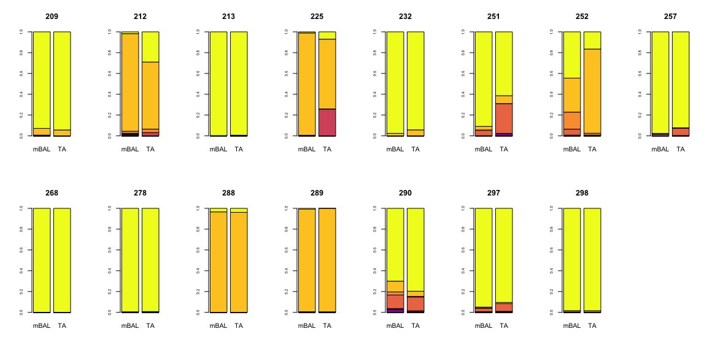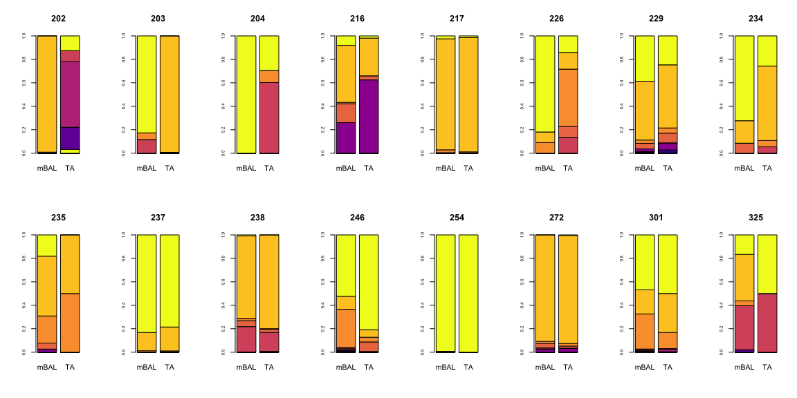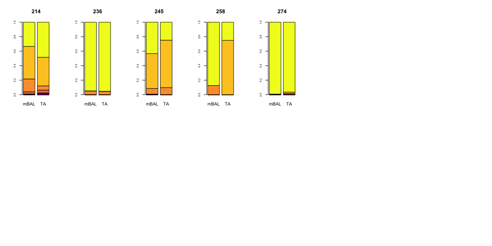

``` r
# dev.off()  
```

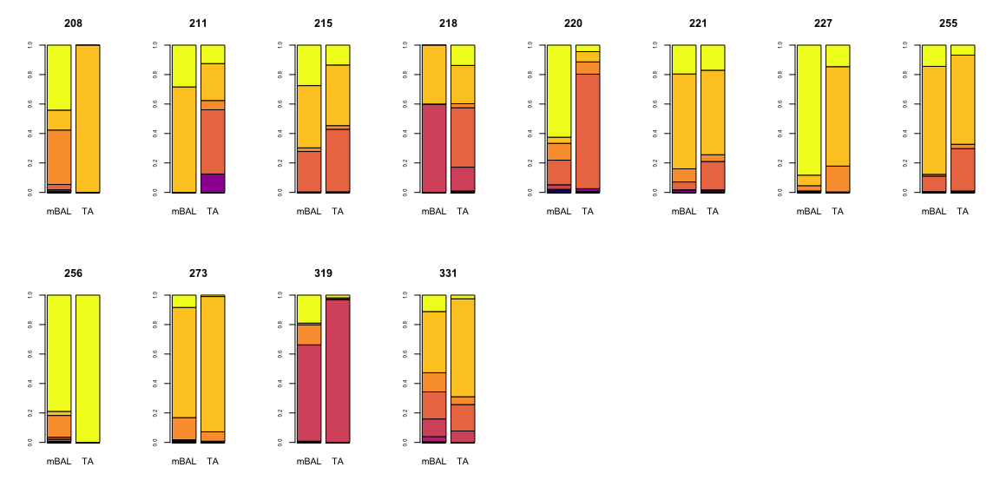

Repeat the barplot with legend.

``` r
if(generate_pdfs){
  pdf('./output/phylum_analysis.legend.pdf')  
  barplot(as.matrix(PhyProp[,c(mbal_filename,ta_filename)]),col=plasma(10),cex.axis = .6,main=i,names.arg = c("mBAL","TA"),legend=TRUE)
}
# genus barplot
# dev.off()
```

**PHYLUM-LEVEL PEARSON CORRELATION**

``` r
if(generate_pdfs){
  pdf('./output/phylum.pearson.pdf',height=5, width=5)  
}
names(full_correlations) <- c("Group 1","Group 2", "Group 3", "Group 4")
stripchart(full_correlations,method='jitter',jitter=.1,vertical=T,col=alpha('navyblue',.6),pch=16,cex=2,main="Pearson Correlation by Patient Group",xlab="Patient Group", ylab="Pearson Correlation")
```

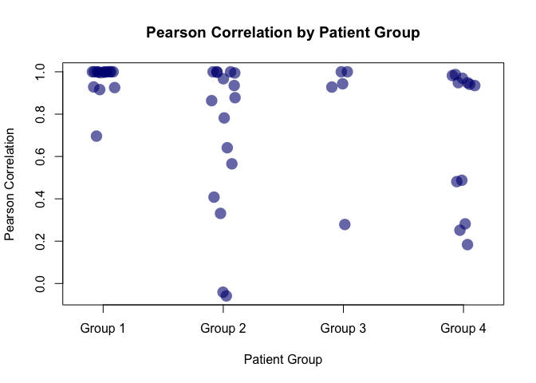

``` r
# dev.off()
```

Difference in the phylum-level pearson correlation between infxn and no infxn:

``` r
wilcox.test(full_correlations[[1]],full_correlations[[4]])
```

    ## 
    ##  Wilcoxon rank sum test
    ## 
    ## data:  full_correlations[[1]] and full_correlations[[4]]
    ## W = 152, p-value = 0.001739
    ## alternative hypothesis: true location shift is not equal to 0

Overall correlation is variable

    ## [1] "mean pearson correlation over all group:  0.79721059067114"

    ## [1] "sd pearson corr over all groups:  0.304583543472195"

...but correlation in group 1 is much higher than correlation in group 4

    ## [1] "mean pearson correlation over group1:  0.963833504909041"

    ## [1] "sd pearson corr over group 1:  0.0804087227611593"

**PHYLUM-LVEL BRAY-CURTIS**

``` r
if(generate_pdfs){
  pdf('./output/phylum.bc.pdf',height=5, width=5)  
}
# there is a significant difference in the phylum-level BC dist between infxn and no infxn
names(full_bc) <- c("Group 1","Group 2", "Group 3", "Group 4")
stripchart(full_bc,method='jitter',jitter=.1,vertical=T,col=alpha('navyblue',.6),pch=16,cex=2,main="Bray Curtis Similarity by Patient Group",xlab="Patient Group", ylab="Bray Curtis Similarity")
```


``` r
# dev.off()
```

``` r
wilcox.test(full_bc[[1]],full_bc[[4]])
```

    ## 
    ##  Wilcoxon rank sum test
    ## 
    ## data:  full_bc[[1]] and full_bc[[4]]
    ## W = 27, p-value = 0.001421
    ## alternative hypothesis: true location shift is not equal to 0

Overall BC is variable

    ## [1] "mean BC over all group:  0.28497583269764"

    ## [1] "sd BC over all groups:  0.288731307267443"

But BC in group 1 is much higher than correlation in group 4

    ## [1] "mean BC over group1:  0.112809157572808"

    ## [1] "sd BC over group1 :  0.157649843597298"

**PHYLUM-LEVEL SIMPSONS DIVERSITY**

``` r
# there is no significant difference in the phylum-level simpsons diversity comparing TA to mBAL in any group
print(wilcox.test(full_simpsons[[1]],full_simpsons[[2]]))
```

    ## 
    ##  Wilcoxon rank sum test
    ## 
    ## data:  full_simpsons[[1]] and full_simpsons[[2]]
    ## W = 91, p-value = 0.3892
    ## alternative hypothesis: true location shift is not equal to 0

``` r
print(wilcox.test(full_simpsons[[3]],full_simpsons[[4]]))
```

    ## 
    ##  Wilcoxon rank sum test with continuity correction
    ## 
    ## data:  full_simpsons[[3]] and full_simpsons[[4]]
    ## W = 120.5, p-value = 0.7919
    ## alternative hypothesis: true location shift is not equal to 0

``` r
print(wilcox.test(full_simpsons[[5]],full_simpsons[[6]]))
```

    ## 
    ##  Wilcoxon rank sum test
    ## 
    ## data:  full_simpsons[[5]] and full_simpsons[[6]]
    ## W = 13, p-value = 1
    ## alternative hypothesis: true location shift is not equal to 0

``` r
print(wilcox.test(full_simpsons[[7]],full_simpsons[[8]]))
```

    ## 
    ##  Wilcoxon rank sum test
    ## 
    ## data:  full_simpsons[[7]] and full_simpsons[[8]]
    ## W = 82, p-value = 0.5899
    ## alternative hypothesis: true location shift is not equal to 0

``` r
print(wilcox.test(c(full_simpsons[[1]],full_simpsons[[3]],full_simpsons[[5]],full_simpsons[[7]]),c(full_simpsons[[2]],full_simpsons[[4]],full_simpsons[[6]],full_simpsons[[8]])))
```

    ## 
    ##  Wilcoxon rank sum test with continuity correction
    ## 
    ## data:  c(full_simpsons[[1]], full_simpsons[[3]], full_simpsons[[5]],  and c(full_simpsons[[2]], full_simpsons[[4]], full_simpsons[[6]],     full_simpsons[[7]]) and     full_simpsons[[8]])
    ## W = 1155, p-value = 0.9854
    ## alternative hypothesis: true location shift is not equal to 0

``` r
# there is a significant difference in phylum-level simpsons diversity comparing G1 to G4 in mBAL (p =)
print(wilcox.test(full_simpsons[[1]],full_simpsons[[7]]))
```

    ## 
    ##  Wilcoxon rank sum test
    ## 
    ## data:  full_simpsons[[1]] and full_simpsons[[7]]
    ## W = 16, p-value = 0.0001035
    ## alternative hypothesis: true location shift is not equal to 0

``` r
# the significance in phylum-level simpsons diversity between G1 and G4 in TA is not maintained (p = .07)
print(wilcox.test(full_simpsons[[2]],full_simpsons[[8]]))
```

    ## 
    ##  Wilcoxon rank sum test
    ## 
    ## data:  full_simpsons[[2]] and full_simpsons[[8]]
    ## W = 51, p-value = 0.05945
    ## alternative hypothesis: true location shift is not equal to 0

``` r
if(generate_pdfs){
  pdf('./output/phylum.simpsons.pdf',height=5, width=5)
}
names(full_simpsons) <- c("Group 1\nMBAL","Group 1\nTA", "Group 2\nMBAL","Group 2\nTA", "Group 3\nMBAL","Group 3\nTA", "Group 4\nMBAL","Group 4\nTA")
boxplot(full_simpsons,cex.axis=.5,main="Simpsons Diversity by Sample Type and Patient Group",xlab="Patient Group", ylab="Simpsons Diversity Index",cex.main=.8)
stripchart(full_simpsons,method='jitter',jitter=.1,vertical=T,col=alpha('navyblue',.6),pch=16,cex=1,add=T)
```

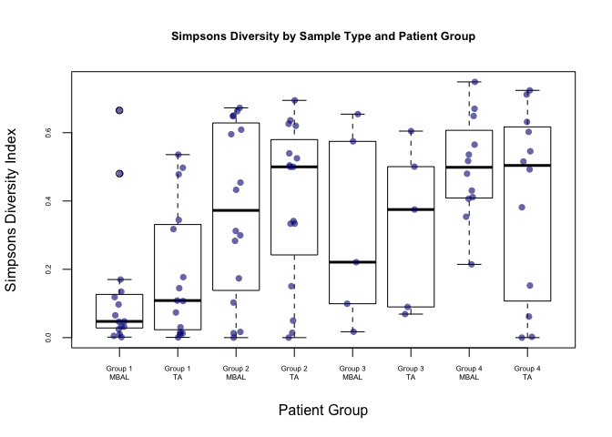

``` r
# dev.off()
```

    ## [1] "mean/sd SDI mBAL Group 1:"

    ## [1] 0.1287243

    ## [1] 0.1902094

    ## [1] "mean/sd SDI TA Group 1:"

    ## [1] 0.190295

    ## [1] 0.1931278

    ## [1] "mean/sd SDI mBAL Group 4:"

    ## [1] 0.498559

    ## [1] 0.1487604

    ## [1] "mean/sd SDI TA Group 4:"

    ## [1] 0.4017825

    ## [1] 0.2753845

**PHYLUM-LEVEL RICHNESS**

``` r
# there is no significant difference in the phylum-level richness diversity comparing TA to mBAL in any group
print(wilcox.test(full_richness[[1]],full_richness[[2]]))
```

    ## 
    ##  Wilcoxon rank sum test with continuity correction
    ## 
    ## data:  full_richness[[1]] and full_richness[[2]]
    ## W = 111, p-value = 0.9665
    ## alternative hypothesis: true location shift is not equal to 0

``` r
print(wilcox.test(full_richness[[3]],full_richness[[4]]))
```

    ## 
    ##  Wilcoxon rank sum test with continuity correction
    ## 
    ## data:  full_richness[[3]] and full_richness[[4]]
    ## W = 121.5, p-value = 0.8185
    ## alternative hypothesis: true location shift is not equal to 0

``` r
print(wilcox.test(full_richness[[5]],full_richness[[6]]))
```

    ## 
    ##  Wilcoxon rank sum test with continuity correction
    ## 
    ## data:  full_richness[[5]] and full_richness[[6]]
    ## W = 14, p-value = 0.8315
    ## alternative hypothesis: true location shift is not equal to 0

``` r
print(wilcox.test(full_richness[[7]],full_richness[[8]]))
```

    ## 
    ##  Wilcoxon rank sum test with continuity correction
    ## 
    ## data:  full_richness[[7]] and full_richness[[8]]
    ## W = 70, p-value = 0.9301
    ## alternative hypothesis: true location shift is not equal to 0

``` r
print(wilcox.test(c(full_richness[[1]],full_richness[[3]],full_richness[[5]],full_richness[[7]]),c(full_richness[[2]],full_richness[[4]],full_richness[[6]],full_richness[[8]])))
```

    ## 
    ##  Wilcoxon rank sum test with continuity correction
    ## 
    ## data:  c(full_richness[[1]], full_richness[[3]], full_richness[[5]],  and c(full_richness[[2]], full_richness[[4]], full_richness[[6]],     full_richness[[7]]) and     full_richness[[8]])
    ## W = 1135, p-value = 0.9027
    ## alternative hypothesis: true location shift is not equal to 0

``` r
# there is NO significant difference in phylum-level richness diversity comparing G1 to G4 in mBAL 
print(wilcox.test(full_richness[[1]],full_richness[[7]]))
```

    ## 
    ##  Wilcoxon rank sum test with continuity correction
    ## 
    ## data:  full_richness[[1]] and full_richness[[7]]
    ## W = 65, p-value = 0.2255
    ## alternative hypothesis: true location shift is not equal to 0

``` r
# there is NO significant difference in phylum-level richness diversity comparing G1 to G4 in TA
print(wilcox.test(full_richness[[2]],full_richness[[8]]))
```

    ## 
    ##  Wilcoxon rank sum test with continuity correction
    ## 
    ## data:  full_richness[[2]] and full_richness[[8]]
    ## W = 76, p-value = 0.507
    ## alternative hypothesis: true location shift is not equal to 0

``` r
#mBAL richness summary
print(summary(c(full_richness[[1]],full_richness[[3]],full_richness[[5]],full_richness[[7]])))
```

    ##    Min. 1st Qu.  Median    Mean 3rd Qu.    Max. 
    ##   1.000   3.750   5.000   5.562   6.000  22.000

``` r
# TA richness summary
print(summary(c(full_richness[[2]],full_richness[[4]],full_richness[[6]],full_richness[[8]])))
```

    ##    Min. 1st Qu.  Median    Mean 3rd Qu.    Max. 
    ##   1.000   4.000   5.000   5.562   7.000  14.000

``` r
if(generate_pdfs){
  pdf('./output/phylum.richness.pdf',height=5, width=5)
}
names(full_richness) <- c("Group 1\nMBAL","Group 1\nTA", "Group 2\nMBAL","Group 2\nTA", "Group 3\nMBAL","Group 3\nTA", "Group 4\nMBAL","Group 4\nTA")
boxplot(full_richness,cex.axis=.5,main="Richness by Sample Type and Patient Group",xlab="Patient Group", ylab="Richness",cex.main=.8)
stripchart(full_richness,method='jitter',jitter=.1,vertical=T,col=alpha('navyblue',.6),pch=16,cex=1,add=T)
```

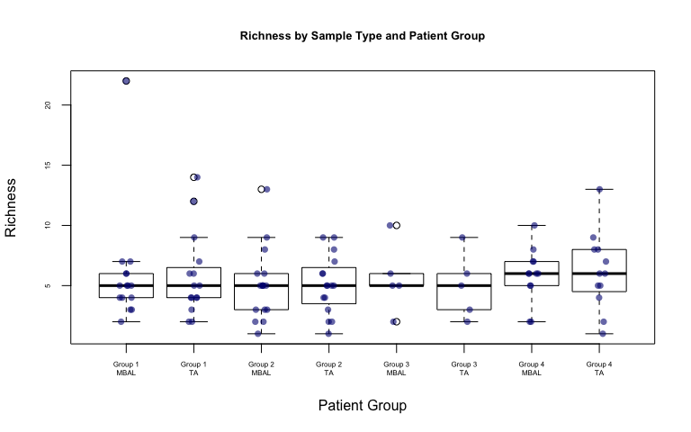

``` r
# dev.off()
```

    ## [1] "mean/sd richness mBAL Group 1:"

    ## [1] 5.866667

    ## [1] 4.688385

    ## [1] "mean/sd richness TA Group 1:"

    ## [1] 5.8

    ## [1] 3.468223

    ## [1] "mean/sd richness mBAL Group 4:"

    ## [1] 5.833333

    ## [1] 2.249579

    ## [1] "mean/sd richness TA Group 4:"

    ## [1] 6.166667

    ## [1] 3.21455

**MICROBES THAT ARE STATISTICALLY DIFFERENT BETWEEN GROUP 1 AND GROUP 4**

``` r
# there are significant differences in phylum-level proportions in Bacteroidetes, Actinobacteria, and Proteobacteria.
par(mfrow=c(1,5))
for(i in rownames(PhyProp)){
  pg1v4 <- wilcox.test(as.numeric(PhyProp[c(i),names(PhyProp) %in% as.character(unlist(metadata[metadata$effective_group == 1,][,c("mBAL_DNAseq_filename","TA_DNAseq_filename")]))]),
as.numeric(PhyProp[c(i),names(PhyProp) %in% as.character(unlist(metadata[metadata$effective_group == 4,][,c("mBAL_DNAseq_filename","TA_DNAseq_filename")]))]))$p.value
  if(!is.na(pg1v4) && pg1v4 < .05){
    if(generate_pdfs){
      pdf(paste('./output/',i,'.reads.TA.pdf',sep=''),height=5, width=5)
    }
    stripchart(list(as.numeric(PhyProp[c(i),names(PhyProp) %in% as.character(unlist(metadata[metadata$effective_group == 1,][,c("TA_DNAseq_filename")]))]),
                    as.numeric(PhyProp[c(i),names(PhyProp) %in% as.character(unlist(metadata[metadata$effective_group == 2,][,c("TA_DNAseq_filename")]))]),
                    as.numeric(PhyProp[c(i),names(PhyProp) %in% as.character(unlist(metadata[metadata$effective_group == 3,][,c("TA_DNAseq_filename")]))]),
                    as.numeric(PhyProp[c(i),names(PhyProp) %in% as.character(unlist(metadata[metadata$effective_group == 4,][,c("TA_DNAseq_filename")]))])),
               method='jitter',jitter=.1,vertical=T,col=alpha('navy',.6),pch=16,cex=2,
               main=i,xlab="Patient Group", ylab="Proportion of Sample",group.names = c("Group 1 ", "Group 2", "Group 3", "Group 4"))
    #dev.off()
    
    print(i)
    # compare proteobacteria in G1 v G4
    print(pg1v4)
    # compare proteobacteria in G1 TA v G1 MBAL
    print(wilcox.test(as.numeric(PhyProp[c(i),names(PhyProp) %in% as.character(unlist(metadata[metadata$effective_group == 1,][,c("TA_DNAseq_filename")]))]),
    as.numeric(PhyProp[c(i),names(PhyProp) %in% as.character(unlist(metadata[metadata$effective_group == 1,][,c("mBAL_DNAseq_filename")]))]))$p.value)
    # compare proteobacteria in G4 TA v G4 MBAL
    print(wilcox.test(as.numeric(PhyProp[c(i),names(PhyProp) %in% as.character(unlist(metadata[metadata$effective_group == 4,][,c("TA_DNAseq_filename")]))]),
    as.numeric(PhyProp[c(i),names(PhyProp) %in% as.character(unlist(metadata[metadata$effective_group == 4,][,c("mBAL_DNAseq_filename")]))]))$p.value)
  }
}
```

    ## [1] "other"
    ## [1] 0.03634539
    ## [1] 0.4147255
    ## [1] 1

    ## [1] "Ascomycota"
    ## [1] 0.01257674
    ## [1] 0.2694874
    ## [1] 0.789575

    ## [1] "Bacteroidetes"
    ## [1] 0.01925712
    ## [1] 0.4887675
    ## [1] 0.1884604

    ## [1] "Actinobacteria"
    ## [1] 0.0001699252
    ## [1] 0.2444328
    ## [1] 0.2355633

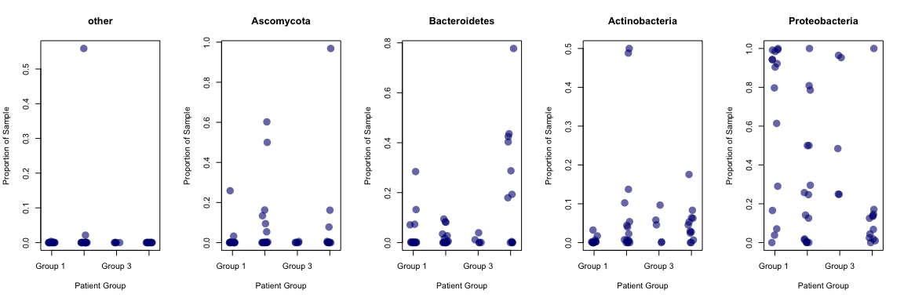

    ## [1] "Proteobacteria"
    ## [1] 0.002672723
    ## [1] 0.8381348
    ## [1] 0.03262561

**MICROBES THAT ARE STATISTICALLY DIFFERENT BETWEEN TA AND MBAL**

``` r
par(mfrow=c(1,5))
# there are significant differences in phylum-level proportions in Bacteroidetes, Actinobacteria, and Proteobacteria.
for(i in rownames(PhyProp)){
  pg1v4 <- wilcox.test(as.numeric(PhyProp[c(i),names(PhyProp) %in% as.character(unlist(metadata[,c("TA_DNAseq_filename")]))]),
                    as.numeric(PhyProp[c(i),names(PhyProp) %in% as.character(unlist(metadata[,c("mBAL_DNAseq_filename")]))]))$p.value
  if(!is.na(pg1v4) && pg1v4 < .05){
    
    if(generate_pdfs){
      pdf(paste('./output/',i,'.mBAL_TA.reads.pdf',sep=''),height=5, width=5)
    }
    stripchart(list(as.numeric(PhyProp[c(i),names(PhyProp) %in% as.character(unlist(metadata[,c("TA_DNAseq_filename")]))]),
                    as.numeric(PhyProp[c(i),names(PhyProp) %in% as.character(unlist(metadata[,c("mBAL_DNAseq_filename")]))])),
               method='jitter',jitter=.1,vertical=T,col=alpha('navy',.6),pch=16,cex=2,
               main=i,xlab="Patient Group", ylab="Proportion of Sample",group.names = c("TA ", "mBAL"))
    # dev.off()
    print(i)
    # compare proteobacteria in G1 v G4
    print(pg1v4)
    # compare proteobacteria in G1 TA v G1 MBAL
  }
}
```

    ## [1] "Deinococcus-Thermus"
    ## [1] 0.006828923

    ## [1] "Basidiomycota"
    ## [1] 0.02663082

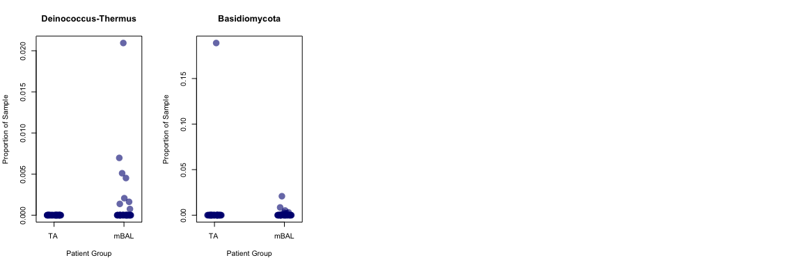

### REPLICATE PHYLUM WITH GENUS DATA

``` r
all_microbe_data.microbes.norm <- t(t(all_microbe_data)/colSums(all_microbe_data))
all_microbe_data.microbes.norm[all_microbe_data.microbes.norm<.01] <- 0
new <- rbind(all_microbe_data.microbes.norm, c(1-colSums(all_microbe_data.microbes.norm)))
rownames(new) <- c(rownames(all_microbe_data.microbes.norm),"Other")
all_microbe_data <- new

all_microbe_data <- all_microbe_data[order(rowSums(all_microbe_data),decreasing=F),]
all_microbe_data <- all_microbe_data[,!is.na(colSums(all_microbe_data))]
mbal_phyla <- all_microbe_data[,colnames(all_microbe_data) %in% MBAL]
#barplot(as.matrix(mbal_phyla),col=rainbow(10),las=2)
ta_phyla <- all_microbe_data[,colnames(all_microbe_data) %in% TA]

if(generate_pdfs){
  pdf('./output/genus_analysis.pdf',width=16,height=6)
}

full_correlations <- vector("list",length=4)
full_bc <- vector("list",length=4)
full_jaccard <- vector("list", length=4)
full_simpsons <- vector("list",length=8) #separate by TA and mBAL for each group
full_richness <- vector("list",length=8)
for(j in c(1,2,3,4)){
  
  correlations <- c()
  bc_dist <- c()
  ta_sdi <- c()
  mbal_sdi <- c()
  names <- c()
  mbal_richness <- c()
  ta_richness <- c()
  jaccard <- c()
  par(mfrow=c(2,8))
  
  for( i in rownames(metadata)){
  mbal_filename <- as.character(metadata[rownames(metadata) == i,]$mBAL_DNAseq_filename)
  ta_filename <- as.character(metadata[rownames(metadata) == i,]$TA_DNAseq_filename)
  
  if(!is.na(metadata[rownames(metadata) == i,]$effective_group)){
    
    if(metadata[rownames(metadata) == i,]$effective_group == j){
    
      # print(mbal_filename)
      # print(ta_filename)
      
      # genus barplot
      barplot(as.matrix(all_microbe_data[,c(mbal_filename,ta_filename)]),col=plasma(10),cex.axis = .6,main=i,names.arg = c("mBAL","TA"))
      
      # pearson correlation - 1 per patient
      correlations <- c(correlations,cor(all_microbe_data[,c(mbal_filename)],all_microbe_data[,c(ta_filename)]))
      
      # bray-curtis distance - 1 per patient
      bray_curtis_dist <- vegdist(t(as.matrix(all_microbe_data[,c(mbal_filename,ta_filename)])), method="bray", binary=FALSE, diag=FALSE, upper=TRUE, na.rm = FALSE)
      bc_dist <- c(bc_dist, bray_curtis_dist[1])
      
      # SDI - 1 per sample ( 2 per patient )
      ta_sdi <- c(ta_sdi,diversity(all_microbe_data[,c(ta_filename)],index="simpson") )
      mbal_sdi <- c(mbal_sdi, diversity(all_microbe_data[,c(mbal_filename)],index="simpson"))
      
      # jaccard - 1 per patient
      jaccard_dist <- vegdist(t(as.matrix(all_microbe_data[,c(mbal_filename,ta_filename)])),method = "jaccard",binary = FALSE,diag = FALSE,upper = TRUE,na.rm = FALSE)
      jaccard <- c(jaccard, jaccard_dist[1])
      
      # richness - 1 per sample ( 2 per patient )
      mbal_richness <- c(mbal_richness, length(all_microbe_data[,c(mbal_filename)][all_microbe_data[,c(mbal_filename)]>0]))
      ta_richness <- c(ta_richness, length(all_microbe_data[,c(ta_filename)][all_microbe_data[,c(ta_filename)]>0]))
      
      names <- c(names,rownames(metadata[rownames(metadata) == i,]))
    }  
  }
}
full_correlations[[j]] <- correlations
full_bc[[j]] <- bc_dist
full_jaccard[[j]] <- jaccard

full_simpsons[[j + (j-1)]] <- mbal_sdi
full_simpsons[[j+1+(j-1)]] <- ta_sdi

full_richness[[j + (j-1)]] <- mbal_richness
full_richness[[j+1+(j-1)]] <- ta_richness

}
```

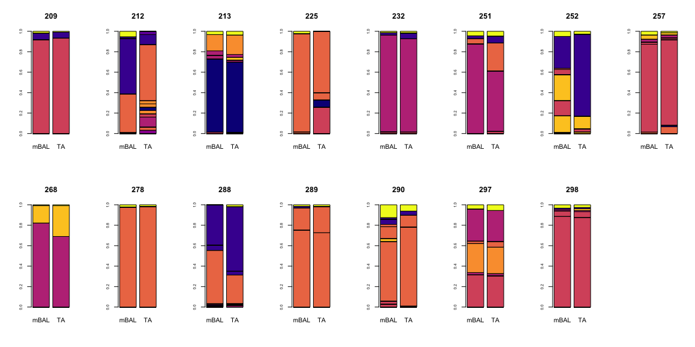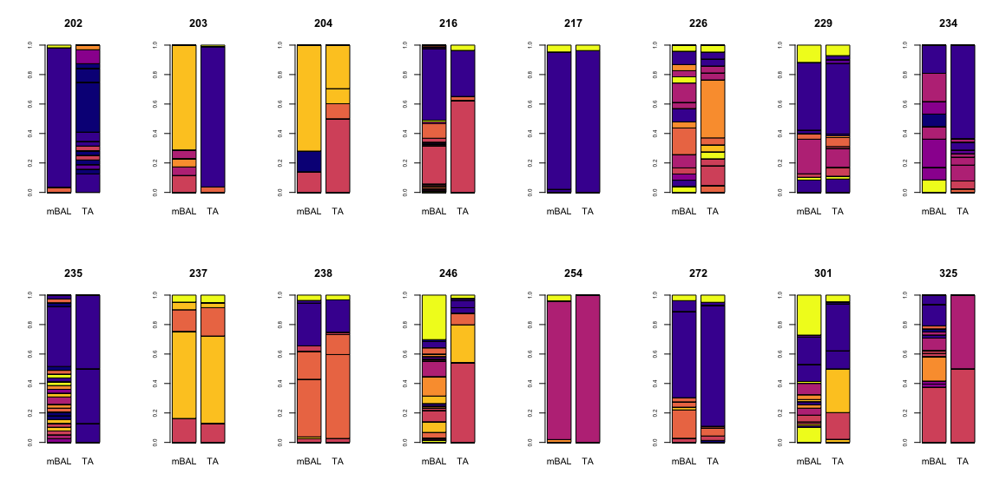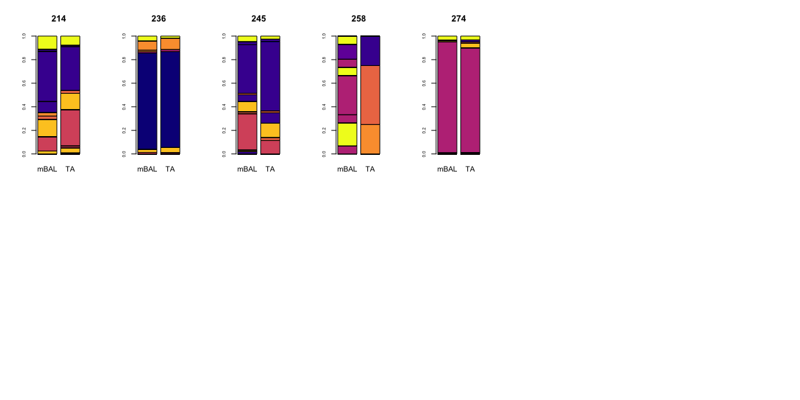

``` r
# dev.off()
```

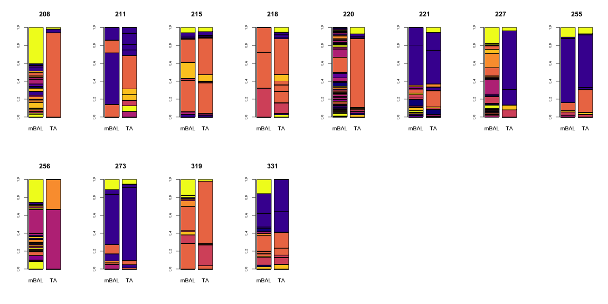

Replicated the barplot including the legend.

``` r
if(generate_pdfs){
  pdf('./output/genus_analysis.legend.pdf')
  barplot(as.matrix(all_microbe_data[,c(mbal_filename,ta_filename)]),col=plasma(10),cex.axis = .6,main=i,names.arg = c("mBAL","TA"),legend=TRUE)
}
# genus barplot
# dev.off()
```

Difference in the genus-level pearson correlation between infxn and no infxn

``` r
if(generate_pdfs){
  pdf('./output/genus.pearson.pdf',height=5, width=5)
}
names(full_correlations) <- c("Group 1","Group 2", "Group 3", "Group 4")
stripchart(full_correlations,method='jitter',jitter=.1,vertical=T,col=alpha('navyblue',.6),pch=16,cex=2,main="Pearson Correlation by Patient Group",xlab="Patient Group", ylab="Pearson Correlation")
```

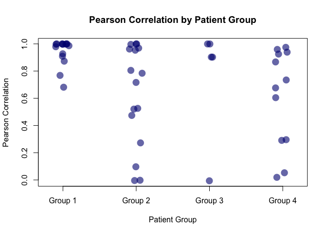

``` r
# dev.off()
wilcox.test(full_correlations[[1]],full_correlations[[4]])
```

Overall correlation is variable

    ## [1] "mean pearson correlation over all group:  0.735695562806887"

    ## [1] "sd pearson corr over all groups:  0.337206695510076"

But correlation in group 1 is much higher than correlation in group 4

    ## [1] "mean pearson correlation over group1:  0.94079657255017"

    ## [1] "sd pearson corr over group 1:  0.0975453231275154"

    ## [1] "mean pearson correlation over group2:  0.629137512470567"

    ## [1] "sd pearson corr over group 2:  0.370552766412696"

    ## [1] "mean pearson correlation over group3:  0.759453361548765"

    ## [1] "sd pearson corr over group 3:  0.430782986689189"

    ## [1] "mean pearson correlation over group4:  0.611497618267094"

    ## [1] "sd pearson corr over group 4:  0.357840906747363"

Summary of Pearson Correlation

``` r
print(summary(unlist(full_correlations)))
```

    ##      Min.   1st Qu.    Median      Mean   3rd Qu.      Max. 
    ## -0.006301  0.584947  0.905905  0.735696  0.996067  0.999978

**GENUS-LEVEL BRAY-CURTIST DISTANCE**

``` r
if(generate_pdfs){
  pdf('./output/genus.bc.pdf',height=5, width=5)
}
# there is a significant difference in the genus-level BC dist between infxn and no infxn
names(full_bc) <- c("Group 1","Group 2", "Group 3", "Group 4")
stripchart(full_bc,method='jitter',jitter=.1,vertical=T,col=alpha('navyblue',.6),pch=16,cex=2,main="Bray Curtis Similarity by Patient Group",xlab="Patient Group", ylab="Bray Curtis Similarity")
```

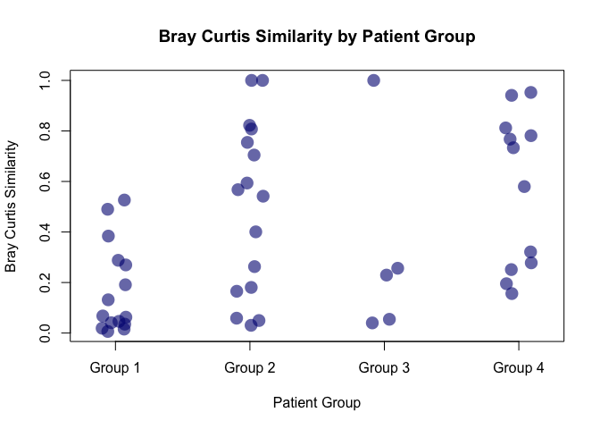

``` r
# dev.off()
wilcox.test(full_bc[[1]],full_bc[[4]])
```

    ## 
    ##  Wilcoxon rank sum test
    ## 
    ## data:  full_bc[[1]] and full_bc[[4]]
    ## W = 23, p-value = 0.0006006
    ## alternative hypothesis: true location shift is not equal to 0

Overall Bray-Curtis is variable

    ## [1] "mean BC over all group:  0.393007306068178"

    ## [1] "sd BC over all groups:  0.328985388720588"

But Bray-Curtis in group 1 is much higher than correlation in group 4

    ## [1] "mean BC over group1:  0.171627447394438"

    ## [1] "sd BC over group1 :  0.178554788848238"

    ## [1] "mean bray curtis over group2:  0.496277447385316"

    ## [1] "sd pearson corr over group 2:  0.338405659266242"

    ## [1] "mean bray curtis over group3:  0.316096641280782"

    ## [1] "sd pearson corr over group 3:  0.394780460591729"

    ## [1] "mean bray curtis over group4:  0.564084717982248"

    ## [1] "sd pearson corr over group 4:  0.30343342242816"

Summary of bray curtis

``` r
print(summary(unlist(full_bc)))
```

    ##     Min.  1st Qu.   Median     Mean  3rd Qu.     Max. 
    ## 0.006363 0.066407 0.273748 0.393007 0.711772 1.000000

**GENUS-LEVEL JACCARD SIMILARITY**

``` r
if(generate_pdfs){
  pdf('./output/genus.jaccard.pdf',height=5, width=5)
}
# there is a significant difference in the genus-level jaccard dist between infxn and no infxn
names(full_jaccard) <- c("Group 1","Group 2", "Group 3", "Group 4")
stripchart(full_jaccard,method='jitter',jitter=.1,vertical=T,col=alpha('navyblue',.6),pch=16,cex=2,main="Jaccard Similarity by Patient Group",xlab="Patient Group", ylab="Jaccard Similarity")
```

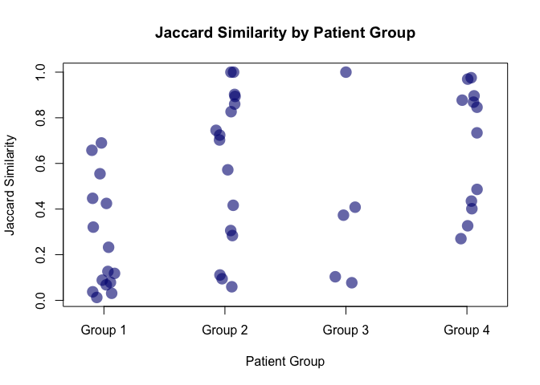

``` r
# dev.off()
wilcox.test(full_jaccard[[1]],full_jaccard[[4]])
```

    ## 
    ##  Wilcoxon rank sum test
    ## 
    ## data:  full_jaccard[[1]] and full_jaccard[[4]]
    ## W = 23, p-value = 0.0006006
    ## alternative hypothesis: true location shift is not equal to 0

Overall jaccard is variable

    ## [1] "mean jaccard over all group:  0.48823387496421"

    ## [1] "sd jaccard over all groups:  0.333721026794367"

But jaccard in group 1 is much higher than correlation in group 4

    ## [1] "mean jaccard over group1:  0.259225816399691"

    ## [1] "sd jaccard over group1 :  0.238539021357383"

    ## [1] "mean jaccard over group2:  0.593623570714054"

    ## [1] "sd jaccard over group 2:  0.333731173990435"

    ## [1] "mean jaccard over group3:  0.392382567210104"

    ## [1] "sd jaccard over group 3:  0.37174015712781"

    ## [1] "mean jaccard over group4:  0.673912398734276"

    ## [1] "sd jaccard over group 4:  0.268042869186135"

Summary of jaccard

``` r
print(summary(unlist(full_jaccard)))
```

    ##    Min. 1st Qu.  Median    Mean 3rd Qu.    Max. 
    ## 0.01265 0.12454 0.42981 0.48823 0.83156 1.00000

**GENUS-LEVEL SIMPSONS DIVERSITY**

Difference in the genus-level simpsons diversity comparing TA to mBAL in any group

``` r
print(wilcox.test(full_simpsons[[1]],full_simpsons[[2]])) # dif btwn TA and mBAL SDI in group 1 
```

    ## 
    ##  Wilcoxon rank sum test
    ## 
    ## data:  full_simpsons[[1]] and full_simpsons[[2]]
    ## W = 102, p-value = 0.6827
    ## alternative hypothesis: true location shift is not equal to 0

``` r
print(wilcox.test(full_simpsons[[3]],full_simpsons[[4]])) # dif btwn TA and mBAL SDI in group 2
```

    ## 
    ##  Wilcoxon rank sum test
    ## 
    ## data:  full_simpsons[[3]] and full_simpsons[[4]]
    ## W = 165, p-value = 0.1713
    ## alternative hypothesis: true location shift is not equal to 0

``` r
print(wilcox.test(full_simpsons[[5]],full_simpsons[[6]])) # dif btwn TA and mBAL SDI in group 3
```

    ## 
    ##  Wilcoxon rank sum test
    ## 
    ## data:  full_simpsons[[5]] and full_simpsons[[6]]
    ## W = 15, p-value = 0.6905
    ## alternative hypothesis: true location shift is not equal to 0

``` r
print(wilcox.test(full_simpsons[[7]],full_simpsons[[8]])) # dif btwn TA and mBAL SDI in group 4
```

    ## 
    ##  Wilcoxon rank sum test
    ## 
    ## data:  full_simpsons[[7]] and full_simpsons[[8]]
    ## W = 113, p-value = 0.01727
    ## alternative hypothesis: true location shift is not equal to 0

``` r
print(wilcox.test(c(full_simpsons[[1]],full_simpsons[[3]],full_simpsons[[5]],full_simpsons[[7]]),
                  c(full_simpsons[[2]],full_simpsons[[4]],full_simpsons[[6]],full_simpsons[[8]]))) # dif btwn TA and mBAL SDI across ALL Groups
```

    ## 
    ##  Wilcoxon rank sum test
    ## 
    ## data:  c(full_simpsons[[1]], full_simpsons[[3]], full_simpsons[[5]],  and c(full_simpsons[[2]], full_simpsons[[4]], full_simpsons[[6]],     full_simpsons[[7]]) and     full_simpsons[[8]])
    ## W = 1396, p-value = 0.07429
    ## alternative hypothesis: true location shift is not equal to 0

Difference in genus-level simpsons diversity comparing G1 to G4 in mBAL (p =)

    ## 
    ##  Wilcoxon rank sum test
    ## 
    ## data:  full_simpsons[[1]] and full_simpsons[[7]]
    ## W = 14, p-value = 5.81e-05
    ## alternative hypothesis: true location shift is not equal to 0

Significance in genus-level simpsons diversity between G1 and G4 in TA is not maintained (p = .07)

    ## 
    ##  Wilcoxon rank sum test
    ## 
    ## data:  full_simpsons[[2]] and full_simpsons[[8]]
    ## W = 51, p-value = 0.05945
    ## alternative hypothesis: true location shift is not equal to 0

Summary of Simpsons Diversity in mBAL

    ##    Min. 1st Qu.  Median    Mean 3rd Qu.    Max. 
    ## 0.04211 0.31728 0.63670 0.56077 0.79656 0.94782

Summary of Simpsons Diversity in TA

    ##    Min. 1st Qu.  Median    Mean 3rd Qu.    Max. 
    ##  0.0000  0.3292  0.5261  0.4884  0.6494  0.8387

``` r
if(generate_pdfs){
  pdf('./output/genus.simpsons.pdf',height=5, width=5)
}
names(full_simpsons) <- c("Group 1\nMBAL","Group 1\nTA", "Group 2\nMBAL","Group 2\nTA", "Group 3\nMBAL","Group 3\nTA", "Group 4\nMBAL","Group 4\nTA")
boxplot(full_simpsons,cex.axis=.5,main="Simpsons Diversity by Sample Type and Patient Group",xlab="Patient Group", ylab="Simpsons Diversity Index",cex.main=.8)
stripchart(full_simpsons,method='jitter',jitter=.1,vertical=T,col=alpha('navyblue',.6),pch=16,cex=1,add=T)
```


``` r
# dev.off()
```

    ## [1] "mean/sd SDI mBAL Group 1:"

    ## [1] 0.3640326

    ## [1] 0.2421732

    ## [1] "mean/sd SDI TA Group 1:"

    ## [1] 0.3968707

    ## [1] 0.2040843

    ## [1] "mean/sd SDI mBAL Group 4:"

    ## [1] 0.7550409

    ## [1] 0.1373653

    ## [1] "mean/sd SDI TA Group 4:"

    ## [1] 0.5593447

    ## [1] 0.2205107

**GENUS-LEVEL RICHNESS**

There is no significant difference in the genus-level richness comparing TA to mBAL in any single group

    ## 
    ##  Wilcoxon rank sum test with continuity correction
    ## 
    ## data:  full_richness[[1]] and full_richness[[2]]
    ## W = 108.5, p-value = 0.8832
    ## alternative hypothesis: true location shift is not equal to 0

    ## 
    ##  Wilcoxon rank sum test with continuity correction
    ## 
    ## data:  full_richness[[3]] and full_richness[[4]]
    ## W = 175, p-value = 0.07816
    ## alternative hypothesis: true location shift is not equal to 0

    ## 
    ##  Wilcoxon rank sum test with continuity correction
    ## 
    ## data:  full_richness[[5]] and full_richness[[6]]
    ## W = 17, p-value = 0.3991
    ## alternative hypothesis: true location shift is not equal to 0

    ## 
    ##  Wilcoxon rank sum test with continuity correction
    ## 
    ## data:  full_richness[[7]] and full_richness[[8]]
    ## W = 106.5, p-value = 0.0489
    ## alternative hypothesis: true location shift is not equal to 0

But, there is significant difference in the richness when you combine across groups!!!

``` r
print(wilcox.test(c(full_richness[[1]],full_richness[[3]],full_richness[[5]],full_richness[[7]]),
                  c(full_richness[[2]],full_richness[[4]],full_richness[[6]],full_richness[[8]])))
```

    ## 
    ##  Wilcoxon rank sum test with continuity correction
    ## 
    ## data:  c(full_richness[[1]], full_richness[[3]], full_richness[[5]],  and c(full_richness[[2]], full_richness[[4]], full_richness[[6]],     full_richness[[7]]) and     full_richness[[8]])
    ## W = 1422.5, p-value = 0.04687
    ## alternative hypothesis: true location shift is not equal to 0

``` r
stripchart(list(c(full_richness[[1]],full_richness[[3]],full_richness[[5]],full_richness[[7]]),
                c(full_richness[[2]],full_richness[[4]],full_richness[[6]],full_richness[[8]])),
           method='jitter',jitter=.1,vertical=T,col=alpha('navyblue',.6),pch=16,cex=2,main="Pearson Correlation by Patient Group",
           xlab="Patient Group", ylab="Pearson Correlation")
```

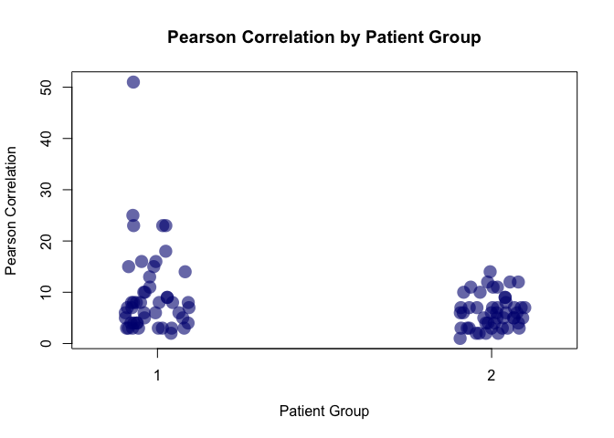

It appears that this difference in richness is driven by an outlier...

Recomputing after removing richness outlier in mBAL

The mean + 3SD of mBAL richness

``` r
original_mbal_richness <- (unlist(list(c(full_richness[[1]],full_richness[[3]],full_richness[[5]],full_richness[7]))))
outlier_threshold <- mean(original_mbal_richness) + sd(original_mbal_richness)*3
new_values <- original_mbal_richness[original_mbal_richness < outlier_threshold]
print(wilcox.test(new_values,c(full_richness[[2]],full_richness[[4]],full_richness[[6]],full_richness[[8]])))
```

    ## 
    ##  Wilcoxon rank sum test with continuity correction
    ## 
    ## data:  new_values and c(full_richness[[2]], full_richness[[4]], full_richness[[6]], new_values and     full_richness[[8]])
    ## W = 1374.5, p-value = 0.06581
    ## alternative hypothesis: true location shift is not equal to 0

``` r
stripchart(list(new_values,c(full_richness[[2]],full_richness[[4]],full_richness[[6]],full_richness[[8]])),method='jitter',jitter=.1,vertical=T,col=alpha('navyblue',.6),pch=16,cex=2,main="Richness by Patient Group",xlab="Patient Group", ylab="Richness")
```

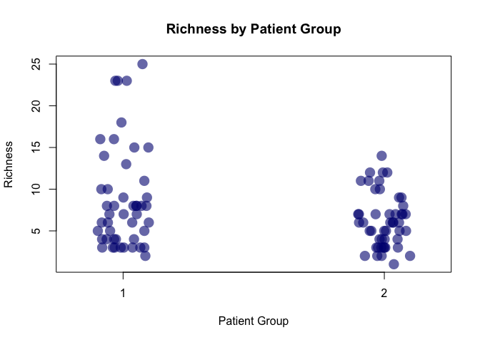

There is NO significant difference in genus-level richness diversity comparing G1 to G4 in mBAL

    ## 
    ##  Wilcoxon rank sum test with continuity correction
    ## 
    ## data:  full_richness[[1]] and full_richness[[7]]
    ## W = 26, p-value = 0.001859
    ## alternative hypothesis: true location shift is not equal to 0

There is NO significant difference in genus-level richness diversity comparing G1 to G4 in TA

    ## 
    ##  Wilcoxon rank sum test with continuity correction
    ## 
    ## data:  full_richness[[2]] and full_richness[[8]]
    ## W = 55, p-value = 0.08926
    ## alternative hypothesis: true location shift is not equal to 0

mBAL richness summary

    ##    Min. 1st Qu.  Median    Mean 3rd Qu.    Max. 
    ##   2.000   4.000   7.000   8.766  10.500  25.000

TA richness summary

    ##    Min. 1st Qu.  Median    Mean 3rd Qu.    Max. 
    ##   1.000   3.750   6.000   6.188   7.250  14.000

``` r
if(generate_pdfs){
  pdf('./output/genus.richness.pdf',height=5, width=5)
}
names(full_richness) <- c("Group 1\nMBAL","Group 1\nTA", "Group 2\nMBAL","Group 2\nTA", "Group 3\nMBAL","Group 3\nTA", "Group 4\nMBAL","Group 4\nTA")
boxplot(full_richness,cex.axis=.5,main="Richness by Sample Type and Patient Group",xlab="Patient Group", ylab="Richness",cex.main=.8)
stripchart(full_richness,method='jitter',jitter=.1,vertical=T,col=alpha('navyblue',.6),pch=16,cex=1,add=T)
```

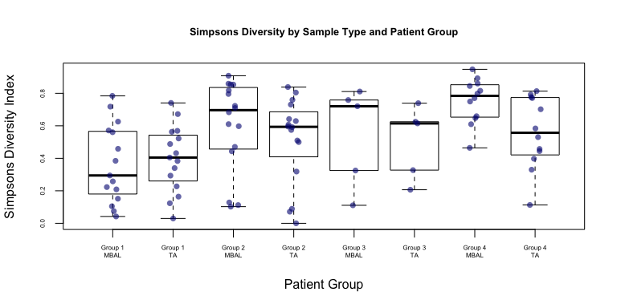

``` r
# dev.off()
```

    ## [1] "mean/sd richness mBAL Group 1:"

    ## [1] 5

    ## [1] 2

    ## [1] "mean/sd richness TA Group 1:"

    ## [1] 5.2

    ## [1] 2.274078

    ## [1] "mean/sd richness mBAL Group 4:"

    ## [1] 16.25

    ## [1] 13.23305

    ## [1] "mean/sd richness TA Group 4:"

    ## [1] 7.416667

    ## [1] 3.34279

#### Get stats for Group 1 Patients

**MINIMALIST VERSION**

``` r
relative_numbers <- FALSE
column_names <- c()
IDs <- c()
overlap_both <- c()
rank_list_mbal <- c()
rank_list_ta <- c()
cummulative_pathos <- c()

plot(c(0,3),c(0,1),main="Proportion of Sample")
for( i in rownames(metadata)){
  mbal_filename <- as.character(metadata[rownames(metadata) == i,]$mBAL_DNAseq_filename)
  ta_filename <- as.character(metadata[rownames(metadata) == i,]$TA_DNAseq_filename)
  
  if(!is.na(metadata[rownames(metadata) == i,]$effective_group)){
    if(metadata[rownames(metadata) == i,]$effective_group == 1){
      # print(mbal_filename)
      # print(ta_filename)
      
      # sort mBAL samples and get names
      mbal <- sort(group1.MBAL.microbes.norm[,c(mbal_filename)],decreasing=TRUE)
      mbal_names <- names(mbal[mbal>.01])
      
      if(ta_filename %in% colnames(group1.TA.microbes.norm)){
        
        IDs <- c(IDs,rownames(metadata[rownames(metadata) == i,]))
        
        # sort TA samples and get names
        ta <- sort(group1.TA.microbes.norm[,c(ta_filename)],decreasing=TRUE)
        ta_names <- names(ta[ta>.01])

        # get the pathogens        
        pathogens <- as.character(metadata[rownames(metadata) == i,]$microbe)
        patholist <- strsplit(pathogens,',')[[1]]
        print(patholist)
        # print(head(mbal_names))
        # print(head(ta_names))
        
        rank_mbal <- match(patholist,mbal_names) 
        rank_ta <- match(patholist,ta_names)
        # print(paste("rank mBAL",rank_mbal))
        # print(paste("rank TA",rank_ta))
        
        rank_list_mbal <- c(rank_list_mbal,rank_mbal)
        rank_list_ta <- c(rank_list_ta, rank_ta)
        cummulative_pathos <- c(cummulative_pathos, patholist)
        
        #move these lines here if you want to only include the pathogens in the barplot
        mbal_names <- mbal_names[mbal_names %in% patholist]
        ta_names <- ta_names[ta_names %in% patholist]
        
        shared <- intersect(as.vector(mbal_names), as.vector(ta_names))
        mbal_specific <- setdiff(mbal_names, ta_names) #gives the number that are present only in mbal_set
        ta_specific <-  setdiff(ta_names, mbal_names)  #gives the number that are present only in ta_set
      
        #otherwise put those lines here:
        #mbal_names <- mbal_names[mbal_names %in% patholist]
        #ta_names <- ta_names[ta_names %in% patholist]
        
        
        
        #print(intersect(shared,patholist))
        overlap_both<-c(overlap_both, length(intersect(shared,patholist)))
        if(length(intersect(shared,patholist)) == length(patholist)){
          #print("ALL FOUND")
          for(p in patholist){
            #print(ta[p])
            #print(mbal[p])
            points(c(1,2),c(ta[p],mbal[p]),type="o")
            text(c(1,2),c(ta[p],mbal[p]),p,cex=.8)
          }
        }else{
          #print("NOT ALL FOUND")
          #print(patholist)
          #print(mbal_names)
          #print(ta_names)
          #print(intersect(mbal_specific,patholist))
          #print(intersect(ta_specific,patholist))
          for(p in patholist){
            if(p %in% ta_names){
              points(c(1),c(ta[p]),pch=4)
            }
            if(p %in% mbal_names){
              points(c(2),c(mbal[p]),pch=4)
            }
          }
        }
        
        if(length(relative_numbers) < 3){
          relative_numbers <- c(length(ta_specific), length(shared), length(mbal_specific))
        }else{
          relative_numbers <- cbind(relative_numbers, c(length(ta_specific), length(shared), length(mbal_specific)) )
        }
        cbind(relative_numbers, c(ta_specific, shared, mbal_specific))  
        
        relative_numbers <- as.matrix(relative_numbers)
        rownames(relative_numbers) <- c("TA", "BOTH", "MBAL")
        column_names <- c(column_names, mbal_filename[1])
        colnames(relative_numbers) <- column_names    
        
      }
     
    }    
  }

}
```

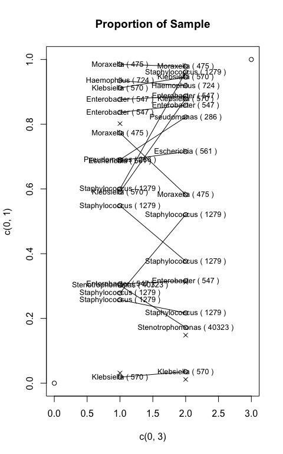

    ## [1] "Haemophilus ( 724 )"
    ## [1] "Staphylococcus ( 1279 )"
    ## [1] "Escherichia ( 561 )" "Klebsiella ( 570 )" 
    ## [1] "Staphylococcus ( 1279 )"
    ## [1] "Klebsiella ( 570 )"
    ## [1] "Klebsiella ( 570 )"
    ## [1] "Enterobacter ( 547 )"    "Staphylococcus ( 1279 )"
    ## [3] "Streptococcus ( 1301 )" 
    ## [1] "Enterobacter ( 547 )"
    ## [1] "Pseudomonas ( 286 )"        "Stenotrophomonas ( 40323 )"
    ## [1] "Moraxella ( 475 )"
    ## [1] "Staphylococcus ( 1279 )"
    ## [1] "Staphylococcus ( 1279 )"
    ## [1] "Moraxella ( 475 )"
    ## [1] "Enterobacter ( 547 )"
    ## [1] "Enterobacter ( 547 )"

Output plots

``` r
if(generate_pdfs){
  pdf('./output/pathogens_identified.pdf',width=8, height=6)
}
par(mar=c(10,3,2,2))
colnames(relative_numbers) <- IDs
barplot(relative_numbers, col=c("gray80","navyblue","gray50"),main="Microbes Identified in DNA-seq by TA and/or mBAL",legend=TRUE,cex.main=.8,ylab="# of Pathogens Cultured",xlab="Patient ID",cex.axis=.6)
```

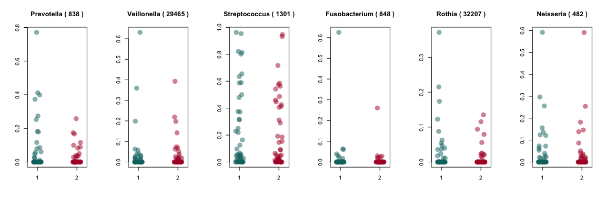

``` r
# dev.off()

print(as.data.frame(cbind(cummulative_pathos,rank_list_mbal,rank_list_ta)))
```

    ##            cummulative_pathos rank_list_mbal rank_list_ta
    ## 1         Haemophilus ( 724 )              1            1
    ## 2     Staphylococcus ( 1279 )              2            1
    ## 3         Escherichia ( 561 )              1            1
    ## 4          Klebsiella ( 570 )              4            5
    ## 5     Staphylococcus ( 1279 )              1            1
    ## 6          Klebsiella ( 570 )              1            1
    ## 7          Klebsiella ( 570 )              1            1
    ## 8        Enterobacter ( 547 )              4            3
    ## 9     Staphylococcus ( 1279 )              7         <NA>
    ## 10     Streptococcus ( 1301 )              1            1
    ## 11       Enterobacter ( 547 )              1            1
    ## 12        Pseudomonas ( 286 )              1            1
    ## 13 Stenotrophomonas ( 40323 )              2            2
    ## 14          Moraxella ( 475 )              1            1
    ## 15    Staphylococcus ( 1279 )              1            2
    ## 16    Staphylococcus ( 1279 )              2            2
    ## 17          Moraxella ( 475 )              1            1
    ## 18       Enterobacter ( 547 )              1            1
    ## 19       Enterobacter ( 547 )              1            1

``` r
write.csv(as.data.frame(cbind(cummulative_pathos,rank_list_mbal,rank_list_ta)),'./output/ranks_by_sample_type.tsv',quote=F)


par(mar=c(10,3,2,2))
barplot(t(t(relative_numbers)/colSums(relative_numbers)), col=c("gray80","navyblue","gray60"),las=2)
```

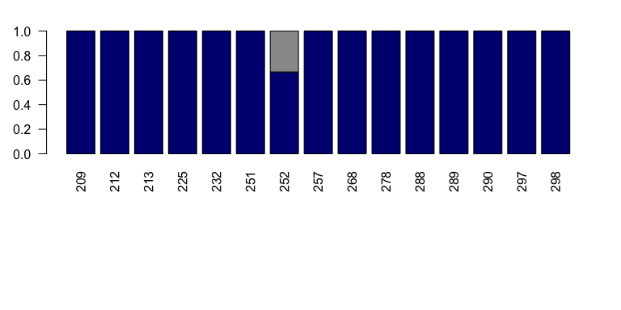

A priori microbes

``` r
colorset1 <- c('#0F726F','#B01833')

if(generate_pdfs){
  pdf('./output/Apriori_genera.pdf',width=18, height=5)
}
par(mfrow=c(1,6))
stripchart(list(all_microbe_data[c("Prevotella ( 838 )"),as.character(unlist(metadata[,c("TA_DNAseq_filename")]))],all_microbe_data[c("Prevotella ( 838 )"),as.character(unlist(metadata[,c("mBAL_DNAseq_filename")]))]),vertical=TRUE,jitter=.1,method='jitter',pch=16,cex=2,col=alpha(colorset1,.5),main="Prevotella ( 838 )")
print(wilcox.test(all_microbe_data[c("Prevotella ( 838 )"),as.character(unlist(metadata[,c("TA_DNAseq_filename")]))],all_microbe_data[c("Prevotella ( 838 )"),as.character(unlist(metadata[,c("mBAL_DNAseq_filename")]))])$p.value)
```

    ## [1] 0.2576891

``` r
stripchart(list(all_microbe_data[c("Veillonella ( 29465 )"),as.character(unlist(metadata[,c("TA_DNAseq_filename")]))],all_microbe_data[c("Veillonella ( 29465 )"),as.character(unlist(metadata[,c("mBAL_DNAseq_filename")]))]),vertical=TRUE,jitter=.1,method='jitter',pch=16,cex=2,col=alpha(colorset1,.5),main="Veillonella ( 29465 )")
print(wilcox.test(all_microbe_data[c("Veillonella ( 29465 )"),as.character(unlist(metadata[,c("TA_DNAseq_filename")]))],all_microbe_data[c("Veillonella ( 29465 )"),as.character(unlist(metadata[,c("mBAL_DNAseq_filename")]))])$p.value)
```

    ## [1] 0.793534

``` r
stripchart(list(all_microbe_data[c("Streptococcus ( 1301 )"),as.character(unlist(metadata[,c("TA_DNAseq_filename")]))],all_microbe_data[c("Streptococcus ( 1301 )"),as.character(unlist(metadata[,c("mBAL_DNAseq_filename")]))]),vertical=TRUE,jitter=.1,method='jitter',pch=16,cex=2,col=alpha(colorset1,.5),main="Streptococcus ( 1301 )")
print(wilcox.test(all_microbe_data[c("Streptococcus ( 1301 )"),as.character(unlist(metadata[,c("TA_DNAseq_filename")]))],all_microbe_data[c("Streptococcus ( 1301 )"),as.character(unlist(metadata[,c("mBAL_DNAseq_filename")]))])$p.value)
```

    ## [1] 0.6943898

``` r
stripchart(list(all_microbe_data[c("Fusobacterium ( 848 )"),as.character(unlist(metadata[,c("TA_DNAseq_filename")]))],all_microbe_data[c("Fusobacterium ( 848 )"),as.character(unlist(metadata[,c("mBAL_DNAseq_filename")]))]),vertical=TRUE,jitter=.1,method='jitter',pch=16,cex=2,col=alpha(colorset1,.5),main="Fusobacterium ( 848 )")
print(wilcox.test(all_microbe_data[c("Fusobacterium ( 848 )"),as.character(unlist(metadata[,c("TA_DNAseq_filename")]))],all_microbe_data[c("Fusobacterium ( 848 )"),as.character(unlist(metadata[,c("mBAL_DNAseq_filename")]))])$p.value)
```

    ## [1] 0.7086773

``` r
stripchart(list(all_microbe_data[c("Rothia ( 32207 )"),as.character(unlist(metadata[,c("TA_DNAseq_filename")]))],all_microbe_data[c("Rothia ( 32207 )"),as.character(unlist(metadata[,c("mBAL_DNAseq_filename")]))]),vertical=TRUE,jitter=.1,method='jitter',pch=16,cex=2,col=alpha(colorset1,.5),main="Rothia ( 32207 )")
print(wilcox.test(all_microbe_data[c("Rothia ( 32207 )"),as.character(unlist(metadata[,c("TA_DNAseq_filename")]))],all_microbe_data[c("Rothia ( 32207 )"),as.character(unlist(metadata[,c("mBAL_DNAseq_filename")]))])$p.value)
```

    ## [1] 0.3143651

``` r
stripchart(list(all_microbe_data[c("Neisseria ( 482 )"),as.character(unlist(metadata[,c("TA_DNAseq_filename")]))],all_microbe_data[c("Neisseria ( 482 )"),as.character(unlist(metadata[,c("mBAL_DNAseq_filename")]))]),vertical=TRUE,jitter=.1,method='jitter',pch=16,cex=2,col=alpha(colorset1,.5),main="Neisseria ( 482 )")
```

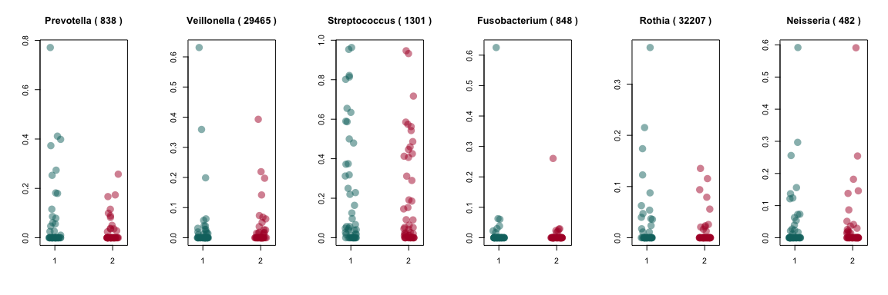

``` r
print(wilcox.test(all_microbe_data[c("Neisseria ( 482 )"),as.character(unlist(metadata[,c("TA_DNAseq_filename")]))],all_microbe_data[c("Neisseria ( 482 )"),as.character(unlist(metadata[,c("mBAL_DNAseq_filename")]))])$p.value)
```

    ## [1] 0.6915092

``` r
# dev.off()
#wilcox.test(all_microbe_data[metadata$effective_group == 1,][c("Neisseria ( 482 )"),as.character(unlist(metadata[c("TA_DNAseq_filename")]))],all_microbe_data[metadata$effective_group == 1,][c("Neisseria ( 482 )"),as.character(unlist(metadata[c("mBAL_DNAseq_filename")]))])
```

#### PREVIOUS CODE

Get stats for all patients

``` r
colorset1 <- c('#0F726F','#B01833')

par(mfrow=c(1,6))
stripchart(list(group1.TA.microbes.norm[c("Prevotella ( 838 )"),],group1.MBAL.microbes.norm[c("Prevotella ( 838 )"),]),vertical=TRUE,jitter=.1,method='jitter',pch=16,cex=1.2,col=colorset1,main="Prevotella ( 838 )")
print(wilcox.test(group1.TA.microbes.norm[c("Prevotella ( 838 )"),],group1.MBAL.microbes.norm[c("Prevotella ( 838 )"),])$p.value)
```

    ## [1] 0.7832496

``` r
stripchart(list(group1.TA.microbes.norm[c("Veillonella ( 29465 )"),],group1.MBAL.microbes.norm[c("Veillonella ( 29465 )"),]),vertical=TRUE,jitter=.1,method='jitter',pch=16,cex=1.2,col=colorset1,main="Veillonella ( 29465 )")
print(wilcox.test(group1.TA.microbes.norm[c("Veillonella ( 29465 )"),],group1.MBAL.microbes.norm[c("Veillonella ( 29465 )"),])$p.value)
```

    ## [1] 0.74826

``` r
stripchart(list(group1.TA.microbes.norm[c("Streptococcus ( 1301 )"),],group1.MBAL.microbes.norm[c("Streptococcus ( 1301 )"),]),vertical=TRUE,jitter=.1,method='jitter',pch=16,cex=1.2,col=colorset1,main="Streptococcus ( 1301 )")
print(wilcox.test(group1.TA.microbes.norm[c("Streptococcus ( 1301 )"),],group1.MBAL.microbes.norm[c("Streptococcus ( 1301 )"),])$p.value)
```

    ## [1] 0.8188512

``` r
stripchart(list(group1.TA.microbes.norm[c("Fusobacterium ( 848 )"),],group1.MBAL.microbes.norm[c("Fusobacterium ( 848 )"),]),vertical=TRUE,jitter=.1,method='jitter',pch=16,cex=1.2,col=colorset1,main="Fusobacterium ( 848 )")
print(wilcox.test(group1.TA.microbes.norm[c("Fusobacterium ( 848 )"),],group1.MBAL.microbes.norm[c("Fusobacterium ( 848 )"),])$p.value)
```

    ## [1] 0.5045715

``` r
stripchart(list(group1.TA.microbes.norm[c("Rothia ( 32207 )"),],group1.MBAL.microbes.norm[c("Rothia ( 32207 )"),]),vertical=TRUE,jitter=.1,method='jitter',pch=16,cex=1.2,col=colorset1,main="Rothia ( 32207 )")
print(wilcox.test(group1.TA.microbes.norm[c("Rothia ( 32207 )"),],group1.MBAL.microbes.norm[c("Rothia ( 32207 )"),])$p.value)
```

    ## [1] 1

``` r
stripchart(list(group1.TA.microbes.norm[c("Neisseria ( 482 )"),],group1.MBAL.microbes.norm[c("Neisseria ( 482 )"),]),vertical=TRUE,jitter=.1,method='jitter',pch=16,cex=1.2,col=colorset1,main="Neisseria ( 482 )")
```

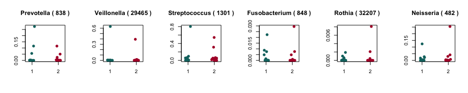

``` r
print(wilcox.test(group1.TA.microbes.norm[c("Neisseria ( 482 )"),],group1.MBAL.microbes.norm[c("Neisseria ( 482 )"),])$p.value)
```

    ## [1] 0.9825471
