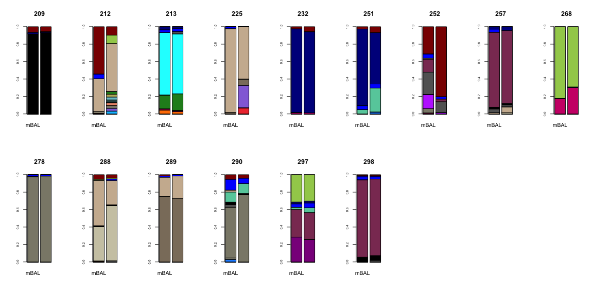
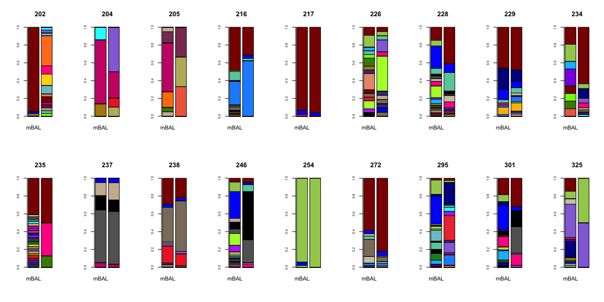
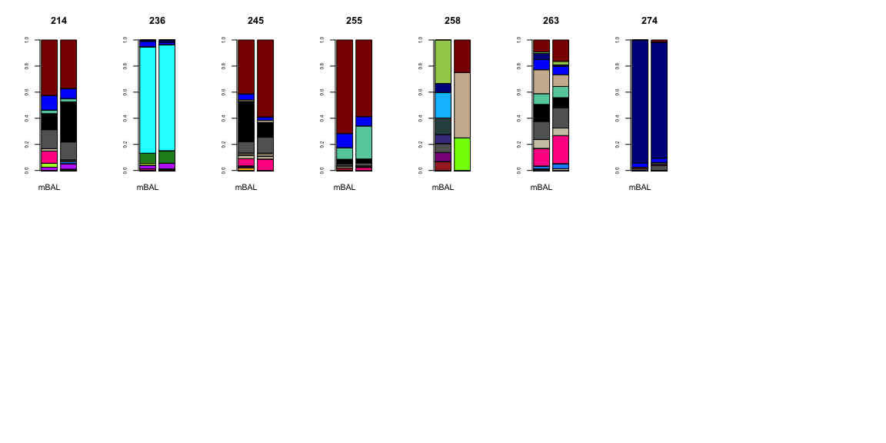
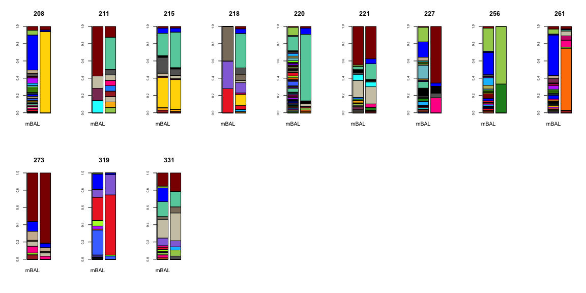
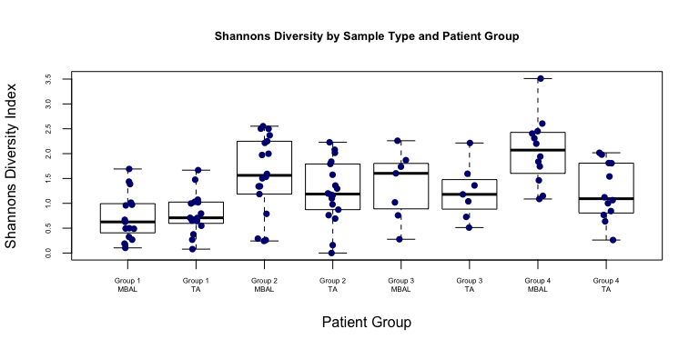
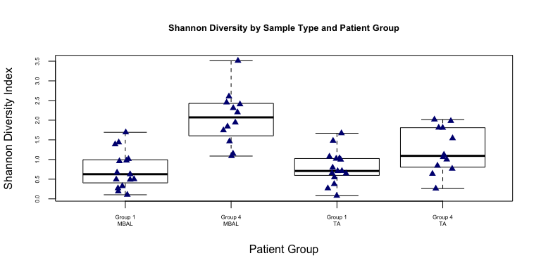
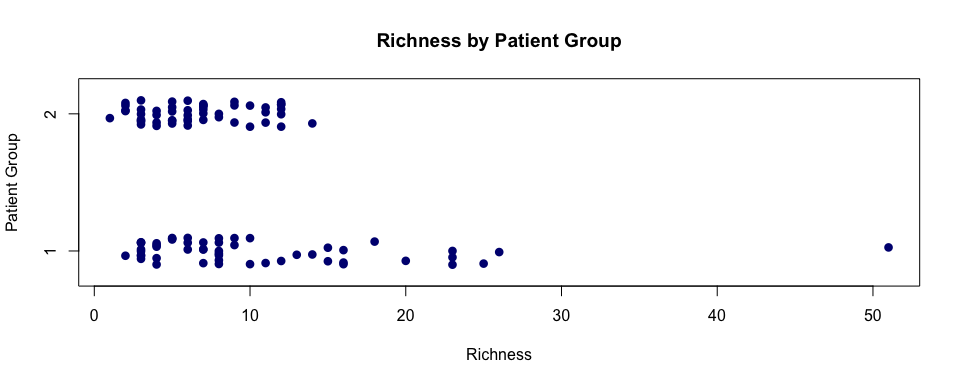
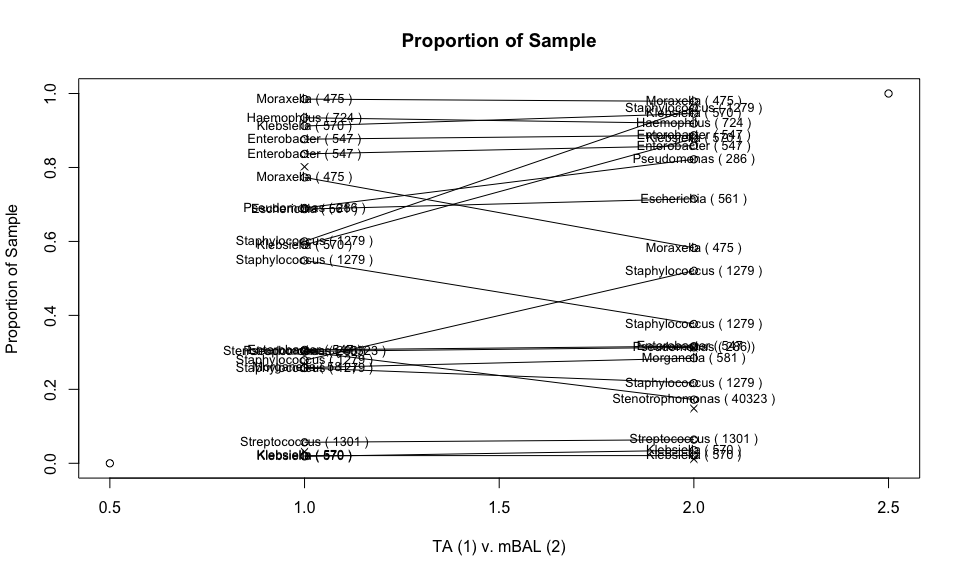
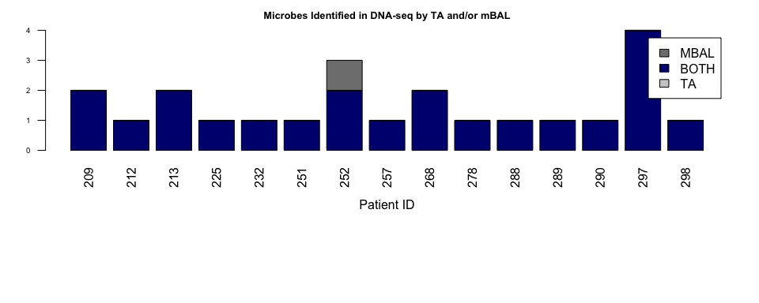
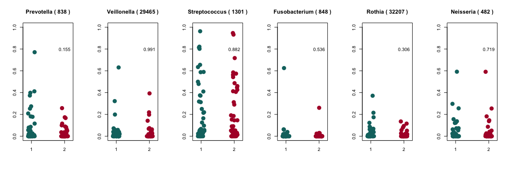

MBAL vs. TA comparison
================
Katrina Kalantar
2018-02-22

**Relevant Definitions:**

**mBAL:** mini broncheolar alveolar lavage

**TA:** tracheal aspirate

**LRTI:** lower respiratory tract infection

**PNA-pos:** Pneumonia positive

**PNA-neg:** Pneumonia negative

**ABSTRACT:** Pneumonia causes more deaths each year in the United States than any other type of infectious disease. The ability to accurately detect etiologic pathogens and distinguish them from background commensal microbiota is essential for guiding optimal antimicrobial treatments. In patients requiring mechanical ventilation, less invasive tracheal aspirate sampling (TA) has historically been considered inferior to mini-bronchial alveolar lavage/telescoping catheter (mBAL) specimen collection due to the potential for oropharyngeal microbiota contamination. This idea has been challenged, however, by studies demonstrating a lack of clinically significant differences between sample types, and a greater acceptance of TA sampling is now reflected in recent updates to clinical practice guidelines.4 Despite the broad potential implications of this shift in diagnostic sampling approach, relatively little information exists regarding microbial composition differences between mBAL and TA specimens, and the potential implications of such differences for clinical diagnostic testing.

------------------------------------------------------------------------

### Import the microbe data and metadata.

The microbial counts per individual were generated as follows:

Detection of host transcripts and airway microbes leveraged a custom bioinformatics pipeline that incorporated quality filtering using PRICESeqfilter and removal of host sequences by alignment against a database of the human genome (NCBI GRC h38) and Pan troglodytes (UCSC PanTro4) using the STAR aligner. Additional filtering was performed using Bowtie2 to remove non-fungal eukaryotes, cloning vectors and phiX phage. The identities of the remaining microbial reads were determined by querying the NCBI nucleotide (NT) and non-redundant protein (NR) databases using GSNAP-L and RAPSEARCH2, respectively. Microbial alignments detected by RNA-Seq and DNA-Seq were aggregated to the genus-level.

Then, the NT genus rpM counts were merged across all samples. Metadata describing the sample and patient relationships, as well as dividing patients into four groups was imported as .csv.

``` r
#IMPORT DATA
#.csv of all microbes by TA/mBAL sample ID #012618/
all_microbe_data <- read.csv('./data/020718/BM_4/merged_genusrpm.tsv', sep='\t', header=TRUE, row.names=1)

#read in metadata #012618/
metadata <- read.csv('./data/020718/tavmbal_metadata_noviruses.tsv', sep='\t', row.names=1)
```

The raw microbe data appeared as follows (showing the first 20 rows):

<table>
<colgroup>
<col width="1%" />
<col width="0%" />
<col width="0%" />
<col width="0%" />
<col width="0%" />
<col width="0%" />
<col width="0%" />
<col width="0%" />
<col width="0%" />
<col width="0%" />
<col width="0%" />
<col width="0%" />
<col width="0%" />
<col width="0%" />
<col width="1%" />
<col width="0%" />
<col width="0%" />
<col width="0%" />
<col width="1%" />
<col width="0%" />
<col width="0%" />
<col width="0%" />
<col width="0%" />
<col width="0%" />
<col width="0%" />
<col width="0%" />
<col width="0%" />
<col width="0%" />
<col width="0%" />
<col width="0%" />
<col width="0%" />
<col width="0%" />
<col width="1%" />
<col width="0%" />
<col width="0%" />
<col width="0%" />
<col width="0%" />
<col width="0%" />
<col width="0%" />
<col width="0%" />
<col width="0%" />
<col width="0%" />
<col width="1%" />
<col width="0%" />
<col width="0%" />
<col width="0%" />
<col width="0%" />
<col width="0%" />
<col width="1%" />
<col width="0%" />
<col width="0%" />
<col width="0%" />
<col width="0%" />
<col width="0%" />
<col width="0%" />
<col width="0%" />
<col width="0%" />
<col width="0%" />
<col width="1%" />
<col width="0%" />
<col width="1%" />
<col width="0%" />
<col width="1%" />
<col width="0%" />
<col width="1%" />
<col width="0%" />
<col width="1%" />
<col width="0%" />
<col width="1%" />
<col width="0%" />
<col width="0%" />
<col width="0%" />
<col width="1%" />
<col width="0%" />
<col width="0%" />
<col width="0%" />
<col width="1%" />
<col width="0%" />
<col width="1%" />
<col width="0%" />
<col width="1%" />
<col width="0%" />
<col width="1%" />
<col width="0%" />
<col width="1%" />
<col width="0%" />
<col width="1%" />
<col width="0%" />
<col width="0%" />
<col width="0%" />
<col width="0%" />
<col width="0%" />
<col width="1%" />
<col width="0%" />
<col width="0%" />
<col width="0%" />
<col width="0%" />
<col width="0%" />
<col width="0%" />
<col width="1%" />
<col width="1%" />
<col width="0%" />
<col width="0%" />
<col width="0%" />
<col width="1%" />
</colgroup>
<thead>
<tr class="header">
<th align="left"></th>
<th align="right">mBAL.202.DNA.B3</th>
<th align="right">mBAL.202.DNA.TA1.B10</th>
<th align="right">mBAL.204.DNA.B1</th>
<th align="right">mBAL.204.DNA.TA1.B8</th>
<th align="right">mBAL.205.DNA.B3</th>
<th align="right">mBAL.205.DNA.TA1.B8</th>
<th align="right">mBAL.208.DNA.B3</th>
<th align="right">mBAL.208.DNA.TA1.B10</th>
<th align="right">mBAL.209.DNA.B2</th>
<th align="right">mBAL.209.DNA.TA1.B8</th>
<th align="right">mBAL.211.DNA.B1</th>
<th align="right">mBAL.211.DNA.TA1.B10</th>
<th align="right">mBAL.212.DNA.B1</th>
<th align="right">mBAL.212.DNA.TA1.ZYM.6717.B7</th>
<th align="right">mBAL.213.DNA.B1</th>
<th align="right">mBAL.213.DNA.TA1.B8</th>
<th align="right">mBAL.214.DNA.B3</th>
<th align="right">mBAL.214.DNA.TA1.ZYM.6717.B7</th>
<th align="right">mBAL.215.DNA.B1</th>
<th align="right">mBAL.215.DNA.TA1.B10</th>
<th align="right">mBAL.216.DNA.B1</th>
<th align="right">mBAL.216.DNA.TA1.B10</th>
<th align="right">mBAL.217.DNA.B1</th>
<th align="right">mBAL.217.DNA.TA1.B8</th>
<th align="right">mBAL.218.DNA.B4</th>
<th align="right">mBAL.218.DNA.TA1.B10</th>
<th align="right">mBAL.220.DNA.B1</th>
<th align="right">mBAL.220.DNA.TA1.B8</th>
<th align="right">mBAL.221.DNA.B1</th>
<th align="right">mBAL.221.DNA.TA1.B8</th>
<th align="right">mBAL.225.DNA.B0</th>
<th align="right">mBAL.225.DNA.TA1.ZYM.6717.B7</th>
<th align="right">mBAL.226.DNA.B1</th>
<th align="right">mBAL.226.DNA.TA1.B10</th>
<th align="right">mBAL.227.DNA.B2</th>
<th align="right">mBAL.227.DNA.TA1.B10</th>
<th align="right">mBAL.228.DNA.B1</th>
<th align="right">mBAL.228.DNA.TA1.B8</th>
<th align="right">mBAL.229.DNA.B1</th>
<th align="right">mBAL.229.DNA.TA1.B8</th>
<th align="right">mBAL.232.DNA.B1</th>
<th align="right">mBAL.232.DNA.TA1.ZYM.6717.B7</th>
<th align="right">mBAL.234.DNA.B1</th>
<th align="right">mBAL.234.DNA.TA1.B10</th>
<th align="right">mBAL.235.DNA.B3</th>
<th align="right">mBAL.235.DNA.TA1.B10</th>
<th align="right">mBAL.236.DNA.B3</th>
<th align="right">mBAL.236.DNA.TA1.QIA.6517.B7</th>
<th align="right">mBAL.237.DNA.B3</th>
<th align="right">mBAL.237.DNA.TA1.B8</th>
<th align="right">mBAL.238.DNA.B3</th>
<th align="right">mBAL.238.DNA.TA1.B10</th>
<th align="right">mBAL.245.DNA.B3</th>
<th align="right">mBAL.245.DNA.TA1.B8</th>
<th align="right">mBAL.246.DNA.B3</th>
<th align="right">mBAL.246.DNA.TA1.B8</th>
<th align="right">mBAL.251.DNA.B1</th>
<th align="right">mBAL.251.DNA.TA2.QIA.6517.B7</th>
<th align="right">mBAL.252.DNA.B3</th>
<th align="right">mBAL.252.DNA.TA1.ZYM.6717.B7</th>
<th align="right">mBAL.254.DNA.B3</th>
<th align="right">mBAL.254.DNA.TA1.QIA.6517.B7</th>
<th align="right">mBAL.255.DNA.B1</th>
<th align="right">mBAL.255.DNA.TA1.QIA.6517.B7</th>
<th align="right">mBAL.256.DNA.B1</th>
<th align="right">mBAL.256.DNA.TA2.QIA.6517.B7</th>
<th align="right">mBAL.257.DNA.B0</th>
<th align="right">mBAL.257.DNA.TA1.ZYM.6717.B7</th>
<th align="right">mBAL.258.DNA.B2</th>
<th align="right">mBAL.258.DNA.TA1.B10</th>
<th align="right">mBAL.261.DNA.B3</th>
<th align="right">mBAL.261.DNA.TA2.QIA.6517.B7</th>
<th align="right">mBAL.263.DNA.B2</th>
<th align="right">mBAL.263.DNA.TA1.B8</th>
<th align="right">mBAL.268.DNA.B3</th>
<th align="right">mBAL.268.DNA.TA2.QIA.6517.B7</th>
<th align="right">mBAL.272.DNA.B3</th>
<th align="right">mBAL.272.DNA.TA2.QIA.6517.B7</th>
<th align="right">mBAL.273.DNA.B3</th>
<th align="right">mBAL.273.DNA.TA1.ZYM.6717.B7</th>
<th align="right">mBAL.274.DNA.B3</th>
<th align="right">mBAL.274.DNA.TA1.ZYM.6717.B7</th>
<th align="right">mBAL.278.DNA.B1</th>
<th align="right">mBAL.278.DNA.TA2.QIA.6517.B7</th>
<th align="right">mBAL.288.DNA.B3</th>
<th align="right">mBAL.288.DNA.TA1.QIA.6117.B7</th>
<th align="right">mBAL.289.DNA.B2</th>
<th align="right">mBAL.289.DNA.TA1.B8</th>
<th align="right">mBAL.290.DNA.B3</th>
<th align="right">mBAL.290.DNA.TA1.B8</th>
<th align="right">mBAL.295.DNA.B2</th>
<th align="right">mBAL.295.DNA.TA1.QIA.6117.B7</th>
<th align="right">mBAL.297.DNA.B4</th>
<th align="right">mBAL.297.DNA.TA1.B8</th>
<th align="right">mBAL.298.DNA.B3</th>
<th align="right">mBAL.298.DNA.TA1.B8</th>
<th align="right">mBAL.301.DNA.B2</th>
<th align="right">mBAL.301.DNA.TA1.B10</th>
<th align="right">mBAL.319.DNA.MB1.ZYM.6117.B7</th>
<th align="right">mBAL.319.DNA.TA1.ZYM.6717.B7</th>
<th align="right">mBAL.325.DNA.B6</th>
<th align="right">mBAL.325.DNA.TA1.B8</th>
<th align="right">mBAL.331.DNA.B6</th>
<th align="right">mBAL.331.DNA.TA1.QIA.6117.B7</th>
</tr>
</thead>
<tbody>
<tr class="odd">
<td align="left">Abiotrophia ( 46123 )</td>
<td align="right">0</td>
<td align="right">0.00</td>
<td align="right">0</td>
<td align="right">0</td>
<td align="right">0</td>
<td align="right">0</td>
<td align="right">0.00</td>
<td align="right">0</td>
<td align="right">0.00</td>
<td align="right">0</td>
<td align="right">0</td>
<td align="right">0</td>
<td align="right">0.03</td>
<td align="right">0</td>
<td align="right">0.00</td>
<td align="right">0.00</td>
<td align="right">0.00</td>
<td align="right">0.00</td>
<td align="right">0.22</td>
<td align="right">0.31</td>
<td align="right">0.00</td>
<td align="right">0</td>
<td align="right">0.00</td>
<td align="right">0.00</td>
<td align="right">0</td>
<td align="right">0.00</td>
<td align="right">0.00</td>
<td align="right">0</td>
<td align="right">0.00</td>
<td align="right">0</td>
<td align="right">0</td>
<td align="right">0</td>
<td align="right">0.00</td>
<td align="right">0</td>
<td align="right">0.00</td>
<td align="right">0.00</td>
<td align="right">0.00</td>
<td align="right">0.00</td>
<td align="right">0.0</td>
<td align="right">0.00</td>
<td align="right">0</td>
<td align="right">0</td>
<td align="right">0.00</td>
<td align="right">0</td>
<td align="right">0.00</td>
<td align="right">0</td>
<td align="right">0.00</td>
<td align="right">0</td>
<td align="right">0.00</td>
<td align="right">0.00</td>
<td align="right">0.00</td>
<td align="right">0.00</td>
<td align="right">0</td>
<td align="right">0</td>
<td align="right">0.00</td>
<td align="right">0</td>
<td align="right">0</td>
<td align="right">0.00</td>
<td align="right">0</td>
<td align="right">0.00</td>
<td align="right">0</td>
<td align="right">0</td>
<td align="right">0.00</td>
<td align="right">0.00</td>
<td align="right">0.00</td>
<td align="right">0</td>
<td align="right">0.00</td>
<td align="right">0</td>
<td align="right">0.00</td>
<td align="right">0</td>
<td align="right">0.00</td>
<td align="right">0</td>
<td align="right">0.00</td>
<td align="right">0.00</td>
<td align="right">0.00</td>
<td align="right">0.00</td>
<td align="right">0</td>
<td align="right">0.00</td>
<td align="right">0.00</td>
<td align="right">0.00</td>
<td align="right">0.00</td>
<td align="right">0.00</td>
<td align="right">0.00</td>
<td align="right">0.0</td>
<td align="right">0</td>
<td align="right">0.00</td>
<td align="right">0</td>
<td align="right">0</td>
<td align="right">0.00</td>
<td align="right">0</td>
<td align="right">0.00</td>
<td align="right">0</td>
<td align="right">0.00</td>
<td align="right">0.00</td>
<td align="right">0.00</td>
<td align="right">0.00</td>
<td align="right">0.00</td>
<td align="right">0</td>
<td align="right">0.00</td>
<td align="right">0</td>
<td align="right">0</td>
<td align="right">0</td>
<td align="right">0.00</td>
<td align="right">0.00</td>
</tr>
<tr class="even">
<td align="left">Absidia ( 4828 )</td>
<td align="right">0</td>
<td align="right">0.16</td>
<td align="right">0</td>
<td align="right">0</td>
<td align="right">0</td>
<td align="right">0</td>
<td align="right">0.00</td>
<td align="right">0</td>
<td align="right">0.00</td>
<td align="right">0</td>
<td align="right">0</td>
<td align="right">0</td>
<td align="right">0.00</td>
<td align="right">0</td>
<td align="right">0.00</td>
<td align="right">0.00</td>
<td align="right">0.00</td>
<td align="right">0.00</td>
<td align="right">0.00</td>
<td align="right">0.00</td>
<td align="right">0.00</td>
<td align="right">0</td>
<td align="right">0.00</td>
<td align="right">0.00</td>
<td align="right">0</td>
<td align="right">0.00</td>
<td align="right">0.00</td>
<td align="right">0</td>
<td align="right">0.00</td>
<td align="right">0</td>
<td align="right">0</td>
<td align="right">0</td>
<td align="right">0.00</td>
<td align="right">0</td>
<td align="right">0.00</td>
<td align="right">0.00</td>
<td align="right">0.00</td>
<td align="right">0.00</td>
<td align="right">0.0</td>
<td align="right">0.00</td>
<td align="right">0</td>
<td align="right">0</td>
<td align="right">0.00</td>
<td align="right">0</td>
<td align="right">0.00</td>
<td align="right">0</td>
<td align="right">0.00</td>
<td align="right">0</td>
<td align="right">0.00</td>
<td align="right">0.00</td>
<td align="right">0.00</td>
<td align="right">0.00</td>
<td align="right">0</td>
<td align="right">0</td>
<td align="right">0.00</td>
<td align="right">0</td>
<td align="right">0</td>
<td align="right">0.00</td>
<td align="right">0</td>
<td align="right">0.00</td>
<td align="right">0</td>
<td align="right">0</td>
<td align="right">0.00</td>
<td align="right">0.00</td>
<td align="right">0.00</td>
<td align="right">0</td>
<td align="right">0.00</td>
<td align="right">0</td>
<td align="right">0.00</td>
<td align="right">0</td>
<td align="right">0.00</td>
<td align="right">0</td>
<td align="right">0.00</td>
<td align="right">0.00</td>
<td align="right">0.00</td>
<td align="right">0.00</td>
<td align="right">0</td>
<td align="right">0.00</td>
<td align="right">0.00</td>
<td align="right">0.00</td>
<td align="right">0.00</td>
<td align="right">0.00</td>
<td align="right">0.00</td>
<td align="right">0.0</td>
<td align="right">0</td>
<td align="right">0.00</td>
<td align="right">0</td>
<td align="right">0</td>
<td align="right">0.00</td>
<td align="right">0</td>
<td align="right">0.00</td>
<td align="right">0</td>
<td align="right">0.00</td>
<td align="right">0.00</td>
<td align="right">0.00</td>
<td align="right">0.00</td>
<td align="right">0.00</td>
<td align="right">0</td>
<td align="right">0.00</td>
<td align="right">0</td>
<td align="right">0</td>
<td align="right">0</td>
<td align="right">0.00</td>
<td align="right">0.00</td>
</tr>
<tr class="odd">
<td align="left">Acetohalobium ( 28186 )</td>
<td align="right">0</td>
<td align="right">0.00</td>
<td align="right">0</td>
<td align="right">0</td>
<td align="right">0</td>
<td align="right">0</td>
<td align="right">0.00</td>
<td align="right">0</td>
<td align="right">0.00</td>
<td align="right">0</td>
<td align="right">0</td>
<td align="right">0</td>
<td align="right">0.00</td>
<td align="right">0</td>
<td align="right">0.00</td>
<td align="right">0.00</td>
<td align="right">0.00</td>
<td align="right">0.00</td>
<td align="right">0.00</td>
<td align="right">0.00</td>
<td align="right">0.00</td>
<td align="right">0</td>
<td align="right">0.00</td>
<td align="right">0.00</td>
<td align="right">0</td>
<td align="right">0.00</td>
<td align="right">0.00</td>
<td align="right">0</td>
<td align="right">0.00</td>
<td align="right">0</td>
<td align="right">0</td>
<td align="right">0</td>
<td align="right">0.00</td>
<td align="right">0</td>
<td align="right">0.00</td>
<td align="right">0.00</td>
<td align="right">0.00</td>
<td align="right">0.00</td>
<td align="right">0.0</td>
<td align="right">0.00</td>
<td align="right">0</td>
<td align="right">0</td>
<td align="right">0.00</td>
<td align="right">0</td>
<td align="right">0.00</td>
<td align="right">0</td>
<td align="right">0.00</td>
<td align="right">0</td>
<td align="right">0.00</td>
<td align="right">0.00</td>
<td align="right">0.00</td>
<td align="right">0.00</td>
<td align="right">0</td>
<td align="right">0</td>
<td align="right">0.00</td>
<td align="right">0</td>
<td align="right">0</td>
<td align="right">0.00</td>
<td align="right">0</td>
<td align="right">0.00</td>
<td align="right">0</td>
<td align="right">0</td>
<td align="right">0.00</td>
<td align="right">0.00</td>
<td align="right">0.00</td>
<td align="right">0</td>
<td align="right">0.00</td>
<td align="right">0</td>
<td align="right">0.00</td>
<td align="right">0</td>
<td align="right">0.00</td>
<td align="right">0</td>
<td align="right">0.00</td>
<td align="right">0.00</td>
<td align="right">0.00</td>
<td align="right">0.00</td>
<td align="right">0</td>
<td align="right">0.14</td>
<td align="right">0.00</td>
<td align="right">0.00</td>
<td align="right">0.00</td>
<td align="right">0.00</td>
<td align="right">0.00</td>
<td align="right">0.0</td>
<td align="right">0</td>
<td align="right">0.00</td>
<td align="right">0</td>
<td align="right">0</td>
<td align="right">0.00</td>
<td align="right">0</td>
<td align="right">0.00</td>
<td align="right">0</td>
<td align="right">0.00</td>
<td align="right">0.00</td>
<td align="right">0.00</td>
<td align="right">0.00</td>
<td align="right">0.00</td>
<td align="right">0</td>
<td align="right">0.00</td>
<td align="right">0</td>
<td align="right">0</td>
<td align="right">0</td>
<td align="right">0.00</td>
<td align="right">0.00</td>
</tr>
<tr class="even">
<td align="left">Acholeplasma ( 2147 )</td>
<td align="right">0</td>
<td align="right">0.00</td>
<td align="right">0</td>
<td align="right">0</td>
<td align="right">0</td>
<td align="right">0</td>
<td align="right">0.00</td>
<td align="right">0</td>
<td align="right">0.00</td>
<td align="right">0</td>
<td align="right">0</td>
<td align="right">0</td>
<td align="right">0.00</td>
<td align="right">0</td>
<td align="right">0.00</td>
<td align="right">0.00</td>
<td align="right">0.00</td>
<td align="right">0.00</td>
<td align="right">0.00</td>
<td align="right">0.00</td>
<td align="right">0.00</td>
<td align="right">0</td>
<td align="right">0.00</td>
<td align="right">0.07</td>
<td align="right">0</td>
<td align="right">0.00</td>
<td align="right">0.00</td>
<td align="right">0</td>
<td align="right">0.00</td>
<td align="right">0</td>
<td align="right">0</td>
<td align="right">0</td>
<td align="right">0.00</td>
<td align="right">0</td>
<td align="right">0.00</td>
<td align="right">0.07</td>
<td align="right">0.00</td>
<td align="right">0.00</td>
<td align="right">0.0</td>
<td align="right">0.00</td>
<td align="right">0</td>
<td align="right">0</td>
<td align="right">0.00</td>
<td align="right">0</td>
<td align="right">0.00</td>
<td align="right">0</td>
<td align="right">0.00</td>
<td align="right">0</td>
<td align="right">0.00</td>
<td align="right">0.00</td>
<td align="right">0.00</td>
<td align="right">0.00</td>
<td align="right">0</td>
<td align="right">0</td>
<td align="right">0.00</td>
<td align="right">0</td>
<td align="right">0</td>
<td align="right">0.00</td>
<td align="right">0</td>
<td align="right">0.00</td>
<td align="right">0</td>
<td align="right">0</td>
<td align="right">0.00</td>
<td align="right">0.00</td>
<td align="right">0.00</td>
<td align="right">0</td>
<td align="right">0.00</td>
<td align="right">0</td>
<td align="right">0.00</td>
<td align="right">0</td>
<td align="right">0.00</td>
<td align="right">0</td>
<td align="right">0.00</td>
<td align="right">0.00</td>
<td align="right">0.00</td>
<td align="right">0.00</td>
<td align="right">0</td>
<td align="right">0.14</td>
<td align="right">0.00</td>
<td align="right">0.00</td>
<td align="right">0.00</td>
<td align="right">0.00</td>
<td align="right">0.00</td>
<td align="right">0.0</td>
<td align="right">0</td>
<td align="right">0.00</td>
<td align="right">0</td>
<td align="right">0</td>
<td align="right">0.00</td>
<td align="right">0</td>
<td align="right">0.00</td>
<td align="right">0</td>
<td align="right">0.03</td>
<td align="right">0.11</td>
<td align="right">0.00</td>
<td align="right">0.00</td>
<td align="right">0.00</td>
<td align="right">0</td>
<td align="right">0.00</td>
<td align="right">0</td>
<td align="right">0</td>
<td align="right">0</td>
<td align="right">0.00</td>
<td align="right">0.00</td>
</tr>
<tr class="odd">
<td align="left">Achromobacter ( 222 )</td>
<td align="right">0</td>
<td align="right">0.00</td>
<td align="right">0</td>
<td align="right">0</td>
<td align="right">0</td>
<td align="right">0</td>
<td align="right">20.31</td>
<td align="right">0</td>
<td align="right">0.00</td>
<td align="right">0</td>
<td align="right">0</td>
<td align="right">0</td>
<td align="right">0.00</td>
<td align="right">0</td>
<td align="right">0.00</td>
<td align="right">0.00</td>
<td align="right">0.04</td>
<td align="right">0.00</td>
<td align="right">0.00</td>
<td align="right">0.00</td>
<td align="right">0.00</td>
<td align="right">0</td>
<td align="right">0.00</td>
<td align="right">0.00</td>
<td align="right">0</td>
<td align="right">0.00</td>
<td align="right">0.56</td>
<td align="right">0</td>
<td align="right">0.00</td>
<td align="right">0</td>
<td align="right">0</td>
<td align="right">0</td>
<td align="right">0.00</td>
<td align="right">0</td>
<td align="right">1168.22</td>
<td align="right">0.00</td>
<td align="right">0.05</td>
<td align="right">0.00</td>
<td align="right">0.0</td>
<td align="right">0.00</td>
<td align="right">0</td>
<td align="right">0</td>
<td align="right">0.00</td>
<td align="right">0</td>
<td align="right">0.00</td>
<td align="right">0</td>
<td align="right">0.00</td>
<td align="right">0</td>
<td align="right">0.04</td>
<td align="right">0.16</td>
<td align="right">0.00</td>
<td align="right">0.00</td>
<td align="right">0</td>
<td align="right">0</td>
<td align="right">7.26</td>
<td align="right">0</td>
<td align="right">0</td>
<td align="right">0.08</td>
<td align="right">0</td>
<td align="right">0.00</td>
<td align="right">0</td>
<td align="right">0</td>
<td align="right">0.19</td>
<td align="right">0.00</td>
<td align="right">0.04</td>
<td align="right">0</td>
<td align="right">0.00</td>
<td align="right">0</td>
<td align="right">0.06</td>
<td align="right">0</td>
<td align="right">23.61</td>
<td align="right">0</td>
<td align="right">0.00</td>
<td align="right">0.09</td>
<td align="right">2.06</td>
<td align="right">15.44</td>
<td align="right">0</td>
<td align="right">0.00</td>
<td align="right">0.00</td>
<td align="right">0.00</td>
<td align="right">0.00</td>
<td align="right">0.00</td>
<td align="right">0.00</td>
<td align="right">0.0</td>
<td align="right">0</td>
<td align="right">0.31</td>
<td align="right">0</td>
<td align="right">0</td>
<td align="right">0.00</td>
<td align="right">0</td>
<td align="right">2.23</td>
<td align="right">0</td>
<td align="right">0.03</td>
<td align="right">0.00</td>
<td align="right">0.00</td>
<td align="right">0.00</td>
<td align="right">0.38</td>
<td align="right">0</td>
<td align="right">0.00</td>
<td align="right">0</td>
<td align="right">0</td>
<td align="right">0</td>
<td align="right">0.00</td>
<td align="right">0.14</td>
</tr>
<tr class="even">
<td align="left">Acidaminococcus ( 904 )</td>
<td align="right">0</td>
<td align="right">0.00</td>
<td align="right">0</td>
<td align="right">0</td>
<td align="right">0</td>
<td align="right">0</td>
<td align="right">0.00</td>
<td align="right">0</td>
<td align="right">0.00</td>
<td align="right">0</td>
<td align="right">0</td>
<td align="right">0</td>
<td align="right">0.00</td>
<td align="right">0</td>
<td align="right">0.00</td>
<td align="right">0.00</td>
<td align="right">0.00</td>
<td align="right">0.00</td>
<td align="right">0.00</td>
<td align="right">0.00</td>
<td align="right">0.00</td>
<td align="right">0</td>
<td align="right">0.00</td>
<td align="right">0.00</td>
<td align="right">0</td>
<td align="right">0.00</td>
<td align="right">0.00</td>
<td align="right">0</td>
<td align="right">0.00</td>
<td align="right">0</td>
<td align="right">0</td>
<td align="right">0</td>
<td align="right">0.00</td>
<td align="right">0</td>
<td align="right">0.00</td>
<td align="right">0.00</td>
<td align="right">0.00</td>
<td align="right">0.00</td>
<td align="right">0.0</td>
<td align="right">0.05</td>
<td align="right">0</td>
<td align="right">0</td>
<td align="right">0.00</td>
<td align="right">0</td>
<td align="right">0.00</td>
<td align="right">0</td>
<td align="right">0.00</td>
<td align="right">0</td>
<td align="right">0.00</td>
<td align="right">0.00</td>
<td align="right">0.00</td>
<td align="right">0.00</td>
<td align="right">0</td>
<td align="right">0</td>
<td align="right">0.00</td>
<td align="right">0</td>
<td align="right">0</td>
<td align="right">0.00</td>
<td align="right">0</td>
<td align="right">0.00</td>
<td align="right">0</td>
<td align="right">0</td>
<td align="right">0.00</td>
<td align="right">0.00</td>
<td align="right">0.00</td>
<td align="right">0</td>
<td align="right">0.00</td>
<td align="right">0</td>
<td align="right">0.00</td>
<td align="right">0</td>
<td align="right">0.00</td>
<td align="right">0</td>
<td align="right">0.00</td>
<td align="right">0.00</td>
<td align="right">0.00</td>
<td align="right">0.00</td>
<td align="right">0</td>
<td align="right">0.00</td>
<td align="right">0.00</td>
<td align="right">0.00</td>
<td align="right">0.00</td>
<td align="right">0.00</td>
<td align="right">0.00</td>
<td align="right">0.0</td>
<td align="right">0</td>
<td align="right">0.00</td>
<td align="right">0</td>
<td align="right">0</td>
<td align="right">0.00</td>
<td align="right">0</td>
<td align="right">0.00</td>
<td align="right">0</td>
<td align="right">7.92</td>
<td align="right">11.08</td>
<td align="right">0.00</td>
<td align="right">0.00</td>
<td align="right">0.00</td>
<td align="right">0</td>
<td align="right">0.00</td>
<td align="right">0</td>
<td align="right">0</td>
<td align="right">0</td>
<td align="right">0.00</td>
<td align="right">0.00</td>
</tr>
<tr class="odd">
<td align="left">Acidiphilium ( 522 )</td>
<td align="right">0</td>
<td align="right">0.00</td>
<td align="right">0</td>
<td align="right">0</td>
<td align="right">0</td>
<td align="right">0</td>
<td align="right">0.00</td>
<td align="right">0</td>
<td align="right">0.00</td>
<td align="right">0</td>
<td align="right">0</td>
<td align="right">0</td>
<td align="right">0.00</td>
<td align="right">0</td>
<td align="right">0.00</td>
<td align="right">0.00</td>
<td align="right">0.00</td>
<td align="right">0.00</td>
<td align="right">0.00</td>
<td align="right">0.00</td>
<td align="right">0.00</td>
<td align="right">0</td>
<td align="right">0.00</td>
<td align="right">0.00</td>
<td align="right">0</td>
<td align="right">0.00</td>
<td align="right">0.00</td>
<td align="right">0</td>
<td align="right">0.00</td>
<td align="right">0</td>
<td align="right">0</td>
<td align="right">0</td>
<td align="right">0.00</td>
<td align="right">0</td>
<td align="right">0.00</td>
<td align="right">0.00</td>
<td align="right">0.00</td>
<td align="right">0.00</td>
<td align="right">0.0</td>
<td align="right">0.00</td>
<td align="right">0</td>
<td align="right">0</td>
<td align="right">0.00</td>
<td align="right">0</td>
<td align="right">0.00</td>
<td align="right">0</td>
<td align="right">0.00</td>
<td align="right">0</td>
<td align="right">0.00</td>
<td align="right">0.00</td>
<td align="right">0.00</td>
<td align="right">0.00</td>
<td align="right">0</td>
<td align="right">0</td>
<td align="right">0.00</td>
<td align="right">0</td>
<td align="right">0</td>
<td align="right">0.00</td>
<td align="right">0</td>
<td align="right">0.00</td>
<td align="right">0</td>
<td align="right">0</td>
<td align="right">0.00</td>
<td align="right">0.00</td>
<td align="right">0.00</td>
<td align="right">0</td>
<td align="right">0.00</td>
<td align="right">0</td>
<td align="right">0.00</td>
<td align="right">0</td>
<td align="right">11.81</td>
<td align="right">0</td>
<td align="right">0.00</td>
<td align="right">0.00</td>
<td align="right">0.00</td>
<td align="right">0.00</td>
<td align="right">0</td>
<td align="right">0.00</td>
<td align="right">0.00</td>
<td align="right">0.00</td>
<td align="right">0.00</td>
<td align="right">0.00</td>
<td align="right">0.00</td>
<td align="right">0.0</td>
<td align="right">0</td>
<td align="right">0.00</td>
<td align="right">0</td>
<td align="right">0</td>
<td align="right">0.00</td>
<td align="right">0</td>
<td align="right">1.39</td>
<td align="right">0</td>
<td align="right">0.00</td>
<td align="right">0.00</td>
<td align="right">0.00</td>
<td align="right">0.00</td>
<td align="right">0.00</td>
<td align="right">0</td>
<td align="right">0.00</td>
<td align="right">0</td>
<td align="right">0</td>
<td align="right">0</td>
<td align="right">0.00</td>
<td align="right">0.00</td>
</tr>
<tr class="even">
<td align="left">Acidithiobacillus ( 119977 )</td>
<td align="right">0</td>
<td align="right">0.00</td>
<td align="right">0</td>
<td align="right">0</td>
<td align="right">0</td>
<td align="right">0</td>
<td align="right">0.00</td>
<td align="right">0</td>
<td align="right">0.00</td>
<td align="right">0</td>
<td align="right">0</td>
<td align="right">0</td>
<td align="right">0.00</td>
<td align="right">0</td>
<td align="right">0.00</td>
<td align="right">0.00</td>
<td align="right">0.00</td>
<td align="right">0.00</td>
<td align="right">0.00</td>
<td align="right">0.00</td>
<td align="right">0.00</td>
<td align="right">0</td>
<td align="right">0.00</td>
<td align="right">0.00</td>
<td align="right">0</td>
<td align="right">0.00</td>
<td align="right">0.00</td>
<td align="right">0</td>
<td align="right">0.00</td>
<td align="right">0</td>
<td align="right">0</td>
<td align="right">0</td>
<td align="right">0.00</td>
<td align="right">0</td>
<td align="right">0.00</td>
<td align="right">0.00</td>
<td align="right">0.00</td>
<td align="right">0.00</td>
<td align="right">0.0</td>
<td align="right">0.00</td>
<td align="right">0</td>
<td align="right">0</td>
<td align="right">0.00</td>
<td align="right">0</td>
<td align="right">0.00</td>
<td align="right">0</td>
<td align="right">0.00</td>
<td align="right">0</td>
<td align="right">0.00</td>
<td align="right">0.00</td>
<td align="right">0.00</td>
<td align="right">0.00</td>
<td align="right">0</td>
<td align="right">0</td>
<td align="right">0.00</td>
<td align="right">0</td>
<td align="right">0</td>
<td align="right">0.00</td>
<td align="right">0</td>
<td align="right">0.00</td>
<td align="right">0</td>
<td align="right">0</td>
<td align="right">0.00</td>
<td align="right">0.00</td>
<td align="right">0.00</td>
<td align="right">0</td>
<td align="right">0.00</td>
<td align="right">0</td>
<td align="right">0.00</td>
<td align="right">0</td>
<td align="right">0.00</td>
<td align="right">0</td>
<td align="right">0.00</td>
<td align="right">0.00</td>
<td align="right">0.00</td>
<td align="right">0.00</td>
<td align="right">0</td>
<td align="right">0.00</td>
<td align="right">0.00</td>
<td align="right">0.00</td>
<td align="right">0.00</td>
<td align="right">0.00</td>
<td align="right">0.00</td>
<td align="right">0.0</td>
<td align="right">0</td>
<td align="right">0.00</td>
<td align="right">0</td>
<td align="right">0</td>
<td align="right">0.00</td>
<td align="right">0</td>
<td align="right">0.00</td>
<td align="right">0</td>
<td align="right">0.03</td>
<td align="right">0.11</td>
<td align="right">0.00</td>
<td align="right">0.00</td>
<td align="right">0.00</td>
<td align="right">0</td>
<td align="right">0.00</td>
<td align="right">0</td>
<td align="right">0</td>
<td align="right">0</td>
<td align="right">0.00</td>
<td align="right">0.00</td>
</tr>
<tr class="odd">
<td align="left">Acidobacterium ( 33973 )</td>
<td align="right">0</td>
<td align="right">0.00</td>
<td align="right">0</td>
<td align="right">0</td>
<td align="right">0</td>
<td align="right">0</td>
<td align="right">0.00</td>
<td align="right">0</td>
<td align="right">0.00</td>
<td align="right">0</td>
<td align="right">0</td>
<td align="right">0</td>
<td align="right">0.00</td>
<td align="right">0</td>
<td align="right">0.00</td>
<td align="right">0.00</td>
<td align="right">0.00</td>
<td align="right">0.00</td>
<td align="right">0.00</td>
<td align="right">0.00</td>
<td align="right">0.00</td>
<td align="right">0</td>
<td align="right">0.00</td>
<td align="right">0.00</td>
<td align="right">0</td>
<td align="right">0.00</td>
<td align="right">0.00</td>
<td align="right">0</td>
<td align="right">0.00</td>
<td align="right">0</td>
<td align="right">0</td>
<td align="right">0</td>
<td align="right">0.00</td>
<td align="right">0</td>
<td align="right">0.00</td>
<td align="right">0.00</td>
<td align="right">0.00</td>
<td align="right">0.00</td>
<td align="right">0.0</td>
<td align="right">0.00</td>
<td align="right">0</td>
<td align="right">0</td>
<td align="right">0.00</td>
<td align="right">0</td>
<td align="right">0.00</td>
<td align="right">0</td>
<td align="right">0.00</td>
<td align="right">0</td>
<td align="right">0.00</td>
<td align="right">0.00</td>
<td align="right">0.00</td>
<td align="right">0.00</td>
<td align="right">0</td>
<td align="right">0</td>
<td align="right">0.00</td>
<td align="right">0</td>
<td align="right">0</td>
<td align="right">0.00</td>
<td align="right">0</td>
<td align="right">0.00</td>
<td align="right">0</td>
<td align="right">0</td>
<td align="right">0.00</td>
<td align="right">0.00</td>
<td align="right">0.00</td>
<td align="right">0</td>
<td align="right">0.00</td>
<td align="right">0</td>
<td align="right">0.00</td>
<td align="right">0</td>
<td align="right">0.00</td>
<td align="right">0</td>
<td align="right">0.00</td>
<td align="right">0.00</td>
<td align="right">0.00</td>
<td align="right">0.00</td>
<td align="right">0</td>
<td align="right">0.00</td>
<td align="right">0.00</td>
<td align="right">0.00</td>
<td align="right">0.00</td>
<td align="right">0.00</td>
<td align="right">0.00</td>
<td align="right">0.0</td>
<td align="right">0</td>
<td align="right">0.00</td>
<td align="right">0</td>
<td align="right">0</td>
<td align="right">0.00</td>
<td align="right">0</td>
<td align="right">0.00</td>
<td align="right">0</td>
<td align="right">0.00</td>
<td align="right">0.11</td>
<td align="right">0.00</td>
<td align="right">0.00</td>
<td align="right">0.00</td>
<td align="right">0</td>
<td align="right">0.00</td>
<td align="right">0</td>
<td align="right">0</td>
<td align="right">0</td>
<td align="right">0.00</td>
<td align="right">0.00</td>
</tr>
<tr class="even">
<td align="left">Acinetobacter ( 469 )</td>
<td align="right">0</td>
<td align="right">0.00</td>
<td align="right">0</td>
<td align="right">0</td>
<td align="right">0</td>
<td align="right">0</td>
<td align="right">60.93</td>
<td align="right">0</td>
<td align="right">0.00</td>
<td align="right">0</td>
<td align="right">0</td>
<td align="right">0</td>
<td align="right">0.00</td>
<td align="right">0</td>
<td align="right">0.06</td>
<td align="right">0.00</td>
<td align="right">0.06</td>
<td align="right">0.00</td>
<td align="right">0.00</td>
<td align="right">0.00</td>
<td align="right">0.03</td>
<td align="right">0</td>
<td align="right">0.03</td>
<td align="right">0.14</td>
<td align="right">0</td>
<td align="right">0.33</td>
<td align="right">1.69</td>
<td align="right">0</td>
<td align="right">0.00</td>
<td align="right">0</td>
<td align="right">0</td>
<td align="right">0</td>
<td align="right">0.06</td>
<td align="right">0</td>
<td align="right">389.41</td>
<td align="right">0.00</td>
<td align="right">0.54</td>
<td align="right">0.00</td>
<td align="right">0.0</td>
<td align="right">0.00</td>
<td align="right">0</td>
<td align="right">0</td>
<td align="right">0.04</td>
<td align="right">0</td>
<td align="right">0.00</td>
<td align="right">0</td>
<td align="right">0.03</td>
<td align="right">0</td>
<td align="right">0.08</td>
<td align="right">0.00</td>
<td align="right">0.00</td>
<td align="right">0.00</td>
<td align="right">0</td>
<td align="right">0</td>
<td align="right">3.63</td>
<td align="right">0</td>
<td align="right">0</td>
<td align="right">0.64</td>
<td align="right">0</td>
<td align="right">0.00</td>
<td align="right">0</td>
<td align="right">0</td>
<td align="right">0.38</td>
<td align="right">0.07</td>
<td align="right">0.50</td>
<td align="right">0</td>
<td align="right">0.07</td>
<td align="right">0</td>
<td align="right">0.17</td>
<td align="right">0</td>
<td align="right">23.61</td>
<td align="right">0</td>
<td align="right">0.14</td>
<td align="right">0.99</td>
<td align="right">0.00</td>
<td align="right">0.00</td>
<td align="right">0</td>
<td align="right">0.00</td>
<td align="right">0.00</td>
<td align="right">0.15</td>
<td align="right">0.00</td>
<td align="right">0.00</td>
<td align="right">0.00</td>
<td align="right">0.0</td>
<td align="right">0</td>
<td align="right">0.00</td>
<td align="right">0</td>
<td align="right">0</td>
<td align="right">0.03</td>
<td align="right">0</td>
<td align="right">1.95</td>
<td align="right">0</td>
<td align="right">0.11</td>
<td align="right">0.00</td>
<td align="right">0.16</td>
<td align="right">0.04</td>
<td align="right">9.79</td>
<td align="right">0</td>
<td align="right">0.22</td>
<td align="right">0</td>
<td align="right">0</td>
<td align="right">0</td>
<td align="right">0.04</td>
<td align="right">0.14</td>
</tr>
<tr class="odd">
<td align="left">Actinobacillus ( 713 )</td>
<td align="right">0</td>
<td align="right">0.00</td>
<td align="right">0</td>
<td align="right">0</td>
<td align="right">0</td>
<td align="right">0</td>
<td align="right">0.00</td>
<td align="right">0</td>
<td align="right">0.00</td>
<td align="right">0</td>
<td align="right">0</td>
<td align="right">0</td>
<td align="right">0.00</td>
<td align="right">0</td>
<td align="right">0.06</td>
<td align="right">1.01</td>
<td align="right">0.00</td>
<td align="right">0.00</td>
<td align="right">1.12</td>
<td align="right">0.41</td>
<td align="right">0.00</td>
<td align="right">0</td>
<td align="right">0.20</td>
<td align="right">3.52</td>
<td align="right">0</td>
<td align="right">0.00</td>
<td align="right">0.00</td>
<td align="right">0</td>
<td align="right">0.00</td>
<td align="right">0</td>
<td align="right">0</td>
<td align="right">0</td>
<td align="right">0.00</td>
<td align="right">0</td>
<td align="right">0.00</td>
<td align="right">0.16</td>
<td align="right">0.00</td>
<td align="right">0.00</td>
<td align="right">0.1</td>
<td align="right">0.05</td>
<td align="right">0</td>
<td align="right">0</td>
<td align="right">0.00</td>
<td align="right">0</td>
<td align="right">0.00</td>
<td align="right">0</td>
<td align="right">0.00</td>
<td align="right">0</td>
<td align="right">0.12</td>
<td align="right">0.00</td>
<td align="right">0.00</td>
<td align="right">0.00</td>
<td align="right">0</td>
<td align="right">0</td>
<td align="right">0.00</td>
<td align="right">0</td>
<td align="right">0</td>
<td align="right">0.00</td>
<td align="right">0</td>
<td align="right">0.06</td>
<td align="right">0</td>
<td align="right">0</td>
<td align="right">0.00</td>
<td align="right">0.20</td>
<td align="right">0.00</td>
<td align="right">0</td>
<td align="right">0.07</td>
<td align="right">0</td>
<td align="right">0.00</td>
<td align="right">0</td>
<td align="right">0.00</td>
<td align="right">0</td>
<td align="right">0.03</td>
<td align="right">0.09</td>
<td align="right">0.00</td>
<td align="right">0.00</td>
<td align="right">0</td>
<td align="right">0.00</td>
<td align="right">0.00</td>
<td align="right">0.00</td>
<td align="right">0.00</td>
<td align="right">0.00</td>
<td align="right">0.18</td>
<td align="right">0.1</td>
<td align="right">0</td>
<td align="right">0.00</td>
<td align="right">0</td>
<td align="right">0</td>
<td align="right">0.00</td>
<td align="right">0</td>
<td align="right">0.00</td>
<td align="right">0</td>
<td align="right">0.08</td>
<td align="right">0.00</td>
<td align="right">0.11</td>
<td align="right">0.17</td>
<td align="right">0.00</td>
<td align="right">0</td>
<td align="right">0.00</td>
<td align="right">0</td>
<td align="right">0</td>
<td align="right">0</td>
<td align="right">0.00</td>
<td align="right">0.00</td>
</tr>
<tr class="even">
<td align="left">Actinobaculum ( 76833 )</td>
<td align="right">0</td>
<td align="right">0.00</td>
<td align="right">0</td>
<td align="right">0</td>
<td align="right">0</td>
<td align="right">0</td>
<td align="right">0.00</td>
<td align="right">0</td>
<td align="right">0.00</td>
<td align="right">0</td>
<td align="right">0</td>
<td align="right">0</td>
<td align="right">0.00</td>
<td align="right">0</td>
<td align="right">0.00</td>
<td align="right">0.00</td>
<td align="right">0.00</td>
<td align="right">0.00</td>
<td align="right">0.00</td>
<td align="right">0.00</td>
<td align="right">0.00</td>
<td align="right">0</td>
<td align="right">0.00</td>
<td align="right">0.00</td>
<td align="right">0</td>
<td align="right">0.00</td>
<td align="right">0.00</td>
<td align="right">0</td>
<td align="right">0.00</td>
<td align="right">0</td>
<td align="right">0</td>
<td align="right">0</td>
<td align="right">0.00</td>
<td align="right">0</td>
<td align="right">0.00</td>
<td align="right">0.00</td>
<td align="right">0.00</td>
<td align="right">0.00</td>
<td align="right">0.0</td>
<td align="right">0.00</td>
<td align="right">0</td>
<td align="right">0</td>
<td align="right">0.00</td>
<td align="right">0</td>
<td align="right">0.00</td>
<td align="right">0</td>
<td align="right">0.00</td>
<td align="right">0</td>
<td align="right">0.29</td>
<td align="right">0.16</td>
<td align="right">0.00</td>
<td align="right">0.00</td>
<td align="right">0</td>
<td align="right">0</td>
<td align="right">0.00</td>
<td align="right">0</td>
<td align="right">0</td>
<td align="right">0.00</td>
<td align="right">0</td>
<td align="right">0.00</td>
<td align="right">0</td>
<td align="right">0</td>
<td align="right">0.00</td>
<td align="right">0.07</td>
<td align="right">0.00</td>
<td align="right">0</td>
<td align="right">0.00</td>
<td align="right">0</td>
<td align="right">0.00</td>
<td align="right">0</td>
<td align="right">0.00</td>
<td align="right">0</td>
<td align="right">0.00</td>
<td align="right">0.00</td>
<td align="right">0.00</td>
<td align="right">0.00</td>
<td align="right">0</td>
<td align="right">0.00</td>
<td align="right">0.00</td>
<td align="right">0.00</td>
<td align="right">0.00</td>
<td align="right">0.00</td>
<td align="right">0.00</td>
<td align="right">0.0</td>
<td align="right">0</td>
<td align="right">0.00</td>
<td align="right">0</td>
<td align="right">0</td>
<td align="right">0.00</td>
<td align="right">0</td>
<td align="right">0.00</td>
<td align="right">0</td>
<td align="right">0.00</td>
<td align="right">0.00</td>
<td align="right">0.00</td>
<td align="right">0.00</td>
<td align="right">0.00</td>
<td align="right">0</td>
<td align="right">0.00</td>
<td align="right">0</td>
<td align="right">0</td>
<td align="right">0</td>
<td align="right">0.00</td>
<td align="right">0.00</td>
</tr>
<tr class="odd">
<td align="left">Actinomyces ( 1654 )</td>
<td align="right">0</td>
<td align="right">0.00</td>
<td align="right">0</td>
<td align="right">0</td>
<td align="right">0</td>
<td align="right">0</td>
<td align="right">0.00</td>
<td align="right">0</td>
<td align="right">0.00</td>
<td align="right">0</td>
<td align="right">0</td>
<td align="right">0</td>
<td align="right">0.00</td>
<td align="right">0</td>
<td align="right">0.00</td>
<td align="right">0.00</td>
<td align="right">0.00</td>
<td align="right">0.00</td>
<td align="right">0.45</td>
<td align="right">0.10</td>
<td align="right">0.00</td>
<td align="right">0</td>
<td align="right">0.00</td>
<td align="right">0.00</td>
<td align="right">0</td>
<td align="right">0.00</td>
<td align="right">0.00</td>
<td align="right">0</td>
<td align="right">0.11</td>
<td align="right">0</td>
<td align="right">0</td>
<td align="right">0</td>
<td align="right">0.00</td>
<td align="right">0</td>
<td align="right">0.00</td>
<td align="right">0.00</td>
<td align="right">0.00</td>
<td align="right">0.00</td>
<td align="right">0.0</td>
<td align="right">0.00</td>
<td align="right">0</td>
<td align="right">0</td>
<td align="right">0.00</td>
<td align="right">0</td>
<td align="right">0.00</td>
<td align="right">0</td>
<td align="right">0.00</td>
<td align="right">0</td>
<td align="right">0.00</td>
<td align="right">0.00</td>
<td align="right">0.00</td>
<td align="right">0.00</td>
<td align="right">0</td>
<td align="right">0</td>
<td align="right">0.00</td>
<td align="right">0</td>
<td align="right">0</td>
<td align="right">0.00</td>
<td align="right">0</td>
<td align="right">0.00</td>
<td align="right">0</td>
<td align="right">0</td>
<td align="right">0.00</td>
<td align="right">0.00</td>
<td align="right">0.00</td>
<td align="right">0</td>
<td align="right">0.00</td>
<td align="right">0</td>
<td align="right">0.00</td>
<td align="right">0</td>
<td align="right">0.00</td>
<td align="right">0</td>
<td align="right">0.00</td>
<td align="right">0.09</td>
<td align="right">0.00</td>
<td align="right">0.00</td>
<td align="right">0</td>
<td align="right">0.00</td>
<td align="right">0.00</td>
<td align="right">0.00</td>
<td align="right">0.00</td>
<td align="right">0.04</td>
<td align="right">0.00</td>
<td align="right">0.0</td>
<td align="right">0</td>
<td align="right">0.00</td>
<td align="right">0</td>
<td align="right">0</td>
<td align="right">0.00</td>
<td align="right">0</td>
<td align="right">0.00</td>
<td align="right">0</td>
<td align="right">0.00</td>
<td align="right">0.00</td>
<td align="right">0.00</td>
<td align="right">0.00</td>
<td align="right">0.00</td>
<td align="right">0</td>
<td align="right">0.00</td>
<td align="right">0</td>
<td align="right">0</td>
<td align="right">0</td>
<td align="right">0.00</td>
<td align="right">0.00</td>
</tr>
<tr class="even">
<td align="left">Actinoplanes ( 1865 )</td>
<td align="right">0</td>
<td align="right">0.00</td>
<td align="right">0</td>
<td align="right">0</td>
<td align="right">0</td>
<td align="right">0</td>
<td align="right">0.00</td>
<td align="right">0</td>
<td align="right">0.00</td>
<td align="right">0</td>
<td align="right">0</td>
<td align="right">0</td>
<td align="right">0.00</td>
<td align="right">0</td>
<td align="right">0.00</td>
<td align="right">0.00</td>
<td align="right">0.00</td>
<td align="right">0.00</td>
<td align="right">0.00</td>
<td align="right">0.00</td>
<td align="right">0.00</td>
<td align="right">0</td>
<td align="right">0.00</td>
<td align="right">0.00</td>
<td align="right">0</td>
<td align="right">0.00</td>
<td align="right">0.00</td>
<td align="right">0</td>
<td align="right">0.00</td>
<td align="right">0</td>
<td align="right">0</td>
<td align="right">0</td>
<td align="right">0.00</td>
<td align="right">0</td>
<td align="right">389.41</td>
<td align="right">0.00</td>
<td align="right">0.00</td>
<td align="right">0.07</td>
<td align="right">0.0</td>
<td align="right">0.00</td>
<td align="right">0</td>
<td align="right">0</td>
<td align="right">0.00</td>
<td align="right">0</td>
<td align="right">0.14</td>
<td align="right">0</td>
<td align="right">0.00</td>
<td align="right">0</td>
<td align="right">0.00</td>
<td align="right">0.00</td>
<td align="right">0.05</td>
<td align="right">0.00</td>
<td align="right">0</td>
<td align="right">0</td>
<td align="right">7.26</td>
<td align="right">0</td>
<td align="right">0</td>
<td align="right">0.08</td>
<td align="right">0</td>
<td align="right">0.00</td>
<td align="right">0</td>
<td align="right">0</td>
<td align="right">0.00</td>
<td align="right">0.00</td>
<td align="right">0.00</td>
<td align="right">0</td>
<td align="right">0.00</td>
<td align="right">0</td>
<td align="right">0.00</td>
<td align="right">0</td>
<td align="right">35.42</td>
<td align="right">0</td>
<td align="right">0.03</td>
<td align="right">0.00</td>
<td align="right">0.00</td>
<td align="right">0.00</td>
<td align="right">0</td>
<td align="right">0.00</td>
<td align="right">0.00</td>
<td align="right">0.07</td>
<td align="right">0.00</td>
<td align="right">0.00</td>
<td align="right">0.00</td>
<td align="right">0.0</td>
<td align="right">0</td>
<td align="right">0.00</td>
<td align="right">0</td>
<td align="right">0</td>
<td align="right">0.00</td>
<td align="right">0</td>
<td align="right">0.56</td>
<td align="right">0</td>
<td align="right">0.00</td>
<td align="right">0.11</td>
<td align="right">0.00</td>
<td align="right">0.00</td>
<td align="right">0.06</td>
<td align="right">0</td>
<td align="right">0.07</td>
<td align="right">0</td>
<td align="right">0</td>
<td align="right">0</td>
<td align="right">0.00</td>
<td align="right">0.00</td>
</tr>
<tr class="odd">
<td align="left">Actinosynnema ( 40566 )</td>
<td align="right">0</td>
<td align="right">0.00</td>
<td align="right">0</td>
<td align="right">0</td>
<td align="right">0</td>
<td align="right">0</td>
<td align="right">0.00</td>
<td align="right">0</td>
<td align="right">0.00</td>
<td align="right">0</td>
<td align="right">0</td>
<td align="right">0</td>
<td align="right">0.00</td>
<td align="right">0</td>
<td align="right">0.00</td>
<td align="right">0.00</td>
<td align="right">0.02</td>
<td align="right">0.00</td>
<td align="right">0.00</td>
<td align="right">0.00</td>
<td align="right">0.00</td>
<td align="right">0</td>
<td align="right">0.00</td>
<td align="right">0.00</td>
<td align="right">0</td>
<td align="right">0.00</td>
<td align="right">0.00</td>
<td align="right">0</td>
<td align="right">0.00</td>
<td align="right">0</td>
<td align="right">0</td>
<td align="right">0</td>
<td align="right">0.00</td>
<td align="right">0</td>
<td align="right">0.00</td>
<td align="right">0.00</td>
<td align="right">0.00</td>
<td align="right">0.00</td>
<td align="right">0.0</td>
<td align="right">0.00</td>
<td align="right">0</td>
<td align="right">0</td>
<td align="right">0.00</td>
<td align="right">0</td>
<td align="right">0.00</td>
<td align="right">0</td>
<td align="right">0.00</td>
<td align="right">0</td>
<td align="right">0.00</td>
<td align="right">0.00</td>
<td align="right">0.00</td>
<td align="right">0.03</td>
<td align="right">0</td>
<td align="right">0</td>
<td align="right">0.00</td>
<td align="right">0</td>
<td align="right">0</td>
<td align="right">0.00</td>
<td align="right">0</td>
<td align="right">0.00</td>
<td align="right">0</td>
<td align="right">0</td>
<td align="right">0.00</td>
<td align="right">0.00</td>
<td align="right">0.00</td>
<td align="right">0</td>
<td align="right">0.00</td>
<td align="right">0</td>
<td align="right">0.00</td>
<td align="right">0</td>
<td align="right">0.00</td>
<td align="right">0</td>
<td align="right">0.00</td>
<td align="right">0.00</td>
<td align="right">0.00</td>
<td align="right">0.00</td>
<td align="right">0</td>
<td align="right">0.00</td>
<td align="right">0.00</td>
<td align="right">0.00</td>
<td align="right">0.00</td>
<td align="right">0.00</td>
<td align="right">0.00</td>
<td align="right">0.0</td>
<td align="right">0</td>
<td align="right">0.00</td>
<td align="right">0</td>
<td align="right">0</td>
<td align="right">0.00</td>
<td align="right">0</td>
<td align="right">0.00</td>
<td align="right">0</td>
<td align="right">0.00</td>
<td align="right">0.00</td>
<td align="right">0.00</td>
<td align="right">0.00</td>
<td align="right">0.06</td>
<td align="right">0</td>
<td align="right">0.00</td>
<td align="right">0</td>
<td align="right">0</td>
<td align="right">0</td>
<td align="right">0.00</td>
<td align="right">0.00</td>
</tr>
<tr class="even">
<td align="left">Adlercreutzia ( 447020 )</td>
<td align="right">0</td>
<td align="right">0.00</td>
<td align="right">0</td>
<td align="right">0</td>
<td align="right">0</td>
<td align="right">0</td>
<td align="right">20.31</td>
<td align="right">0</td>
<td align="right">0.00</td>
<td align="right">0</td>
<td align="right">0</td>
<td align="right">0</td>
<td align="right">0.00</td>
<td align="right">0</td>
<td align="right">0.00</td>
<td align="right">0.00</td>
<td align="right">0.00</td>
<td align="right">0.00</td>
<td align="right">0.00</td>
<td align="right">0.00</td>
<td align="right">0.00</td>
<td align="right">0</td>
<td align="right">0.00</td>
<td align="right">0.00</td>
<td align="right">0</td>
<td align="right">0.00</td>
<td align="right">0.00</td>
<td align="right">0</td>
<td align="right">0.00</td>
<td align="right">0</td>
<td align="right">0</td>
<td align="right">0</td>
<td align="right">0.00</td>
<td align="right">0</td>
<td align="right">0.00</td>
<td align="right">0.00</td>
<td align="right">0.00</td>
<td align="right">0.00</td>
<td align="right">0.0</td>
<td align="right">0.00</td>
<td align="right">0</td>
<td align="right">0</td>
<td align="right">0.00</td>
<td align="right">0</td>
<td align="right">0.00</td>
<td align="right">0</td>
<td align="right">0.00</td>
<td align="right">0</td>
<td align="right">0.00</td>
<td align="right">0.00</td>
<td align="right">0.00</td>
<td align="right">0.00</td>
<td align="right">0</td>
<td align="right">0</td>
<td align="right">0.00</td>
<td align="right">0</td>
<td align="right">0</td>
<td align="right">0.00</td>
<td align="right">0</td>
<td align="right">0.00</td>
<td align="right">0</td>
<td align="right">0</td>
<td align="right">0.00</td>
<td align="right">0.00</td>
<td align="right">0.00</td>
<td align="right">0</td>
<td align="right">0.00</td>
<td align="right">0</td>
<td align="right">0.00</td>
<td align="right">0</td>
<td align="right">0.00</td>
<td align="right">0</td>
<td align="right">0.00</td>
<td align="right">0.00</td>
<td align="right">0.00</td>
<td align="right">0.00</td>
<td align="right">0</td>
<td align="right">0.00</td>
<td align="right">0.00</td>
<td align="right">0.00</td>
<td align="right">0.03</td>
<td align="right">0.00</td>
<td align="right">0.00</td>
<td align="right">0.0</td>
<td align="right">0</td>
<td align="right">0.00</td>
<td align="right">0</td>
<td align="right">0</td>
<td align="right">0.00</td>
<td align="right">0</td>
<td align="right">0.00</td>
<td align="right">0</td>
<td align="right">0.05</td>
<td align="right">0.00</td>
<td align="right">0.00</td>
<td align="right">0.00</td>
<td align="right">0.00</td>
<td align="right">0</td>
<td align="right">0.00</td>
<td align="right">0</td>
<td align="right">0</td>
<td align="right">0</td>
<td align="right">0.00</td>
<td align="right">0.00</td>
</tr>
<tr class="odd">
<td align="left">Advenella ( 290425 )</td>
<td align="right">0</td>
<td align="right">0.00</td>
<td align="right">0</td>
<td align="right">0</td>
<td align="right">0</td>
<td align="right">0</td>
<td align="right">0.00</td>
<td align="right">0</td>
<td align="right">0.00</td>
<td align="right">0</td>
<td align="right">0</td>
<td align="right">0</td>
<td align="right">0.00</td>
<td align="right">0</td>
<td align="right">0.00</td>
<td align="right">0.00</td>
<td align="right">0.00</td>
<td align="right">0.00</td>
<td align="right">0.00</td>
<td align="right">0.00</td>
<td align="right">0.00</td>
<td align="right">0</td>
<td align="right">0.00</td>
<td align="right">0.00</td>
<td align="right">0</td>
<td align="right">0.00</td>
<td align="right">0.00</td>
<td align="right">0</td>
<td align="right">0.00</td>
<td align="right">0</td>
<td align="right">0</td>
<td align="right">0</td>
<td align="right">0.00</td>
<td align="right">0</td>
<td align="right">0.00</td>
<td align="right">0.00</td>
<td align="right">0.00</td>
<td align="right">0.00</td>
<td align="right">0.0</td>
<td align="right">0.00</td>
<td align="right">0</td>
<td align="right">0</td>
<td align="right">0.00</td>
<td align="right">0</td>
<td align="right">0.00</td>
<td align="right">0</td>
<td align="right">0.00</td>
<td align="right">0</td>
<td align="right">0.00</td>
<td align="right">0.00</td>
<td align="right">0.00</td>
<td align="right">0.00</td>
<td align="right">0</td>
<td align="right">0</td>
<td align="right">3.63</td>
<td align="right">0</td>
<td align="right">0</td>
<td align="right">0.00</td>
<td align="right">0</td>
<td align="right">0.00</td>
<td align="right">0</td>
<td align="right">0</td>
<td align="right">0.00</td>
<td align="right">0.00</td>
<td align="right">0.00</td>
<td align="right">0</td>
<td align="right">0.00</td>
<td align="right">0</td>
<td align="right">0.00</td>
<td align="right">0</td>
<td align="right">0.00</td>
<td align="right">0</td>
<td align="right">0.00</td>
<td align="right">0.00</td>
<td align="right">0.00</td>
<td align="right">0.00</td>
<td align="right">0</td>
<td align="right">0.00</td>
<td align="right">0.00</td>
<td align="right">0.00</td>
<td align="right">0.00</td>
<td align="right">0.00</td>
<td align="right">0.00</td>
<td align="right">0.0</td>
<td align="right">0</td>
<td align="right">0.00</td>
<td align="right">0</td>
<td align="right">0</td>
<td align="right">0.00</td>
<td align="right">0</td>
<td align="right">0.00</td>
<td align="right">0</td>
<td align="right">0.00</td>
<td align="right">0.00</td>
<td align="right">0.00</td>
<td align="right">0.00</td>
<td align="right">0.00</td>
<td align="right">0</td>
<td align="right">0.00</td>
<td align="right">0</td>
<td align="right">0</td>
<td align="right">0</td>
<td align="right">0.00</td>
<td align="right">0.00</td>
</tr>
<tr class="even">
<td align="left">Aequorivita ( 153265 )</td>
<td align="right">0</td>
<td align="right">0.00</td>
<td align="right">0</td>
<td align="right">0</td>
<td align="right">0</td>
<td align="right">0</td>
<td align="right">0.00</td>
<td align="right">0</td>
<td align="right">0.00</td>
<td align="right">0</td>
<td align="right">0</td>
<td align="right">0</td>
<td align="right">0.00</td>
<td align="right">0</td>
<td align="right">0.00</td>
<td align="right">0.00</td>
<td align="right">0.00</td>
<td align="right">0.00</td>
<td align="right">0.00</td>
<td align="right">0.00</td>
<td align="right">0.00</td>
<td align="right">0</td>
<td align="right">0.00</td>
<td align="right">0.00</td>
<td align="right">0</td>
<td align="right">0.00</td>
<td align="right">0.00</td>
<td align="right">0</td>
<td align="right">0.00</td>
<td align="right">0</td>
<td align="right">0</td>
<td align="right">0</td>
<td align="right">0.00</td>
<td align="right">0</td>
<td align="right">0.00</td>
<td align="right">0.00</td>
<td align="right">0.00</td>
<td align="right">0.00</td>
<td align="right">0.0</td>
<td align="right">0.00</td>
<td align="right">0</td>
<td align="right">0</td>
<td align="right">0.00</td>
<td align="right">0</td>
<td align="right">0.00</td>
<td align="right">0</td>
<td align="right">0.00</td>
<td align="right">0</td>
<td align="right">0.00</td>
<td align="right">0.00</td>
<td align="right">0.00</td>
<td align="right">0.00</td>
<td align="right">0</td>
<td align="right">0</td>
<td align="right">0.00</td>
<td align="right">0</td>
<td align="right">0</td>
<td align="right">0.08</td>
<td align="right">0</td>
<td align="right">0.00</td>
<td align="right">0</td>
<td align="right">0</td>
<td align="right">0.00</td>
<td align="right">0.00</td>
<td align="right">0.00</td>
<td align="right">0</td>
<td align="right">0.00</td>
<td align="right">0</td>
<td align="right">0.00</td>
<td align="right">0</td>
<td align="right">0.00</td>
<td align="right">0</td>
<td align="right">0.00</td>
<td align="right">0.00</td>
<td align="right">0.00</td>
<td align="right">0.00</td>
<td align="right">0</td>
<td align="right">0.00</td>
<td align="right">0.00</td>
<td align="right">0.00</td>
<td align="right">0.00</td>
<td align="right">0.00</td>
<td align="right">0.00</td>
<td align="right">0.0</td>
<td align="right">0</td>
<td align="right">0.00</td>
<td align="right">0</td>
<td align="right">0</td>
<td align="right">0.00</td>
<td align="right">0</td>
<td align="right">0.00</td>
<td align="right">0</td>
<td align="right">0.00</td>
<td align="right">0.00</td>
<td align="right">0.00</td>
<td align="right">0.00</td>
<td align="right">0.00</td>
<td align="right">0</td>
<td align="right">0.00</td>
<td align="right">0</td>
<td align="right">0</td>
<td align="right">0</td>
<td align="right">0.00</td>
<td align="right">0.00</td>
</tr>
<tr class="odd">
<td align="left">Aerococcus ( 1375 )</td>
<td align="right">0</td>
<td align="right">0.00</td>
<td align="right">0</td>
<td align="right">0</td>
<td align="right">0</td>
<td align="right">0</td>
<td align="right">0.00</td>
<td align="right">0</td>
<td align="right">0.00</td>
<td align="right">0</td>
<td align="right">0</td>
<td align="right">0</td>
<td align="right">0.00</td>
<td align="right">0</td>
<td align="right">0.00</td>
<td align="right">0.00</td>
<td align="right">0.00</td>
<td align="right">0.00</td>
<td align="right">0.00</td>
<td align="right">0.00</td>
<td align="right">0.00</td>
<td align="right">0</td>
<td align="right">0.00</td>
<td align="right">0.00</td>
<td align="right">0</td>
<td align="right">0.00</td>
<td align="right">0.00</td>
<td align="right">0</td>
<td align="right">0.00</td>
<td align="right">0</td>
<td align="right">0</td>
<td align="right">0</td>
<td align="right">0.00</td>
<td align="right">0</td>
<td align="right">0.00</td>
<td align="right">0.03</td>
<td align="right">0.00</td>
<td align="right">0.00</td>
<td align="right">0.0</td>
<td align="right">0.00</td>
<td align="right">0</td>
<td align="right">0</td>
<td align="right">0.00</td>
<td align="right">0</td>
<td align="right">0.00</td>
<td align="right">0</td>
<td align="right">0.00</td>
<td align="right">0</td>
<td align="right">0.00</td>
<td align="right">0.00</td>
<td align="right">0.00</td>
<td align="right">0.00</td>
<td align="right">0</td>
<td align="right">0</td>
<td align="right">0.00</td>
<td align="right">0</td>
<td align="right">0</td>
<td align="right">0.00</td>
<td align="right">0</td>
<td align="right">0.00</td>
<td align="right">0</td>
<td align="right">0</td>
<td align="right">0.00</td>
<td align="right">0.00</td>
<td align="right">0.00</td>
<td align="right">0</td>
<td align="right">0.00</td>
<td align="right">0</td>
<td align="right">0.00</td>
<td align="right">0</td>
<td align="right">0.00</td>
<td align="right">0</td>
<td align="right">0.00</td>
<td align="right">0.00</td>
<td align="right">0.00</td>
<td align="right">0.00</td>
<td align="right">0</td>
<td align="right">0.00</td>
<td align="right">0.00</td>
<td align="right">0.00</td>
<td align="right">0.03</td>
<td align="right">0.00</td>
<td align="right">0.00</td>
<td align="right">0.0</td>
<td align="right">0</td>
<td align="right">0.00</td>
<td align="right">0</td>
<td align="right">0</td>
<td align="right">0.00</td>
<td align="right">0</td>
<td align="right">0.00</td>
<td align="right">0</td>
<td align="right">0.00</td>
<td align="right">0.00</td>
<td align="right">0.00</td>
<td align="right">0.00</td>
<td align="right">0.00</td>
<td align="right">0</td>
<td align="right">0.00</td>
<td align="right">0</td>
<td align="right">0</td>
<td align="right">0</td>
<td align="right">0.00</td>
<td align="right">0.00</td>
</tr>
<tr class="even">
<td align="left">Aeromonas ( 642 )</td>
<td align="right">0</td>
<td align="right">0.00</td>
<td align="right">0</td>
<td align="right">0</td>
<td align="right">0</td>
<td align="right">0</td>
<td align="right">40.62</td>
<td align="right">0</td>
<td align="right">0.06</td>
<td align="right">0</td>
<td align="right">0</td>
<td align="right">0</td>
<td align="right">0.00</td>
<td align="right">0</td>
<td align="right">0.00</td>
<td align="right">0.00</td>
<td align="right">0.06</td>
<td align="right">0.05</td>
<td align="right">0.22</td>
<td align="right">0.10</td>
<td align="right">0.00</td>
<td align="right">0</td>
<td align="right">0.00</td>
<td align="right">0.00</td>
<td align="right">0</td>
<td align="right">0.00</td>
<td align="right">0.56</td>
<td align="right">0</td>
<td align="right">0.00</td>
<td align="right">0</td>
<td align="right">0</td>
<td align="right">0</td>
<td align="right">0.00</td>
<td align="right">0</td>
<td align="right">0.00</td>
<td align="right">0.00</td>
<td align="right">0.15</td>
<td align="right">0.00</td>
<td align="right">0.0</td>
<td align="right">0.05</td>
<td align="right">0</td>
<td align="right">0</td>
<td align="right">0.00</td>
<td align="right">0</td>
<td align="right">0.00</td>
<td align="right">0</td>
<td align="right">0.03</td>
<td align="right">0</td>
<td align="right">0.08</td>
<td align="right">0.00</td>
<td align="right">0.00</td>
<td align="right">0.03</td>
<td align="right">0</td>
<td align="right">0</td>
<td align="right">14.52</td>
<td align="right">0</td>
<td align="right">0</td>
<td align="right">0.08</td>
<td align="right">0</td>
<td align="right">0.06</td>
<td align="right">0</td>
<td align="right">0</td>
<td align="right">0.00</td>
<td align="right">0.07</td>
<td align="right">0.00</td>
<td align="right">0</td>
<td align="right">0.00</td>
<td align="right">0</td>
<td align="right">0.00</td>
<td align="right">0</td>
<td align="right">59.04</td>
<td align="right">0</td>
<td align="right">0.00</td>
<td align="right">0.09</td>
<td align="right">0.00</td>
<td align="right">0.22</td>
<td align="right">0</td>
<td align="right">0.00</td>
<td align="right">0.06</td>
<td align="right">0.00</td>
<td align="right">0.08</td>
<td align="right">0.00</td>
<td align="right">0.00</td>
<td align="right">0.0</td>
<td align="right">0</td>
<td align="right">0.00</td>
<td align="right">0</td>
<td align="right">0</td>
<td align="right">0.00</td>
<td align="right">0</td>
<td align="right">1.67</td>
<td align="right">0</td>
<td align="right">0.11</td>
<td align="right">0.32</td>
<td align="right">0.16</td>
<td align="right">0.26</td>
<td align="right">0.26</td>
<td align="right">0</td>
<td align="right">0.00</td>
<td align="right">0</td>
<td align="right">0</td>
<td align="right">0</td>
<td align="right">0.00</td>
<td align="right">0.00</td>
</tr>
</tbody>
</table>

And the metadata was:

<table>
<colgroup>
<col width="3%" />
<col width="18%" />
<col width="18%" />
<col width="10%" />
<col width="49%" />
</colgroup>
<thead>
<tr class="header">
<th align="left"></th>
<th align="left">mBAL_DNAseq_filename</th>
<th align="left">TA_DNAseq_filename</th>
<th align="right">effective_group</th>
<th align="left">microbe</th>
</tr>
</thead>
<tbody>
<tr class="odd">
<td align="left">202</td>
<td align="left">mBAL.202.DNA.B3</td>
<td align="left">mBAL.202.DNA.TA1.B10</td>
<td align="right">2</td>
<td align="left"></td>
</tr>
<tr class="even">
<td align="left">204</td>
<td align="left">mBAL.204.DNA.B1</td>
<td align="left">mBAL.204.DNA.TA1.B8</td>
<td align="right">2</td>
<td align="left"></td>
</tr>
<tr class="odd">
<td align="left">205</td>
<td align="left">mBAL.205.DNA.B3</td>
<td align="left">mBAL.205.DNA.TA1.B8</td>
<td align="right">2</td>
<td align="left">Enterovirus ( 12059 )</td>
</tr>
<tr class="even">
<td align="left">208</td>
<td align="left">mBAL.208.DNA.B3</td>
<td align="left">mBAL.208.DNA.TA1.B10</td>
<td align="right">4</td>
<td align="left"></td>
</tr>
<tr class="odd">
<td align="left">209</td>
<td align="left">mBAL.209.DNA.B2</td>
<td align="left">mBAL.209.DNA.TA1.B8</td>
<td align="right">1</td>
<td align="left">Haemophilus ( 724 ),Streptococcus ( 1301 )</td>
</tr>
<tr class="even">
<td align="left">211</td>
<td align="left">mBAL.211.DNA.B1</td>
<td align="left">mBAL.211.DNA.TA1.B10</td>
<td align="right">4</td>
<td align="left"></td>
</tr>
<tr class="odd">
<td align="left">212</td>
<td align="left">mBAL.212.DNA.B1</td>
<td align="left">mBAL.212.DNA.TA1.ZYM.6717.B7</td>
<td align="right">1</td>
<td align="left">Staphylococcus ( 1279 )</td>
</tr>
<tr class="even">
<td align="left">213</td>
<td align="left">mBAL.213.DNA.B1</td>
<td align="left">mBAL.213.DNA.TA1.B8</td>
<td align="right">1</td>
<td align="left">Escherichia ( 561 ),Klebsiella ( 570 )</td>
</tr>
<tr class="odd">
<td align="left">214</td>
<td align="left">mBAL.214.DNA.B3</td>
<td align="left">mBAL.214.DNA.TA1.ZYM.6717.B7</td>
<td align="right">3</td>
<td align="left"></td>
</tr>
<tr class="even">
<td align="left">215</td>
<td align="left">mBAL.215.DNA.B1</td>
<td align="left">mBAL.215.DNA.TA1.B10</td>
<td align="right">4</td>
<td align="left"></td>
</tr>
<tr class="odd">
<td align="left">216</td>
<td align="left">mBAL.216.DNA.B1</td>
<td align="left">mBAL.216.DNA.TA1.B10</td>
<td align="right">2</td>
<td align="left"></td>
</tr>
<tr class="even">
<td align="left">217</td>
<td align="left">mBAL.217.DNA.B1</td>
<td align="left">mBAL.217.DNA.TA1.B8</td>
<td align="right">2</td>
<td align="left"></td>
</tr>
<tr class="odd">
<td align="left">218</td>
<td align="left">mBAL.218.DNA.B4</td>
<td align="left">mBAL.218.DNA.TA1.B10</td>
<td align="right">4</td>
<td align="left"></td>
</tr>
<tr class="even">
<td align="left">220</td>
<td align="left">mBAL.220.DNA.B1</td>
<td align="left">mBAL.220.DNA.TA1.B8</td>
<td align="right">4</td>
<td align="left"></td>
</tr>
<tr class="odd">
<td align="left">221</td>
<td align="left">mBAL.221.DNA.B1</td>
<td align="left">mBAL.221.DNA.TA1.B8</td>
<td align="right">4</td>
<td align="left"></td>
</tr>
<tr class="even">
<td align="left">225</td>
<td align="left">mBAL.225.DNA.B0</td>
<td align="left">mBAL.225.DNA.TA1.ZYM.6717.B7</td>
<td align="right">1</td>
<td align="left">Staphylococcus ( 1279 )</td>
</tr>
<tr class="odd">
<td align="left">226</td>
<td align="left">mBAL.226.DNA.B1</td>
<td align="left">mBAL.226.DNA.TA1.B10</td>
<td align="right">2</td>
<td align="left"></td>
</tr>
<tr class="even">
<td align="left">227</td>
<td align="left">mBAL.227.DNA.B2</td>
<td align="left">mBAL.227.DNA.TA1.B10</td>
<td align="right">4</td>
<td align="left"></td>
</tr>
<tr class="odd">
<td align="left">228</td>
<td align="left">mBAL.228.DNA.B1</td>
<td align="left">mBAL.228.DNA.TA1.B8</td>
<td align="right">2</td>
<td align="left">Pneumovirus ( 11245 )</td>
</tr>
<tr class="even">
<td align="left">229</td>
<td align="left">mBAL.229.DNA.B1</td>
<td align="left">mBAL.229.DNA.TA1.B8</td>
<td align="right">2</td>
<td align="left"></td>
</tr>
<tr class="odd">
<td align="left">232</td>
<td align="left">mBAL.232.DNA.B1</td>
<td align="left">mBAL.232.DNA.TA1.ZYM.6717.B7</td>
<td align="right">1</td>
<td align="left">Klebsiella ( 570 )</td>
</tr>
<tr class="even">
<td align="left">234</td>
<td align="left">mBAL.234.DNA.B1</td>
<td align="left">mBAL.234.DNA.TA1.B10</td>
<td align="right">2</td>
<td align="left"></td>
</tr>
<tr class="odd">
<td align="left">235</td>
<td align="left">mBAL.235.DNA.B3</td>
<td align="left">mBAL.235.DNA.TA1.B10</td>
<td align="right">2</td>
<td align="left"></td>
</tr>
<tr class="even">
<td align="left">236</td>
<td align="left">mBAL.236.DNA.B3</td>
<td align="left">mBAL.236.DNA.TA1.QIA.6517.B7</td>
<td align="right">3</td>
<td align="left"></td>
</tr>
<tr class="odd">
<td align="left">237</td>
<td align="left">mBAL.237.DNA.B3</td>
<td align="left">mBAL.237.DNA.TA1.B8</td>
<td align="right">2</td>
<td align="left"></td>
</tr>
<tr class="even">
<td align="left">238</td>
<td align="left">mBAL.238.DNA.B3</td>
<td align="left">mBAL.238.DNA.TA1.B10</td>
<td align="right">2</td>
<td align="left"></td>
</tr>
<tr class="odd">
<td align="left">245</td>
<td align="left">mBAL.245.DNA.B3</td>
<td align="left">mBAL.245.DNA.TA1.B8</td>
<td align="right">3</td>
<td align="left"></td>
</tr>
<tr class="even">
<td align="left">246</td>
<td align="left">mBAL.246.DNA.B3</td>
<td align="left">mBAL.246.DNA.TA1.B8</td>
<td align="right">2</td>
<td align="left"></td>
</tr>
<tr class="odd">
<td align="left">251</td>
<td align="left">mBAL.251.DNA.B1</td>
<td align="left">mBAL.251.DNA.TA2.QIA.6517.B7</td>
<td align="right">1</td>
<td align="left">Klebsiella ( 570 )</td>
</tr>
<tr class="even">
<td align="left">252</td>
<td align="left">mBAL.252.DNA.B3</td>
<td align="left">mBAL.252.DNA.TA1.ZYM.6717.B7</td>
<td align="right">1</td>
<td align="left">Enterobacter ( 547 ),Staphylococcus ( 1279 ),Streptococcus ( 1301 )</td>
</tr>
<tr class="odd">
<td align="left">254</td>
<td align="left">mBAL.254.DNA.B3</td>
<td align="left">mBAL.254.DNA.TA1.QIA.6517.B7</td>
<td align="right">2</td>
<td align="left"></td>
</tr>
<tr class="even">
<td align="left">255</td>
<td align="left">mBAL.255.DNA.B1</td>
<td align="left">mBAL.255.DNA.TA1.QIA.6517.B7</td>
<td align="right">3</td>
<td align="left"></td>
</tr>
<tr class="odd">
<td align="left">256</td>
<td align="left">mBAL.256.DNA.B1</td>
<td align="left">mBAL.256.DNA.TA2.QIA.6517.B7</td>
<td align="right">4</td>
<td align="left"></td>
</tr>
<tr class="even">
<td align="left">257</td>
<td align="left">mBAL.257.DNA.B0</td>
<td align="left">mBAL.257.DNA.TA1.ZYM.6717.B7</td>
<td align="right">1</td>
<td align="left">Enterobacter ( 547 )</td>
</tr>
<tr class="odd">
<td align="left">258</td>
<td align="left">mBAL.258.DNA.B2</td>
<td align="left">mBAL.258.DNA.TA1.B10</td>
<td align="right">3</td>
<td align="left"></td>
</tr>
<tr class="even">
<td align="left">261</td>
<td align="left">mBAL.261.DNA.B3</td>
<td align="left">mBAL.261.DNA.TA2.QIA.6517.B7</td>
<td align="right">4</td>
<td align="left"></td>
</tr>
<tr class="odd">
<td align="left">263</td>
<td align="left">mBAL.263.DNA.B2</td>
<td align="left">mBAL.263.DNA.TA1.B8</td>
<td align="right">3</td>
<td align="left"></td>
</tr>
<tr class="even">
<td align="left">268</td>
<td align="left">mBAL.268.DNA.B3</td>
<td align="left">mBAL.268.DNA.TA2.QIA.6517.B7</td>
<td align="right">1</td>
<td align="left">Pseudomonas ( 286 ),Stenotrophomonas ( 40323 )</td>
</tr>
<tr class="odd">
<td align="left">272</td>
<td align="left">mBAL.272.DNA.B3</td>
<td align="left">mBAL.272.DNA.TA2.QIA.6517.B7</td>
<td align="right">2</td>
<td align="left"></td>
</tr>
<tr class="even">
<td align="left">273</td>
<td align="left">mBAL.273.DNA.B3</td>
<td align="left">mBAL.273.DNA.TA1.ZYM.6717.B7</td>
<td align="right">4</td>
<td align="left"></td>
</tr>
<tr class="odd">
<td align="left">274</td>
<td align="left">mBAL.274.DNA.B3</td>
<td align="left">mBAL.274.DNA.TA1.ZYM.6717.B7</td>
<td align="right">3</td>
<td align="left"></td>
</tr>
<tr class="even">
<td align="left">278</td>
<td align="left">mBAL.278.DNA.B1</td>
<td align="left">mBAL.278.DNA.TA2.QIA.6517.B7</td>
<td align="right">1</td>
<td align="left">Moraxella ( 475 )</td>
</tr>
<tr class="odd">
<td align="left">288</td>
<td align="left">mBAL.288.DNA.B3</td>
<td align="left">mBAL.288.DNA.TA1.QIA.6117.B7</td>
<td align="right">1</td>
<td align="left">Staphylococcus ( 1279 )</td>
</tr>
<tr class="even">
<td align="left">289</td>
<td align="left">mBAL.289.DNA.B2</td>
<td align="left">mBAL.289.DNA.TA1.B8</td>
<td align="right">1</td>
<td align="left">Staphylococcus ( 1279 )</td>
</tr>
<tr class="odd">
<td align="left">290</td>
<td align="left">mBAL.290.DNA.B3</td>
<td align="left">mBAL.290.DNA.TA1.B8</td>
<td align="right">1</td>
<td align="left">Moraxella ( 475 )</td>
</tr>
<tr class="even">
<td align="left">295</td>
<td align="left">mBAL.295.DNA.B2</td>
<td align="left">mBAL.295.DNA.TA1.QIA.6117.B7</td>
<td align="right">2</td>
<td align="left">Pneumovirus ( 11245 )</td>
</tr>
<tr class="odd">
<td align="left">297</td>
<td align="left">mBAL.297.DNA.B4</td>
<td align="left">mBAL.297.DNA.TA1.B8</td>
<td align="right">1</td>
<td align="left">Enterobacter ( 547 ),Morganella ( 581 ),Klebsiella ( 570 ),Pseudomonas ( 286 )</td>
</tr>
<tr class="even">
<td align="left">298</td>
<td align="left">mBAL.298.DNA.B3</td>
<td align="left">mBAL.298.DNA.TA1.B8</td>
<td align="right">1</td>
<td align="left">Enterobacter ( 547 )</td>
</tr>
<tr class="odd">
<td align="left">301</td>
<td align="left">mBAL.301.DNA.B2</td>
<td align="left">mBAL.301.DNA.TA1.B10</td>
<td align="right">2</td>
<td align="left"></td>
</tr>
<tr class="even">
<td align="left">319</td>
<td align="left">mBAL.319.DNA.MB1.ZYM.6117.B7</td>
<td align="left">mBAL.319.DNA.TA1.ZYM.6717.B7</td>
<td align="right">4</td>
<td align="left"></td>
</tr>
<tr class="odd">
<td align="left">325</td>
<td align="left">mBAL.325.DNA.B6</td>
<td align="left">mBAL.325.DNA.TA1.B8</td>
<td align="right">2</td>
<td align="left"></td>
</tr>
<tr class="even">
<td align="left">331</td>
<td align="left">mBAL.331.DNA.B6</td>
<td align="left">mBAL.331.DNA.TA1.QIA.6117.B7</td>
<td align="right">4</td>
<td align="left"></td>
</tr>
</tbody>
</table>

------------------------------------------------------------------------

### Cohort Summary

The initial cohort contained 52 adults 21 to over 89 years of age who were admitted to the intensive care unit with acute respiratory failure. Matched mBAL and TA specimens were obtained from each patient. For analysis purposes, all patients patients were stratified post-collection across four groups according to their likelihood of having a lower respiratory tract infection.

Two-physician adjudication was used to identify subjects with culture-confirmed bacterial pneumonia (PNA-pos, n = 15) based on retrospective medical record review (blinded to mNGS results) using the United States Centers for Disease Control surveillance case definition of pneumonia.

Adjudication is noted in the analysis under the following categories:

Group 1 = "PNA-pos", Definite bacterial pneumonia

Group 2 = Probable Lower Respiratory Tract Infection, but negative clinical microbiology

Group 3 = Unknown

Group 4 = "PNA-neg", Definitely no LRTI, with clear alternative explanation for acute respiratory failure

The distribution of patients is as follows:


| Var1 |  Freq|
|:-----|-----:|
| 1    |    15|
| 2    |    18|
| 3    |     7|
| 4    |    12|

------------------------------------------------------------------------

### Comparison of DNA Microbial Burden

#### No differences in Burden of microbial genera between TA and mBAL

``` r
burden <- colSums(all_microbe_data) 
```

**Microbial burden**, as measured by the total microbial alignments by genus per million reads sequenced (rpM), did not significantly differ between TA and mBAL when using whole genome DNA sequencing: WGS, Wilcoxon rank sum p =

Summary of burden in TA:

|  Min.|  1st Qu.|  Median|      Mean|   3rd Qu.|     Max.|
|-----:|--------:|-------:|---------:|---------:|--------:|
|   0.1|    6.685|  43.295|  305.3173|  327.9275|  3568.04|

Summary of burden in mBAL:

|  Min.|  1st Qu.|  Median|      Mean|   3rd Qu.|      Max.|
|-----:|--------:|-------:|---------:|---------:|---------:|
|   0.4|   5.6575|   26.89|  1737.491|  167.6275|  76324.15|

    ## [1] 0.6655015

------------------------------------------------------------------------

### Analysis of microbial community proportions

#### Create data splits, normalize microbe counts by Total Sum Scaling, and remove low-level microbes &lt; 1% of total reads.

Separate MBAL and TA into dataframes, normalize the microbial data into proportions, and separate out group 1.

``` r
MBAL <- as.character(unname(unlist(metadata[c("mBAL_DNAseq_filename")])))  # separate mBAL from TA
TA <- as.character(unname(unlist(metadata[c("TA_DNAseq_filename")])))
MBAL.microbes <- all_microbe_data[,colnames(all_microbe_data) %in% MBAL]  
TA.microbes <- all_microbe_data[,colnames(all_microbe_data) %in% TA]
MBAL.microbes.norm <-  t(t(MBAL.microbes)/colSums(MBAL.microbes))   # normalize (Total Sum Scaling) -> generate proportions
TA.microbes.norm <- t(t(TA.microbes)/colSums(TA.microbes))
 
# Isolate Group 1 Data
group1.MBAL <- as.character(unname(unlist(metadata[metadata$effective_group==1,][c("mBAL_DNAseq_filename")])))
group1.TA <- as.character(unname(unlist(metadata[metadata$effective_group==1,][c("TA_DNAseq_filename")])))
group1.MBAL.microbes <- all_microbe_data[,colnames(all_microbe_data) %in% group1.MBAL]
group1.MBAL.microbes.norm <- t(t(group1.MBAL.microbes)/colSums(group1.MBAL.microbes))
group1.TA.microbes <- all_microbe_data[,colnames(all_microbe_data) %in% group1.TA]
group1.TA.microbes.norm <- t(t(group1.TA.microbes)/colSums(group1.TA.microbes))

all_microbe_data.microbes.norm <- t(t(all_microbe_data)/colSums(all_microbe_data)) # normalize (TSS)
write.csv(all_microbe_data.microbes.norm, "./output/TableS2.tsv", sep="\t", quote=FALSE) # save file for publication
all_microbe_data_orig <- all_microbe_data.microbes.norm  # re-assign variable so we have a copy with non-normalized values
all_microbe_data.microbes.norm[all_microbe_data.microbes.norm<.01] <- 0  # remove microbes present at < 1% abundance
new <- rbind(all_microbe_data.microbes.norm, c(1-colSums(all_microbe_data.microbes.norm)))  # add "Other" category
rownames(new) <- c(rownames(all_microbe_data.microbes.norm),"Other")  # adjust row names
all_microbe_data <- new  
```

Set colors to be used in genus-abundance barplots

``` r
bp <- c('aquamarine3','bisque3','blue','blue4','darkolivegreen3','darkred','darksalmon','darkslateblue',
        'darkslategray','blueviolet','brown','brown2','darkgoldenrod','darkgoldenrod1','royalblue1',
        'chocolate1','coral2','chartreuse4','chartreuse','cadetblue3','darkkhaki','darkmagenta','deepskyblue',
        'darkorchid1','darkorange1','greenyellow','forestgreen','dodgerblue1','firebrick2','gold1',
        'deeppink','deeppink3','mediumpurple','cornsilk3','cornsilk4','cyan','bisque4','gray39','black','hotpink4')
```

------------------------------------------------------------------------

### Obtain Community Composition metrics for genus-level microbial proportions

Ultimately, we are interested in genus-level comparisons. Clinical diagnoses are made at the species- and strain-level, but our analysis of NGS data from airway samples has been limited to genus-level comparison due to technical challenges in calling species-level microbial hits (with strong confidence and accuracy). To avoid these issues, we collapse all hits to the genus-level. Thus, comparing the genus-level similarity between samples is important for understanding the impact it would have on ongoing projects.

Iterate over all pairs of mBAL and TA samples from individuals to generate the community similarity metrics at the genus level. Initial output: a barchart of genera represented in each sample. The bar charts are separated by "group" - group 1 in the first two rows, group 2 in the second...etc.

The main code to accomplish this is shown here:

``` r
generate_pdfs = FALSE

file_pair_order <- c()

all_microbe_data <- all_microbe_data[order(rowSums(all_microbe_data),decreasing=F),]
all_microbe_data <- all_microbe_data[,!is.na(colSums(all_microbe_data))]
mbal_phyla <- all_microbe_data[,colnames(all_microbe_data) %in% MBAL]
ta_phyla <- all_microbe_data[,colnames(all_microbe_data) %in% TA]

if(generate_pdfs){
  pdf('./output/genus_analysis.pdf',width=16,height=6)
}

full_correlations <- vector("list",length=4)
full_bc <- vector("list",length=4)
full_jaccard <- vector("list", length=4)
full_Shannons <- vector("list",length=8) #separate by TA and mBAL for each group
full_richness <- vector("list",length=8)
for(j in c(1,2,3,4)){
  
  correlations <- c()
  bc_dist <- c()
  ta_sdi <- c()
  mbal_sdi <- c()
  names <- c()
  mbal_richness <- c()
  ta_richness <- c()
  jaccard <- c()
  par(mfrow=c(2,9))
  
  for( i in rownames(metadata)){
  mbal_filename <- as.character(metadata[rownames(metadata) == i,]$mBAL_DNAseq_filename)
  ta_filename <- as.character(metadata[rownames(metadata) == i,]$TA_DNAseq_filename)
  
  if(!is.na(metadata[rownames(metadata) == i,]$effective_group)){
    
    if(metadata[rownames(metadata) == i,]$effective_group == j){
    
      # genus barplot
      barplot(as.matrix(all_microbe_data[,c(mbal_filename,ta_filename)]),col=bp,cex.axis = .6,main=i,names.arg = c("mBAL","TA"))
      file_pair_order <- c(file_pair_order, mbal_filename, ta_filename)
      
      # pairwise pearson correlation - 1 value per patient
      c <- cbind(all_microbe_data[,c(mbal_filename)],all_microbe_data[,c(ta_filename)])
      c <- c[rowSums(c) > 0,]
      colnames(c) <- c(mbal_filename,ta_filename)
      correlations <- c(correlations,cor(c)[2])
      
      # bray-curtis distance - 1 value per patient
      bray_curtis_dist <- vegdist(t(as.matrix(all_microbe_data[,c(mbal_filename,ta_filename)])), method="bray", binary=FALSE, diag=FALSE, upper=TRUE, na.rm = FALSE)
      bc_dist <- c(bc_dist, bray_curtis_dist[1])
      
      # SDI - 1 per sample ( 2 values per patient )
      ta_sdi <- c(ta_sdi,diversity(all_microbe_data[,c(ta_filename)],index="shannon") ) #simpson d
      mbal_sdi <- c(mbal_sdi, diversity(all_microbe_data[,c(mbal_filename)],index="shannon")) #simpson
      
      # jaccard - 1 value per patient
      jaccard_dist <- vegdist(t(as.matrix(all_microbe_data[,c(mbal_filename,ta_filename)])),method = "jaccard",binary = FALSE,diag = FALSE,upper = TRUE,na.rm = FALSE)
      jaccard <- c(jaccard, jaccard_dist[1])
      
      # richness - 1 value per sample ( 2 values per patient )
      mbal_richness <- c(mbal_richness, length(all_microbe_data[,c(mbal_filename)][all_microbe_data[,c(mbal_filename)]>0]))
      ta_richness <- c(ta_richness, length(all_microbe_data[,c(ta_filename)][all_microbe_data[,c(ta_filename)]>0]))
      
      names <- c(names,rownames(metadata[rownames(metadata) == i,]))
    }  
  }
}
full_correlations[[j]] <- correlations
full_bc[[j]] <- bc_dist
full_jaccard[[j]] <- jaccard

full_Shannons[[j + (j-1)]] <- mbal_sdi
full_Shannons[[j+1+(j-1)]] <- ta_sdi

full_richness[[j + (j-1)]] <- mbal_richness
full_richness[[j+1+(j-1)]] <- ta_richness

}
```



------------------------------------------------------------------------

### Per-patient Pearson Correlation

We evaluate the pearson correlation between mBAL and TA samples from the same individual.

Summary of Per-patient, Pearson Correlation between mBAL and TA:

``` r
#print(summary(unlist(full_correlations)))
kable(t(as.matrix(summary(unlist(full_correlations)))), "markdown") %>%
  kable_styling(bootstrap_options = c("striped","hover","condensed","responsive"),full_width=F)#,position = "float_right")
```

|       Min.|    1st Qu.|     Median|       Mean|   3rd Qu.|  Max.|
|----------:|----------:|----------:|----------:|---------:|-----:|
|  -0.544415|  0.3718411|  0.8372393|  0.6243173|  0.992337|     1|

We note that there is a difference in the genus-level pearson correlation between Group 1 and Group 4 individuals.

``` r
wilcox.test(full_correlations[[1]],full_correlations[[4]])
```

    ## 
    ##  Wilcoxon rank sum test
    ## 
    ## data:  full_correlations[[1]] and full_correlations[[4]]
    ## W = 164, p-value = 0.0001035
    ## alternative hypothesis: true location shift is not equal to 0

------------------------------------------------------------------------

### Pearson Correlation of all microbes, regardless of patient ID.

We plot the microbial genus rpM from mini-BAL samples versus the microbial genus rpM from Tracheal Aspriate samples and evaluate the pearson correlation between microbe counts across all patients (black). Then, repeat the ananlysis restricting to only the microbes identified in PNA-pos (red) or PNA-neg (blue) patients.


Pearson correlation for all microbes was:

    ## 
    ##  Pearson's product-moment correlation
    ## 
    ## data:  gALL$microbes_TA and gALL$microbes_MBAL
    ## t = 26.779, df = 656, p-value < 2.2e-16
    ## alternative hypothesis: true correlation is not equal to 0
    ## 95 percent confidence interval:
    ##  0.6840197 0.7572744
    ## sample estimates:
    ##       cor 
    ## 0.7226702

Pearson correlation for microbes found in PNA-pos patients was:

    ## 
    ##  Pearson's product-moment correlation
    ## 
    ## data:  g1$microbes_TA_g1 and g1$microbes_MBAL_g1
    ## t = 22.199, df = 89, p-value < 2.2e-16
    ## alternative hypothesis: true correlation is not equal to 0
    ## 95 percent confidence interval:
    ##  0.8814721 0.9468263
    ## sample estimates:
    ##       cor 
    ## 0.9203428

Pearson correlation for microbes found in PNA-neg patients was:

    ## 
    ##  Pearson's product-moment correlation
    ## 
    ## data:  g4$microbes_TA_g4 and g4$microbes_MBAL_g4
    ## t = 6.7291, df = 251, p-value = 1.15e-10
    ## alternative hypothesis: true correlation is not equal to 0
    ## 95 percent confidence interval:
    ##  0.2811655 0.4906114
    ## sample estimates:
    ##       cor 
    ## 0.3909375

------------------------------------------------------------------------

### Genus-level Bray-Curtis Distance:

We evaluate the Bray-curtis community similarity metric between mBAL and TA samples from the same individual, and evaluate significance using the PERMANOVA test.

**PERMANOVA Analysis** 

PERMANOVA result across all samples:

``` r
print(permanova_result_ALL)
```

    ## Permutation test for adonis under reduced model
    ## Terms added sequentially (first to last)
    ## Permutation: free
    ## Number of permutations: 999
    ## 
    ## vegan::adonis2(formula = BC ~ group, data = a, permutations = 999)
    ##           Df SumOfSqs      F Pr(>F)
    ## group      1    0.441 1.1266  0.313
    ## Residual 102   39.969

PERMANOVA result across only the PNA-pos samples:

``` r
print(permanova_result_g1)
```

    ## Permutation test for adonis under reduced model
    ## Terms added sequentially (first to last)
    ## Permutation: free
    ## Number of permutations: 999
    ## 
    ## vegan::adonis2(formula = BC ~ group, data = a, permutations = 999)
    ##          Df SumOfSqs      F Pr(>F)
    ## group     1   0.0157 0.0366      1
    ## Residual 28  11.9893

PERMANOVA result across only the PNA-neg samples:

``` r
print(permanova_result_g4)
```

    ## Permutation test for adonis under reduced model
    ## Terms added sequentially (first to last)
    ## Permutation: free
    ## Number of permutations: 999
    ## 
    ## vegan::adonis2(formula = BC ~ group, data = a, permutations = 999)
    ##          Df SumOfSqs      F Pr(>F)  
    ## group     1   0.5761 1.6435  0.078 .
    ## Residual 22   7.7117                
    ## ---
    ## Signif. codes:  0 '***' 0.001 '**' 0.01 '*' 0.05 '.' 0.1 ' ' 1

------------------------------------------------------------------------

### Shannons diversity index

Reduced alpha diversity of the human respiratory microbiome has been described as an ecological marker of infection, and thus we next asked whether Shannon's Diversity Index (SDI) differed by specimen type.

Here we evaluate the Shannons diversity index (SDI, alpha diversity) for each sample type from each individual. We expect that SDI will be similar across sample type for the same patient.

Difference in genus-level Shannons diversity comparing G1 to G4 in mBAL

    ## 
    ##  Wilcoxon rank sum test
    ## 
    ## data:  full_Shannons[[1]] and full_Shannons[[7]]
    ## W = 7, p-value = 5.177e-06
    ## alternative hypothesis: true location shift is not equal to 0

Significance in genus-level Shannons diversity between G1 and G4 in TA

    ## 
    ##  Wilcoxon rank sum test
    ## 
    ## data:  full_Shannons[[2]] and full_Shannons[[8]]
    ## W = 49, p-value = 0.04687
    ## alternative hypothesis: true location shift is not equal to 0

Summary of Shannons Diversity in mBAL

|       Min.|   1st Qu.|    Median|      Mean|   3rd Qu.|      Max.|
|----------:|---------:|---------:|---------:|---------:|---------:|
|  0.1038994|  0.735984|  1.448818|  1.418934|  2.048576|  3.511092|

Summary of Shannons Diversity in TA

|  Min.|    1st Qu.|    Median|      Mean|   3rd Qu.|      Max.|
|-----:|----------:|---------:|---------:|---------:|---------:|
|     0|  0.7080832|  1.051651|  1.111475|  1.549218|  2.227865|

``` r
if(generate_pdfs){
  pdf('./output/genus.Shannons.pdf',height=5, width=5)
}
names(full_Shannons) <- c("Group 1\nMBAL","Group 1\nTA", "Group 2\nMBAL","Group 2\nTA", "Group 3\nMBAL","Group 3\nTA", "Group 4\nMBAL","Group 4\nTA")
boxplot(full_Shannons,cex.axis=.5,main="Shannons Diversity by Sample Type and Patient Group",xlab="Patient Group", ylab="Shannons Diversity Index",cex.main=.8)
stripchart(full_Shannons,method='jitter',jitter=.1,vertical=T,col='navyblue',pch=16,cex=1,add=T)
```



``` r
# dev.off()


if(generate_pdfs){
  pdf('./output/genus.shannon_g1g4.pdf',height=5, width=5)
}
f <- full_Shannons[c(1,7,2,8)]
names(f) <- c("Group 1\nMBAL","Group 4\nMBAL","Group 1\nTA", "Group 4\nTA")
boxplot(f,cex.axis=.5,main="Shannon Diversity by Sample Type and Patient Group",xlab="Patient Group", ylab="Shannon Diversity Index",cex.main=.8)
stripchart(f,method='jitter',jitter=.1,vertical=T,col='navyblue',pch=17,cex=1,add=T)
```



``` r
# dev.off()
```

------------------------------------------------------------------------

### Genus-level richness

We evaluate the genus richness per sample type per patient, expecting no difference in richness between sample types from the same individual.

It appears that this difference in richness is driven by an outlier...

``` r
stripchart(list(c(full_richness[[1]],full_richness[[3]],full_richness[[5]],full_richness[[7]]),
                c(full_richness[[2]],full_richness[[4]],full_richness[[6]],full_richness[[8]])),
           method='jitter',jitter=.1,vertical=F,col='navyblue',pch=16,cex=1.2,main="Richness by Patient Group",
           ylab="Patient Group", xlab="Richness")
```



Recomputing after removing richness outlier in mBAL

The mean + 3SD of mBAL richness

``` r
original_mbal_richness <- (unlist(list(c(full_richness[[1]],full_richness[[3]],full_richness[[5]],full_richness[7]))))
outlier_threshold <- mean(original_mbal_richness) + sd(original_mbal_richness)*3
new_values <- original_mbal_richness[original_mbal_richness < outlier_threshold]
print(wilcox.test(new_values,c(full_richness[[2]],full_richness[[4]],full_richness[[6]],full_richness[[8]])))
```

    ## 
    ##  Wilcoxon rank sum test with continuity correction
    ## 
    ## data:  new_values and c(full_richness[[2]], full_richness[[4]], full_richness[[6]], new_values and     full_richness[[8]])
    ## W = 1628, p-value = 0.0459
    ## alternative hypothesis: true location shift is not equal to 0

``` r
stripchart(list(new_values,c(full_richness[[2]],full_richness[[4]],full_richness[[6]],full_richness[[8]])),method='jitter',jitter=.1,vertical=F,col='navyblue',pch=16,cex=1.2,main="Richness by Patient Group",ylab="Patient Group", xlab="Richness")
```


Overall mBAL richness summary

|  Min.|  1st Qu.|  Median|     Mean|  3rd Qu.|  Max.|
|-----:|--------:|-------:|--------:|--------:|-----:|
|     2|        4|       8|  9.54902|     13.5|    26|

Overall TA richness summary

|  Min.|  1st Qu.|  Median|      Mean|  3rd Qu.|  Max.|
|-----:|--------:|-------:|---------:|--------:|-----:|
|     1|        4|       6|  6.596154|        9|    14|

Comparing genus-level richness between PNA-pos and PNA-neg patients in mBAL

    ## 
    ##  Wilcoxon rank sum test with continuity correction
    ## 
    ## data:  full_richness[[1]] and full_richness[[7]]
    ## W = 23.5, p-value = 0.001221
    ## alternative hypothesis: true location shift is not equal to 0

Comparing genus-level richness between PNA-pos and PNA-neg patients in TA

    ## 
    ##  Wilcoxon rank sum test with continuity correction
    ## 
    ## data:  full_richness[[2]] and full_richness[[8]]
    ## W = 52, p-value = 0.0654
    ## alternative hypothesis: true location shift is not equal to 0

------------------------------------------------------------------------

### Evaluate the presence/absence of clinically-confirmed pathogens in Group 1 Patients





| cummulative\_pathos        | rank\_list\_mbal | rank\_list\_ta |
|:---------------------------|:-----------------|:---------------|
| Haemophilus ( 724 )        | 1                | 1              |
| Streptococcus ( 1301 )     | 2                | 2              |
| Staphylococcus ( 1279 )    | 2                | 1              |
| Escherichia ( 561 )        | 1                | 1              |
| Klebsiella ( 570 )         | 4                | 5              |
| Staphylococcus ( 1279 )    | 1                | 1              |
| Klebsiella ( 570 )         | 1                | 1              |
| Klebsiella ( 570 )         | 1                | 1              |
| Enterobacter ( 547 )       | 4                | 3              |
| Staphylococcus ( 1279 )    | 7                | NA             |
| Streptococcus ( 1301 )     | 1                | 1              |
| Enterobacter ( 547 )       | 1                | 1              |
| Pseudomonas ( 286 )        | 1                | 1              |
| Stenotrophomonas ( 40323 ) | 2                | 2              |
| Moraxella ( 475 )          | 1                | 1              |
| Staphylococcus ( 1279 )    | 1                | 2              |
| Staphylococcus ( 1279 )    | 2                | 2              |
| Moraxella ( 475 )          | 1                | 1              |
| Enterobacter ( 547 )       | 1                | 1              |
| Morganella ( 581 )         | 3                | 3              |
| Klebsiella ( 570 )         | 5                | 5              |
| Pseudomonas ( 286 )        | 2                | 2              |
| Enterobacter ( 547 )       | 1                | 1              |

------------------------------------------------------------------------

### Analysis of a. priori selected oropharyngeal microbe contaiminants



Summary of Microbial Abundances in Tracheal Aspriate Samples:

<table>
<colgroup>
<col width="3%" />
<col width="15%" />
<col width="17%" />
<col width="18%" />
<col width="17%" />
<col width="13%" />
<col width="14%" />
</colgroup>
<thead>
<tr class="header">
<th align="left"></th>
<th align="left">Prevotella ( 838 )</th>
<th align="left">Veillonella ( 29465 )</th>
<th align="left">Streptococcus ( 1301 )</th>
<th align="left">Fusobacterium ( 848 )</th>
<th align="left">Rothia ( 32207 )</th>
<th align="left">Neisseria ( 482 )</th>
</tr>
</thead>
<tbody>
<tr class="odd">
<td align="left"></td>
<td align="left">Min. :0.00000</td>
<td align="left">Min. :0.00000</td>
<td align="left">Min. :0.00000</td>
<td align="left">Min. :0.00000</td>
<td align="left">Min. :0.00000</td>
<td align="left">Min. :0.00000</td>
</tr>
<tr class="even">
<td align="left"></td>
<td align="left">1st Qu.:0.00000</td>
<td align="left">1st Qu.:0.00000</td>
<td align="left">1st Qu.:0.00000</td>
<td align="left">1st Qu.:0.00000</td>
<td align="left">1st Qu.:0.00000</td>
<td align="left">1st Qu.:0.00000</td>
</tr>
<tr class="odd">
<td align="left"></td>
<td align="left">Median :0.00000</td>
<td align="left">Median :0.00000</td>
<td align="left">Median :0.04394</td>
<td align="left">Median :0.00000</td>
<td align="left">Median :0.00000</td>
<td align="left">Median :0.00000</td>
</tr>
<tr class="even">
<td align="left"></td>
<td align="left">Mean :0.06913</td>
<td align="left">Mean :0.03189</td>
<td align="left">Mean :0.19699</td>
<td align="left">Mean :0.01682</td>
<td align="left">Mean :0.02807</td>
<td align="left">Mean :0.04036</td>
</tr>
<tr class="odd">
<td align="left"></td>
<td align="left">3rd Qu.:0.05727</td>
<td align="left">3rd Qu.:0.01941</td>
<td align="left">3rd Qu.:0.33162</td>
<td align="left">3rd Qu.:0.00000</td>
<td align="left">3rd Qu.:0.02679</td>
<td align="left">3rd Qu.:0.02440</td>
</tr>
<tr class="even">
<td align="left"></td>
<td align="left">Max. :0.77080</td>
<td align="left">Max. :0.63096</td>
<td align="left">Max. :0.96290</td>
<td align="left">Max. :0.62509</td>
<td align="left">Max. :0.37143</td>
<td align="left">Max. :0.59181</td>
</tr>
</tbody>
</table>

Summary of Microbial Abundances in mini-BAL Samples:

<table>
<colgroup>
<col width="3%" />
<col width="15%" />
<col width="17%" />
<col width="18%" />
<col width="17%" />
<col width="13%" />
<col width="14%" />
</colgroup>
<thead>
<tr class="header">
<th align="left"></th>
<th align="left">Prevotella ( 838 )</th>
<th align="left">Veillonella ( 29465 )</th>
<th align="left">Streptococcus ( 1301 )</th>
<th align="left">Fusobacterium ( 848 )</th>
<th align="left">Rothia ( 32207 )</th>
<th align="left">Neisseria ( 482 )</th>
</tr>
</thead>
<tbody>
<tr class="odd">
<td align="left"></td>
<td align="left">Min. :0.00000</td>
<td align="left">Min. :0.00000</td>
<td align="left">Min. :0.0000</td>
<td align="left">Min. :0.000000</td>
<td align="left">Min. :0.000000</td>
<td align="left">Min. :0.00000</td>
</tr>
<tr class="even">
<td align="left"></td>
<td align="left">1st Qu.:0.00000</td>
<td align="left">1st Qu.:0.00000</td>
<td align="left">1st Qu.:0.0000</td>
<td align="left">1st Qu.:0.000000</td>
<td align="left">1st Qu.:0.000000</td>
<td align="left">1st Qu.:0.00000</td>
</tr>
<tr class="odd">
<td align="left"></td>
<td align="left">Median :0.00000</td>
<td align="left">Median :0.00000</td>
<td align="left">Median :0.0438</td>
<td align="left">Median :0.000000</td>
<td align="left">Median :0.000000</td>
<td align="left">Median :0.00000</td>
</tr>
<tr class="even">
<td align="left"></td>
<td align="left">Mean :0.02423</td>
<td align="left">Mean :0.02729</td>
<td align="left">Mean :0.1836</td>
<td align="left">Mean :0.007329</td>
<td align="left">Mean :0.012868</td>
<td align="left">Mean :0.03253</td>
</tr>
<tr class="odd">
<td align="left"></td>
<td align="left">3rd Qu.:0.02527</td>
<td align="left">3rd Qu.:0.01748</td>
<td align="left">3rd Qu.:0.3355</td>
<td align="left">3rd Qu.:0.000000</td>
<td align="left">3rd Qu.:0.003238</td>
<td align="left">3rd Qu.:0.01858</td>
</tr>
<tr class="even">
<td align="left"></td>
<td align="left">Max. :0.25753</td>
<td align="left">Max. :0.39286</td>
<td align="left">Max. :0.9466</td>
<td align="left">Max. :0.260536</td>
<td align="left">Max. :0.135281</td>
<td align="left">Max. :0.59111</td>
</tr>
</tbody>
</table>

------------------------------------------------------------------------

### Analysis of a. priori oropharyngeal microbial contaminants

**(without removing things with &lt; 1% abundance)**


Summary of Microbial Abundances in Tracheal Aspriate Samples:

<table>
<colgroup>
<col width="3%" />
<col width="15%" />
<col width="17%" />
<col width="18%" />
<col width="17%" />
<col width="13%" />
<col width="14%" />
</colgroup>
<thead>
<tr class="header">
<th align="left"></th>
<th align="left">Prevotella ( 838 )</th>
<th align="left">Veillonella ( 29465 )</th>
<th align="left">Streptococcus ( 1301 )</th>
<th align="left">Fusobacterium ( 848 )</th>
<th align="left">Rothia ( 32207 )</th>
<th align="left">Neisseria ( 482 )</th>
</tr>
</thead>
<tbody>
<tr class="odd">
<td align="left"></td>
<td align="left">Min. :0.000000</td>
<td align="left">Min. :0.000000</td>
<td align="left">Min. :0.000000</td>
<td align="left">Min. :0.00000</td>
<td align="left">Min. :0.000000</td>
<td align="left">Min. :0.00000</td>
</tr>
<tr class="even">
<td align="left"></td>
<td align="left">1st Qu.:0.000000</td>
<td align="left">1st Qu.:0.000000</td>
<td align="left">1st Qu.:0.006185</td>
<td align="left">1st Qu.:0.00000</td>
<td align="left">1st Qu.:0.000000</td>
<td align="left">1st Qu.:0.00000</td>
</tr>
<tr class="odd">
<td align="left"></td>
<td align="left">Median :0.001291</td>
<td align="left">Median :0.001084</td>
<td align="left">Median :0.043941</td>
<td align="left">Median :0.00000</td>
<td align="left">Median :0.000081</td>
<td align="left">Median :0.00000</td>
</tr>
<tr class="even">
<td align="left"></td>
<td align="left">Mean :0.069656</td>
<td align="left">Mean :0.032591</td>
<td align="left">Mean :0.197654</td>
<td align="left">Mean :0.01803</td>
<td align="left">Mean :0.028362</td>
<td align="left">Mean :0.04072</td>
</tr>
<tr class="odd">
<td align="left"></td>
<td align="left">3rd Qu.:0.057266</td>
<td align="left">3rd Qu.:0.019413</td>
<td align="left">3rd Qu.:0.331617</td>
<td align="left">3rd Qu.:0.00538</td>
<td align="left">3rd Qu.:0.026793</td>
<td align="left">3rd Qu.:0.02440</td>
</tr>
<tr class="even">
<td align="left"></td>
<td align="left">Max. :0.770803</td>
<td align="left">Max. :0.630963</td>
<td align="left">Max. :0.962896</td>
<td align="left">Max. :0.62509</td>
<td align="left">Max. :0.371429</td>
<td align="left">Max. :0.59181</td>
</tr>
</tbody>
</table>

Summary of Microbial Abundances in mini-BAL Samples:

<table>
<colgroup>
<col width="3%" />
<col width="15%" />
<col width="17%" />
<col width="18%" />
<col width="17%" />
<col width="13%" />
<col width="14%" />
</colgroup>
<thead>
<tr class="header">
<th align="left"></th>
<th align="left">Prevotella ( 838 )</th>
<th align="left">Veillonella ( 29465 )</th>
<th align="left">Streptococcus ( 1301 )</th>
<th align="left">Fusobacterium ( 848 )</th>
<th align="left">Rothia ( 32207 )</th>
<th align="left">Neisseria ( 482 )</th>
</tr>
</thead>
<tbody>
<tr class="odd">
<td align="left"></td>
<td align="left">Min. :0.00000</td>
<td align="left">Min. :0.00000</td>
<td align="left">Min. :0.000000</td>
<td align="left">Min. :0.000000</td>
<td align="left">Min. :0.00000</td>
<td align="left">Min. :0.00000</td>
</tr>
<tr class="even">
<td align="left"></td>
<td align="left">1st Qu.:0.00000</td>
<td align="left">1st Qu.:0.00000</td>
<td align="left">1st Qu.:0.003663</td>
<td align="left">1st Qu.:0.000000</td>
<td align="left">1st Qu.:0.00000</td>
<td align="left">1st Qu.:0.00000</td>
</tr>
<tr class="odd">
<td align="left"></td>
<td align="left">Median :0.00000</td>
<td align="left">Median :0.00186</td>
<td align="left">Median :0.043801</td>
<td align="left">Median :0.000000</td>
<td align="left">Median :0.00000</td>
<td align="left">Median :0.00173</td>
</tr>
<tr class="even">
<td align="left"></td>
<td align="left">Mean :0.02510</td>
<td align="left">Mean :0.02800</td>
<td align="left">Mean :0.183982</td>
<td align="left">Mean :0.008122</td>
<td align="left">Mean :0.01340</td>
<td align="left">Mean :0.03343</td>
</tr>
<tr class="odd">
<td align="left"></td>
<td align="left">3rd Qu.:0.02527</td>
<td align="left">3rd Qu.:0.01748</td>
<td align="left">3rd Qu.:0.335529</td>
<td align="left">3rd Qu.:0.001870</td>
<td align="left">3rd Qu.:0.01028</td>
<td align="left">3rd Qu.:0.01858</td>
</tr>
<tr class="even">
<td align="left"></td>
<td align="left">Max. :0.25753</td>
<td align="left">Max. :0.39286</td>
<td align="left">Max. :0.946554</td>
<td align="left">Max. :0.260536</td>
<td align="left">Max. :0.13528</td>
<td align="left">Max. :0.59111</td>
</tr>
</tbody>
</table>
