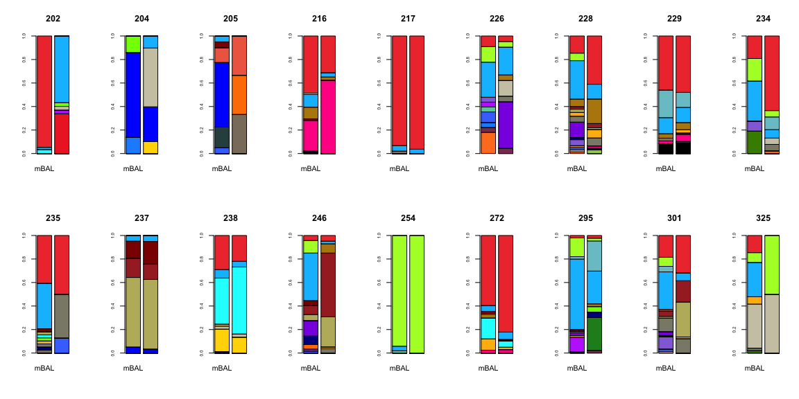
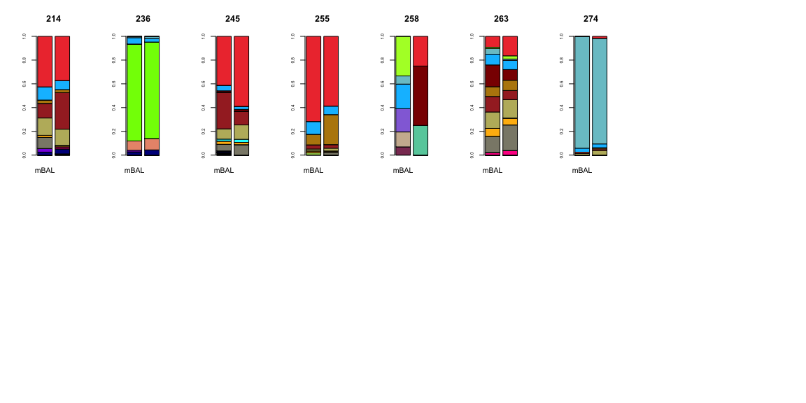

MBAL vs. TA comparison
================
Katrina Kalantar
2018-03-21

**Relevant Definitions:**

**mBAL:** mini broncheolar alveolar lavage

**TA:** tracheal aspirate

**LRTI:** lower respiratory tract infection

**PNA-pos:** Pneumonia positive

**PNA-neg:** Pneumonia negative

**ABSTRACT:** Pneumonia causes more deaths each year in the United States than any other type of infectious disease. The ability to accurately detect etiologic pathogens and distinguish them from background commensal microbiota is essential for guiding optimal antimicrobial treatments. In patients requiring mechanical ventilation, less invasive tracheal aspirate sampling (TA) has historically been considered inferior to mini-bronchial alveolar lavage/telescoping catheter (mBAL) specimen collection due to the potential for oropharyngeal microbiota contamination. This idea has been challenged, however, by studies demonstrating a lack of clinically significant differences between sample types, and a greater acceptance of TA sampling is now reflected in recent updates to clinical practice guidelines.4 Despite the broad potential implications of this shift in diagnostic sampling approach, relatively little information exists regarding microbial composition differences between mBAL and TA specimens, and the potential implications of such differences for clinical diagnostic testing.

------------------------------------------------------------------------

### Import the microbe data and metadata.

The microbial counts per individual were generated as follows:

Detection of host transcripts and airway microbes leveraged a custom bioinformatics pipeline that incorporated quality filtering using PRICESeqfilter and removal of host sequences by alignment against a database of the human genome (NCBI GRC h38) and Pan troglodytes (UCSC PanTro4) using the STAR aligner. Additional filtering was performed using Bowtie2 to remove non-fungal eukaryotes, cloning vectors and phiX phage. The identities of the remaining microbial reads were determined by querying the NCBI nucleotide (NT) and non-redundant protein (NR) databases using GSNAP-L and RAPSEARCH2, respectively. Microbial alignments detected by RNA-Seq and DNA-Seq were aggregated to the genus-level.

Then, the NT genus rpM counts were merged across all samples. Metadata describing the sample and patient relationships, as well as dividing patients into four groups was imported as .csv.

``` r
#IMPORT DATA
#.csv of all microbes by TA/mBAL sample ID #012618/
all_microbe_data <- read.csv('./data/032118/BM_4/merged_genusrpm.tsv', sep='\t', header=TRUE, row.names=1)

#read in metadata #012618/
metadata <- read.csv('./data/032118/tavmbal_metadata_noviruses.tsv', sep='\t', row.names=1)
```

The raw microbe data appeared as follows (showing only the first 5 rows):

<table style="width:100%;">
<colgroup>
<col width="1%" />
<col width="0%" />
<col width="0%" />
<col width="0%" />
<col width="0%" />
<col width="0%" />
<col width="0%" />
<col width="0%" />
<col width="0%" />
<col width="0%" />
<col width="0%" />
<col width="0%" />
<col width="0%" />
<col width="0%" />
<col width="1%" />
<col width="0%" />
<col width="0%" />
<col width="0%" />
<col width="1%" />
<col width="0%" />
<col width="0%" />
<col width="0%" />
<col width="0%" />
<col width="0%" />
<col width="0%" />
<col width="0%" />
<col width="0%" />
<col width="0%" />
<col width="0%" />
<col width="0%" />
<col width="0%" />
<col width="0%" />
<col width="1%" />
<col width="0%" />
<col width="0%" />
<col width="0%" />
<col width="0%" />
<col width="0%" />
<col width="0%" />
<col width="0%" />
<col width="0%" />
<col width="0%" />
<col width="1%" />
<col width="0%" />
<col width="0%" />
<col width="0%" />
<col width="0%" />
<col width="0%" />
<col width="1%" />
<col width="0%" />
<col width="0%" />
<col width="0%" />
<col width="0%" />
<col width="0%" />
<col width="0%" />
<col width="0%" />
<col width="0%" />
<col width="0%" />
<col width="1%" />
<col width="0%" />
<col width="1%" />
<col width="0%" />
<col width="1%" />
<col width="0%" />
<col width="1%" />
<col width="0%" />
<col width="1%" />
<col width="0%" />
<col width="1%" />
<col width="0%" />
<col width="0%" />
<col width="0%" />
<col width="1%" />
<col width="0%" />
<col width="0%" />
<col width="0%" />
<col width="1%" />
<col width="0%" />
<col width="1%" />
<col width="0%" />
<col width="1%" />
<col width="0%" />
<col width="1%" />
<col width="0%" />
<col width="1%" />
<col width="0%" />
<col width="1%" />
<col width="0%" />
<col width="0%" />
<col width="0%" />
<col width="0%" />
<col width="0%" />
<col width="1%" />
<col width="0%" />
<col width="0%" />
<col width="0%" />
<col width="0%" />
<col width="0%" />
<col width="0%" />
<col width="1%" />
<col width="1%" />
<col width="0%" />
<col width="0%" />
<col width="0%" />
<col width="1%" />
</colgroup>
<thead>
<tr class="header">
<th align="left"></th>
<th align="right">mBAL.202.DNA.B3</th>
<th align="right">mBAL.202.DNA.TA1.B10</th>
<th align="right">mBAL.204.DNA.B1</th>
<th align="right">mBAL.204.DNA.TA1.B8</th>
<th align="right">mBAL.205.DNA.B3</th>
<th align="right">mBAL.205.DNA.TA1.B8</th>
<th align="right">mBAL.208.DNA.B3</th>
<th align="right">mBAL.208.DNA.TA1.B10</th>
<th align="right">mBAL.209.DNA.B2</th>
<th align="right">mBAL.209.DNA.TA1.B8</th>
<th align="right">mBAL.211.DNA.B1</th>
<th align="right">mBAL.211.DNA.TA1.B10</th>
<th align="right">mBAL.212.DNA.B1</th>
<th align="right">mBAL.212.DNA.TA1.ZYM.6717.B7</th>
<th align="right">mBAL.213.DNA.B1</th>
<th align="right">mBAL.213.DNA.TA1.B8</th>
<th align="right">mBAL.214.DNA.B3</th>
<th align="right">mBAL.214.DNA.TA1.ZYM.6717.B7</th>
<th align="right">mBAL.215.DNA.B1</th>
<th align="right">mBAL.215.DNA.TA1.B10</th>
<th align="right">mBAL.216.DNA.B1</th>
<th align="right">mBAL.216.DNA.TA1.B10</th>
<th align="right">mBAL.217.DNA.B1</th>
<th align="right">mBAL.217.DNA.TA1.B8</th>
<th align="right">mBAL.218.DNA.B4</th>
<th align="right">mBAL.218.DNA.TA1.B10</th>
<th align="right">mBAL.220.DNA.B1</th>
<th align="right">mBAL.220.DNA.TA1.B8</th>
<th align="right">mBAL.221.DNA.B1</th>
<th align="right">mBAL.221.DNA.TA1.B8</th>
<th align="right">mBAL.225.DNA.B0</th>
<th align="right">mBAL.225.DNA.TA1.ZYM.6717.B7</th>
<th align="right">mBAL.226.DNA.B1</th>
<th align="right">mBAL.226.DNA.TA1.B10</th>
<th align="right">mBAL.227.DNA.B2</th>
<th align="right">mBAL.227.DNA.TA1.B10</th>
<th align="right">mBAL.228.DNA.B1</th>
<th align="right">mBAL.228.DNA.TA1.B8</th>
<th align="right">mBAL.229.DNA.B1</th>
<th align="right">mBAL.229.DNA.TA1.B8</th>
<th align="right">mBAL.232.DNA.B1</th>
<th align="right">mBAL.232.DNA.TA1.ZYM.6717.B7</th>
<th align="right">mBAL.234.DNA.B1</th>
<th align="right">mBAL.234.DNA.TA1.B10</th>
<th align="right">mBAL.235.DNA.B3</th>
<th align="right">mBAL.235.DNA.TA1.B10</th>
<th align="right">mBAL.236.DNA.B3</th>
<th align="right">mBAL.236.DNA.TA1.QIA.6517.B7</th>
<th align="right">mBAL.237.DNA.B3</th>
<th align="right">mBAL.237.DNA.TA1.B8</th>
<th align="right">mBAL.238.DNA.B3</th>
<th align="right">mBAL.238.DNA.TA1.B10</th>
<th align="right">mBAL.245.DNA.B3</th>
<th align="right">mBAL.245.DNA.TA1.B8</th>
<th align="right">mBAL.246.DNA.B3</th>
<th align="right">mBAL.246.DNA.TA1.B8</th>
<th align="right">mBAL.251.DNA.B1</th>
<th align="right">mBAL.251.DNA.TA2.QIA.6517.B7</th>
<th align="right">mBAL.252.DNA.B3</th>
<th align="right">mBAL.252.DNA.TA1.ZYM.6717.B7</th>
<th align="right">mBAL.254.DNA.B3</th>
<th align="right">mBAL.254.DNA.TA1.QIA.6517.B7</th>
<th align="right">mBAL.255.DNA.B1</th>
<th align="right">mBAL.255.DNA.TA1.QIA.6517.B7</th>
<th align="right">mBAL.256.DNA.B1</th>
<th align="right">mBAL.256.DNA.TA2.QIA.6517.B7</th>
<th align="right">mBAL.257.DNA.B0</th>
<th align="right">mBAL.257.DNA.TA1.ZYM.6717.B7</th>
<th align="right">mBAL.258.DNA.B2</th>
<th align="right">mBAL.258.DNA.TA1.B10</th>
<th align="right">mBAL.261.DNA.B3</th>
<th align="right">mBAL.261.DNA.TA2.QIA.6517.B7</th>
<th align="right">mBAL.263.DNA.B2</th>
<th align="right">mBAL.263.DNA.TA1.B8</th>
<th align="right">mBAL.268.DNA.B3</th>
<th align="right">mBAL.268.DNA.TA2.QIA.6517.B7</th>
<th align="right">mBAL.272.DNA.B3</th>
<th align="right">mBAL.272.DNA.TA2.QIA.6517.B7</th>
<th align="right">mBAL.273.DNA.B3</th>
<th align="right">mBAL.273.DNA.TA1.ZYM.6717.B7</th>
<th align="right">mBAL.274.DNA.B3</th>
<th align="right">mBAL.274.DNA.TA1.ZYM.6717.B7</th>
<th align="right">mBAL.278.DNA.B1</th>
<th align="right">mBAL.278.DNA.TA2.QIA.6517.B7</th>
<th align="right">mBAL.288.DNA.B3</th>
<th align="right">mBAL.288.DNA.TA1.QIA.6117.B7</th>
<th align="right">mBAL.289.DNA.B2</th>
<th align="right">mBAL.289.DNA.TA1.B8</th>
<th align="right">mBAL.290.DNA.B3</th>
<th align="right">mBAL.290.DNA.TA1.B8</th>
<th align="right">mBAL.295.DNA.B2</th>
<th align="right">mBAL.295.DNA.TA1.QIA.6117.B7</th>
<th align="right">mBAL.297.DNA.B4</th>
<th align="right">mBAL.297.DNA.TA1.B8</th>
<th align="right">mBAL.298.DNA.B3</th>
<th align="right">mBAL.298.DNA.TA1.B8</th>
<th align="right">mBAL.301.DNA.B2</th>
<th align="right">mBAL.301.DNA.TA1.B10</th>
<th align="right">mBAL.319.DNA.MB1.ZYM.6117.B7</th>
<th align="right">mBAL.319.DNA.TA1.ZYM.6717.B7</th>
<th align="right">mBAL.325.DNA.B6</th>
<th align="right">mBAL.325.DNA.TA1.B8</th>
<th align="right">mBAL.331.DNA.B6</th>
<th align="right">mBAL.331.DNA.TA1.QIA.6117.B7</th>
</tr>
</thead>
<tbody>
<tr class="odd">
<td align="left">Abiotrophia ( 46123 )</td>
<td align="right">0</td>
<td align="right">0.00</td>
<td align="right">0</td>
<td align="right">0</td>
<td align="right">0</td>
<td align="right">0</td>
<td align="right">0.00</td>
<td align="right">0</td>
<td align="right">0</td>
<td align="right">0</td>
<td align="right">0</td>
<td align="right">0</td>
<td align="right">0.03</td>
<td align="right">0</td>
<td align="right">0</td>
<td align="right">0</td>
<td align="right">0.00</td>
<td align="right">0</td>
<td align="right">0.22</td>
<td align="right">0.31</td>
<td align="right">0</td>
<td align="right">0</td>
<td align="right">0</td>
<td align="right">0.00</td>
<td align="right">0</td>
<td align="right">0</td>
<td align="right">0.00</td>
<td align="right">0</td>
<td align="right">0</td>
<td align="right">0</td>
<td align="right">0</td>
<td align="right">0</td>
<td align="right">0</td>
<td align="right">0</td>
<td align="right">0.00</td>
<td align="right">0.00</td>
<td align="right">0.00</td>
<td align="right">0</td>
<td align="right">0</td>
<td align="right">0</td>
<td align="right">0</td>
<td align="right">0</td>
<td align="right">0</td>
<td align="right">0</td>
<td align="right">0</td>
<td align="right">0</td>
<td align="right">0</td>
<td align="right">0</td>
<td align="right">0.00</td>
<td align="right">0.00</td>
<td align="right">0</td>
<td align="right">0</td>
<td align="right">0</td>
<td align="right">0</td>
<td align="right">0.00</td>
<td align="right">0</td>
<td align="right">0</td>
<td align="right">0.00</td>
<td align="right">0</td>
<td align="right">0</td>
<td align="right">0</td>
<td align="right">0</td>
<td align="right">0.00</td>
<td align="right">0</td>
<td align="right">0.00</td>
<td align="right">0</td>
<td align="right">0</td>
<td align="right">0</td>
<td align="right">0.00</td>
<td align="right">0</td>
<td align="right">0.00</td>
<td align="right">0</td>
<td align="right">0</td>
<td align="right">0.00</td>
<td align="right">0.00</td>
<td align="right">0.00</td>
<td align="right">0</td>
<td align="right">0.00</td>
<td align="right">0</td>
<td align="right">0</td>
<td align="right">0</td>
<td align="right">0</td>
<td align="right">0</td>
<td align="right">0</td>
<td align="right">0</td>
<td align="right">0.00</td>
<td align="right">0</td>
<td align="right">0</td>
<td align="right">0</td>
<td align="right">0</td>
<td align="right">0.00</td>
<td align="right">0</td>
<td align="right">0.00</td>
<td align="right">0.00</td>
<td align="right">0</td>
<td align="right">0</td>
<td align="right">0.00</td>
<td align="right">0</td>
<td align="right">0</td>
<td align="right">0</td>
<td align="right">0</td>
<td align="right">0</td>
<td align="right">0</td>
<td align="right">0.00</td>
</tr>
<tr class="even">
<td align="left">Absidia ( 4828 )</td>
<td align="right">0</td>
<td align="right">0.16</td>
<td align="right">0</td>
<td align="right">0</td>
<td align="right">0</td>
<td align="right">0</td>
<td align="right">0.00</td>
<td align="right">0</td>
<td align="right">0</td>
<td align="right">0</td>
<td align="right">0</td>
<td align="right">0</td>
<td align="right">0.00</td>
<td align="right">0</td>
<td align="right">0</td>
<td align="right">0</td>
<td align="right">0.00</td>
<td align="right">0</td>
<td align="right">0.00</td>
<td align="right">0.00</td>
<td align="right">0</td>
<td align="right">0</td>
<td align="right">0</td>
<td align="right">0.00</td>
<td align="right">0</td>
<td align="right">0</td>
<td align="right">0.00</td>
<td align="right">0</td>
<td align="right">0</td>
<td align="right">0</td>
<td align="right">0</td>
<td align="right">0</td>
<td align="right">0</td>
<td align="right">0</td>
<td align="right">0.00</td>
<td align="right">0.00</td>
<td align="right">0.00</td>
<td align="right">0</td>
<td align="right">0</td>
<td align="right">0</td>
<td align="right">0</td>
<td align="right">0</td>
<td align="right">0</td>
<td align="right">0</td>
<td align="right">0</td>
<td align="right">0</td>
<td align="right">0</td>
<td align="right">0</td>
<td align="right">0.00</td>
<td align="right">0.00</td>
<td align="right">0</td>
<td align="right">0</td>
<td align="right">0</td>
<td align="right">0</td>
<td align="right">0.00</td>
<td align="right">0</td>
<td align="right">0</td>
<td align="right">0.00</td>
<td align="right">0</td>
<td align="right">0</td>
<td align="right">0</td>
<td align="right">0</td>
<td align="right">0.00</td>
<td align="right">0</td>
<td align="right">0.00</td>
<td align="right">0</td>
<td align="right">0</td>
<td align="right">0</td>
<td align="right">0.00</td>
<td align="right">0</td>
<td align="right">0.00</td>
<td align="right">0</td>
<td align="right">0</td>
<td align="right">0.00</td>
<td align="right">0.00</td>
<td align="right">0.00</td>
<td align="right">0</td>
<td align="right">0.00</td>
<td align="right">0</td>
<td align="right">0</td>
<td align="right">0</td>
<td align="right">0</td>
<td align="right">0</td>
<td align="right">0</td>
<td align="right">0</td>
<td align="right">0.00</td>
<td align="right">0</td>
<td align="right">0</td>
<td align="right">0</td>
<td align="right">0</td>
<td align="right">0.00</td>
<td align="right">0</td>
<td align="right">0.00</td>
<td align="right">0.00</td>
<td align="right">0</td>
<td align="right">0</td>
<td align="right">0.00</td>
<td align="right">0</td>
<td align="right">0</td>
<td align="right">0</td>
<td align="right">0</td>
<td align="right">0</td>
<td align="right">0</td>
<td align="right">0.00</td>
</tr>
<tr class="odd">
<td align="left">Acetohalobium ( 28186 )</td>
<td align="right">0</td>
<td align="right">0.00</td>
<td align="right">0</td>
<td align="right">0</td>
<td align="right">0</td>
<td align="right">0</td>
<td align="right">0.00</td>
<td align="right">0</td>
<td align="right">0</td>
<td align="right">0</td>
<td align="right">0</td>
<td align="right">0</td>
<td align="right">0.00</td>
<td align="right">0</td>
<td align="right">0</td>
<td align="right">0</td>
<td align="right">0.00</td>
<td align="right">0</td>
<td align="right">0.00</td>
<td align="right">0.00</td>
<td align="right">0</td>
<td align="right">0</td>
<td align="right">0</td>
<td align="right">0.00</td>
<td align="right">0</td>
<td align="right">0</td>
<td align="right">0.00</td>
<td align="right">0</td>
<td align="right">0</td>
<td align="right">0</td>
<td align="right">0</td>
<td align="right">0</td>
<td align="right">0</td>
<td align="right">0</td>
<td align="right">0.00</td>
<td align="right">0.00</td>
<td align="right">0.00</td>
<td align="right">0</td>
<td align="right">0</td>
<td align="right">0</td>
<td align="right">0</td>
<td align="right">0</td>
<td align="right">0</td>
<td align="right">0</td>
<td align="right">0</td>
<td align="right">0</td>
<td align="right">0</td>
<td align="right">0</td>
<td align="right">0.00</td>
<td align="right">0.00</td>
<td align="right">0</td>
<td align="right">0</td>
<td align="right">0</td>
<td align="right">0</td>
<td align="right">0.00</td>
<td align="right">0</td>
<td align="right">0</td>
<td align="right">0.00</td>
<td align="right">0</td>
<td align="right">0</td>
<td align="right">0</td>
<td align="right">0</td>
<td align="right">0.00</td>
<td align="right">0</td>
<td align="right">0.00</td>
<td align="right">0</td>
<td align="right">0</td>
<td align="right">0</td>
<td align="right">0.00</td>
<td align="right">0</td>
<td align="right">0.00</td>
<td align="right">0</td>
<td align="right">0</td>
<td align="right">0.00</td>
<td align="right">0.00</td>
<td align="right">0.00</td>
<td align="right">0</td>
<td align="right">0.14</td>
<td align="right">0</td>
<td align="right">0</td>
<td align="right">0</td>
<td align="right">0</td>
<td align="right">0</td>
<td align="right">0</td>
<td align="right">0</td>
<td align="right">0.00</td>
<td align="right">0</td>
<td align="right">0</td>
<td align="right">0</td>
<td align="right">0</td>
<td align="right">0.00</td>
<td align="right">0</td>
<td align="right">0.00</td>
<td align="right">0.00</td>
<td align="right">0</td>
<td align="right">0</td>
<td align="right">0.00</td>
<td align="right">0</td>
<td align="right">0</td>
<td align="right">0</td>
<td align="right">0</td>
<td align="right">0</td>
<td align="right">0</td>
<td align="right">0.00</td>
</tr>
<tr class="even">
<td align="left">Acholeplasma ( 2147 )</td>
<td align="right">0</td>
<td align="right">0.00</td>
<td align="right">0</td>
<td align="right">0</td>
<td align="right">0</td>
<td align="right">0</td>
<td align="right">0.00</td>
<td align="right">0</td>
<td align="right">0</td>
<td align="right">0</td>
<td align="right">0</td>
<td align="right">0</td>
<td align="right">0.00</td>
<td align="right">0</td>
<td align="right">0</td>
<td align="right">0</td>
<td align="right">0.00</td>
<td align="right">0</td>
<td align="right">0.00</td>
<td align="right">0.00</td>
<td align="right">0</td>
<td align="right">0</td>
<td align="right">0</td>
<td align="right">0.07</td>
<td align="right">0</td>
<td align="right">0</td>
<td align="right">0.00</td>
<td align="right">0</td>
<td align="right">0</td>
<td align="right">0</td>
<td align="right">0</td>
<td align="right">0</td>
<td align="right">0</td>
<td align="right">0</td>
<td align="right">0.00</td>
<td align="right">0.07</td>
<td align="right">0.00</td>
<td align="right">0</td>
<td align="right">0</td>
<td align="right">0</td>
<td align="right">0</td>
<td align="right">0</td>
<td align="right">0</td>
<td align="right">0</td>
<td align="right">0</td>
<td align="right">0</td>
<td align="right">0</td>
<td align="right">0</td>
<td align="right">0.00</td>
<td align="right">0.00</td>
<td align="right">0</td>
<td align="right">0</td>
<td align="right">0</td>
<td align="right">0</td>
<td align="right">0.00</td>
<td align="right">0</td>
<td align="right">0</td>
<td align="right">0.00</td>
<td align="right">0</td>
<td align="right">0</td>
<td align="right">0</td>
<td align="right">0</td>
<td align="right">0.00</td>
<td align="right">0</td>
<td align="right">0.00</td>
<td align="right">0</td>
<td align="right">0</td>
<td align="right">0</td>
<td align="right">0.00</td>
<td align="right">0</td>
<td align="right">0.00</td>
<td align="right">0</td>
<td align="right">0</td>
<td align="right">0.00</td>
<td align="right">0.00</td>
<td align="right">0.00</td>
<td align="right">0</td>
<td align="right">0.14</td>
<td align="right">0</td>
<td align="right">0</td>
<td align="right">0</td>
<td align="right">0</td>
<td align="right">0</td>
<td align="right">0</td>
<td align="right">0</td>
<td align="right">0.00</td>
<td align="right">0</td>
<td align="right">0</td>
<td align="right">0</td>
<td align="right">0</td>
<td align="right">0.00</td>
<td align="right">0</td>
<td align="right">0.03</td>
<td align="right">0.11</td>
<td align="right">0</td>
<td align="right">0</td>
<td align="right">0.00</td>
<td align="right">0</td>
<td align="right">0</td>
<td align="right">0</td>
<td align="right">0</td>
<td align="right">0</td>
<td align="right">0</td>
<td align="right">0.00</td>
</tr>
<tr class="odd">
<td align="left">Achromobacter ( 222 )</td>
<td align="right">0</td>
<td align="right">0.00</td>
<td align="right">0</td>
<td align="right">0</td>
<td align="right">0</td>
<td align="right">0</td>
<td align="right">20.31</td>
<td align="right">0</td>
<td align="right">0</td>
<td align="right">0</td>
<td align="right">0</td>
<td align="right">0</td>
<td align="right">0.00</td>
<td align="right">0</td>
<td align="right">0</td>
<td align="right">0</td>
<td align="right">0.04</td>
<td align="right">0</td>
<td align="right">0.00</td>
<td align="right">0.00</td>
<td align="right">0</td>
<td align="right">0</td>
<td align="right">0</td>
<td align="right">0.00</td>
<td align="right">0</td>
<td align="right">0</td>
<td align="right">0.56</td>
<td align="right">0</td>
<td align="right">0</td>
<td align="right">0</td>
<td align="right">0</td>
<td align="right">0</td>
<td align="right">0</td>
<td align="right">0</td>
<td align="right">1168.22</td>
<td align="right">0.00</td>
<td align="right">0.05</td>
<td align="right">0</td>
<td align="right">0</td>
<td align="right">0</td>
<td align="right">0</td>
<td align="right">0</td>
<td align="right">0</td>
<td align="right">0</td>
<td align="right">0</td>
<td align="right">0</td>
<td align="right">0</td>
<td align="right">0</td>
<td align="right">0.04</td>
<td align="right">0.16</td>
<td align="right">0</td>
<td align="right">0</td>
<td align="right">0</td>
<td align="right">0</td>
<td align="right">7.26</td>
<td align="right">0</td>
<td align="right">0</td>
<td align="right">0.08</td>
<td align="right">0</td>
<td align="right">0</td>
<td align="right">0</td>
<td align="right">0</td>
<td align="right">0.19</td>
<td align="right">0</td>
<td align="right">0.04</td>
<td align="right">0</td>
<td align="right">0</td>
<td align="right">0</td>
<td align="right">0.06</td>
<td align="right">0</td>
<td align="right">23.61</td>
<td align="right">0</td>
<td align="right">0</td>
<td align="right">0.09</td>
<td align="right">2.06</td>
<td align="right">15.44</td>
<td align="right">0</td>
<td align="right">0.00</td>
<td align="right">0</td>
<td align="right">0</td>
<td align="right">0</td>
<td align="right">0</td>
<td align="right">0</td>
<td align="right">0</td>
<td align="right">0</td>
<td align="right">0.31</td>
<td align="right">0</td>
<td align="right">0</td>
<td align="right">0</td>
<td align="right">0</td>
<td align="right">2.23</td>
<td align="right">0</td>
<td align="right">0.05</td>
<td align="right">0.00</td>
<td align="right">0</td>
<td align="right">0</td>
<td align="right">0.38</td>
<td align="right">0</td>
<td align="right">0</td>
<td align="right">0</td>
<td align="right">0</td>
<td align="right">0</td>
<td align="right">0</td>
<td align="right">0.14</td>
</tr>
</tbody>
</table>

And the metadata was:

Note, that effective\_group = 1 refers to samples indicated as PNA-pos (unequivocal pneumonia-positive) in the manuscript and effective\_group = 4 refers to samples indicated as PNA-neg (unequivocal pneumonia-negative, with clear alternative cause for respiratory failure). "effective\_group"'s 2 and 3 are lumped together to form the PNA-unk (pneumonia-unknown) group.

For more information on the adjudication process, refer to "Cohort Summary" below.

<table>
<colgroup>
<col width="3%" />
<col width="18%" />
<col width="18%" />
<col width="10%" />
<col width="49%" />
</colgroup>
<thead>
<tr class="header">
<th align="left"></th>
<th align="left">mBAL_DNAseq_filename</th>
<th align="left">TA_DNAseq_filename</th>
<th align="right">effective_group</th>
<th align="left">microbe</th>
</tr>
</thead>
<tbody>
<tr class="odd">
<td align="left">202</td>
<td align="left">mBAL.202.DNA.B3</td>
<td align="left">mBAL.202.DNA.TA1.B10</td>
<td align="right">2</td>
<td align="left"></td>
</tr>
<tr class="even">
<td align="left">204</td>
<td align="left">mBAL.204.DNA.B1</td>
<td align="left">mBAL.204.DNA.TA1.B8</td>
<td align="right">2</td>
<td align="left"></td>
</tr>
<tr class="odd">
<td align="left">205</td>
<td align="left">mBAL.205.DNA.B3</td>
<td align="left">mBAL.205.DNA.TA1.B8</td>
<td align="right">2</td>
<td align="left">Enterovirus ( 12059 )</td>
</tr>
<tr class="even">
<td align="left">208</td>
<td align="left">mBAL.208.DNA.B3</td>
<td align="left">mBAL.208.DNA.TA1.B10</td>
<td align="right">4</td>
<td align="left"></td>
</tr>
<tr class="odd">
<td align="left">209</td>
<td align="left">mBAL.209.DNA.B2</td>
<td align="left">mBAL.209.DNA.TA1.B8</td>
<td align="right">1</td>
<td align="left">Haemophilus ( 724 ),Streptococcus ( 1301 )</td>
</tr>
<tr class="even">
<td align="left">211</td>
<td align="left">mBAL.211.DNA.B1</td>
<td align="left">mBAL.211.DNA.TA1.B10</td>
<td align="right">4</td>
<td align="left"></td>
</tr>
<tr class="odd">
<td align="left">212</td>
<td align="left">mBAL.212.DNA.B1</td>
<td align="left">mBAL.212.DNA.TA1.ZYM.6717.B7</td>
<td align="right">1</td>
<td align="left">Staphylococcus ( 1279 )</td>
</tr>
<tr class="even">
<td align="left">213</td>
<td align="left">mBAL.213.DNA.B1</td>
<td align="left">mBAL.213.DNA.TA1.B8</td>
<td align="right">1</td>
<td align="left">Escherichia ( 561 ),Klebsiella ( 570 )</td>
</tr>
<tr class="odd">
<td align="left">214</td>
<td align="left">mBAL.214.DNA.B3</td>
<td align="left">mBAL.214.DNA.TA1.ZYM.6717.B7</td>
<td align="right">3</td>
<td align="left"></td>
</tr>
<tr class="even">
<td align="left">215</td>
<td align="left">mBAL.215.DNA.B1</td>
<td align="left">mBAL.215.DNA.TA1.B10</td>
<td align="right">4</td>
<td align="left"></td>
</tr>
<tr class="odd">
<td align="left">216</td>
<td align="left">mBAL.216.DNA.B1</td>
<td align="left">mBAL.216.DNA.TA1.B10</td>
<td align="right">2</td>
<td align="left"></td>
</tr>
<tr class="even">
<td align="left">217</td>
<td align="left">mBAL.217.DNA.B1</td>
<td align="left">mBAL.217.DNA.TA1.B8</td>
<td align="right">2</td>
<td align="left"></td>
</tr>
<tr class="odd">
<td align="left">218</td>
<td align="left">mBAL.218.DNA.B4</td>
<td align="left">mBAL.218.DNA.TA1.B10</td>
<td align="right">4</td>
<td align="left"></td>
</tr>
<tr class="even">
<td align="left">220</td>
<td align="left">mBAL.220.DNA.B1</td>
<td align="left">mBAL.220.DNA.TA1.B8</td>
<td align="right">4</td>
<td align="left"></td>
</tr>
<tr class="odd">
<td align="left">221</td>
<td align="left">mBAL.221.DNA.B1</td>
<td align="left">mBAL.221.DNA.TA1.B8</td>
<td align="right">4</td>
<td align="left"></td>
</tr>
<tr class="even">
<td align="left">225</td>
<td align="left">mBAL.225.DNA.B0</td>
<td align="left">mBAL.225.DNA.TA1.ZYM.6717.B7</td>
<td align="right">1</td>
<td align="left">Staphylococcus ( 1279 )</td>
</tr>
<tr class="odd">
<td align="left">226</td>
<td align="left">mBAL.226.DNA.B1</td>
<td align="left">mBAL.226.DNA.TA1.B10</td>
<td align="right">2</td>
<td align="left"></td>
</tr>
<tr class="even">
<td align="left">227</td>
<td align="left">mBAL.227.DNA.B2</td>
<td align="left">mBAL.227.DNA.TA1.B10</td>
<td align="right">4</td>
<td align="left"></td>
</tr>
<tr class="odd">
<td align="left">228</td>
<td align="left">mBAL.228.DNA.B1</td>
<td align="left">mBAL.228.DNA.TA1.B8</td>
<td align="right">2</td>
<td align="left">Pneumovirus ( 11245 )</td>
</tr>
<tr class="even">
<td align="left">229</td>
<td align="left">mBAL.229.DNA.B1</td>
<td align="left">mBAL.229.DNA.TA1.B8</td>
<td align="right">2</td>
<td align="left"></td>
</tr>
<tr class="odd">
<td align="left">232</td>
<td align="left">mBAL.232.DNA.B1</td>
<td align="left">mBAL.232.DNA.TA1.ZYM.6717.B7</td>
<td align="right">1</td>
<td align="left">Klebsiella ( 570 )</td>
</tr>
<tr class="even">
<td align="left">234</td>
<td align="left">mBAL.234.DNA.B1</td>
<td align="left">mBAL.234.DNA.TA1.B10</td>
<td align="right">2</td>
<td align="left"></td>
</tr>
<tr class="odd">
<td align="left">235</td>
<td align="left">mBAL.235.DNA.B3</td>
<td align="left">mBAL.235.DNA.TA1.B10</td>
<td align="right">2</td>
<td align="left"></td>
</tr>
<tr class="even">
<td align="left">236</td>
<td align="left">mBAL.236.DNA.B3</td>
<td align="left">mBAL.236.DNA.TA1.QIA.6517.B7</td>
<td align="right">3</td>
<td align="left"></td>
</tr>
<tr class="odd">
<td align="left">237</td>
<td align="left">mBAL.237.DNA.B3</td>
<td align="left">mBAL.237.DNA.TA1.B8</td>
<td align="right">2</td>
<td align="left"></td>
</tr>
<tr class="even">
<td align="left">238</td>
<td align="left">mBAL.238.DNA.B3</td>
<td align="left">mBAL.238.DNA.TA1.B10</td>
<td align="right">2</td>
<td align="left"></td>
</tr>
<tr class="odd">
<td align="left">245</td>
<td align="left">mBAL.245.DNA.B3</td>
<td align="left">mBAL.245.DNA.TA1.B8</td>
<td align="right">3</td>
<td align="left"></td>
</tr>
<tr class="even">
<td align="left">246</td>
<td align="left">mBAL.246.DNA.B3</td>
<td align="left">mBAL.246.DNA.TA1.B8</td>
<td align="right">2</td>
<td align="left"></td>
</tr>
<tr class="odd">
<td align="left">251</td>
<td align="left">mBAL.251.DNA.B1</td>
<td align="left">mBAL.251.DNA.TA2.QIA.6517.B7</td>
<td align="right">1</td>
<td align="left">Klebsiella ( 570 )</td>
</tr>
<tr class="even">
<td align="left">252</td>
<td align="left">mBAL.252.DNA.B3</td>
<td align="left">mBAL.252.DNA.TA1.ZYM.6717.B7</td>
<td align="right">1</td>
<td align="left">Enterobacter ( 547 ),Staphylococcus ( 1279 ),Streptococcus ( 1301 )</td>
</tr>
<tr class="odd">
<td align="left">254</td>
<td align="left">mBAL.254.DNA.B3</td>
<td align="left">mBAL.254.DNA.TA1.QIA.6517.B7</td>
<td align="right">2</td>
<td align="left"></td>
</tr>
<tr class="even">
<td align="left">255</td>
<td align="left">mBAL.255.DNA.B1</td>
<td align="left">mBAL.255.DNA.TA1.QIA.6517.B7</td>
<td align="right">3</td>
<td align="left"></td>
</tr>
<tr class="odd">
<td align="left">256</td>
<td align="left">mBAL.256.DNA.B1</td>
<td align="left">mBAL.256.DNA.TA2.QIA.6517.B7</td>
<td align="right">4</td>
<td align="left"></td>
</tr>
<tr class="even">
<td align="left">257</td>
<td align="left">mBAL.257.DNA.B0</td>
<td align="left">mBAL.257.DNA.TA1.ZYM.6717.B7</td>
<td align="right">1</td>
<td align="left">Enterobacter ( 547 )</td>
</tr>
<tr class="odd">
<td align="left">258</td>
<td align="left">mBAL.258.DNA.B2</td>
<td align="left">mBAL.258.DNA.TA1.B10</td>
<td align="right">3</td>
<td align="left"></td>
</tr>
<tr class="even">
<td align="left">261</td>
<td align="left">mBAL.261.DNA.B3</td>
<td align="left">mBAL.261.DNA.TA2.QIA.6517.B7</td>
<td align="right">4</td>
<td align="left"></td>
</tr>
<tr class="odd">
<td align="left">263</td>
<td align="left">mBAL.263.DNA.B2</td>
<td align="left">mBAL.263.DNA.TA1.B8</td>
<td align="right">3</td>
<td align="left"></td>
</tr>
<tr class="even">
<td align="left">268</td>
<td align="left">mBAL.268.DNA.B3</td>
<td align="left">mBAL.268.DNA.TA2.QIA.6517.B7</td>
<td align="right">1</td>
<td align="left">Pseudomonas ( 286 ),Stenotrophomonas ( 40323 )</td>
</tr>
<tr class="odd">
<td align="left">272</td>
<td align="left">mBAL.272.DNA.B3</td>
<td align="left">mBAL.272.DNA.TA2.QIA.6517.B7</td>
<td align="right">2</td>
<td align="left"></td>
</tr>
<tr class="even">
<td align="left">273</td>
<td align="left">mBAL.273.DNA.B3</td>
<td align="left">mBAL.273.DNA.TA1.ZYM.6717.B7</td>
<td align="right">4</td>
<td align="left"></td>
</tr>
<tr class="odd">
<td align="left">274</td>
<td align="left">mBAL.274.DNA.B3</td>
<td align="left">mBAL.274.DNA.TA1.ZYM.6717.B7</td>
<td align="right">3</td>
<td align="left"></td>
</tr>
<tr class="even">
<td align="left">278</td>
<td align="left">mBAL.278.DNA.B1</td>
<td align="left">mBAL.278.DNA.TA2.QIA.6517.B7</td>
<td align="right">1</td>
<td align="left">Moraxella ( 475 )</td>
</tr>
<tr class="odd">
<td align="left">288</td>
<td align="left">mBAL.288.DNA.B3</td>
<td align="left">mBAL.288.DNA.TA1.QIA.6117.B7</td>
<td align="right">1</td>
<td align="left">Staphylococcus ( 1279 )</td>
</tr>
<tr class="even">
<td align="left">289</td>
<td align="left">mBAL.289.DNA.B2</td>
<td align="left">mBAL.289.DNA.TA1.B8</td>
<td align="right">1</td>
<td align="left">Staphylococcus ( 1279 )</td>
</tr>
<tr class="odd">
<td align="left">290</td>
<td align="left">mBAL.290.DNA.B3</td>
<td align="left">mBAL.290.DNA.TA1.B8</td>
<td align="right">1</td>
<td align="left">Moraxella ( 475 )</td>
</tr>
<tr class="even">
<td align="left">295</td>
<td align="left">mBAL.295.DNA.B2</td>
<td align="left">mBAL.295.DNA.TA1.QIA.6117.B7</td>
<td align="right">2</td>
<td align="left">Pneumovirus ( 11245 )</td>
</tr>
<tr class="odd">
<td align="left">297</td>
<td align="left">mBAL.297.DNA.B4</td>
<td align="left">mBAL.297.DNA.TA1.B8</td>
<td align="right">1</td>
<td align="left">Enterobacter ( 547 ),Morganella ( 581 ),Klebsiella ( 570 ),Pseudomonas ( 286 )</td>
</tr>
<tr class="even">
<td align="left">298</td>
<td align="left">mBAL.298.DNA.B3</td>
<td align="left">mBAL.298.DNA.TA1.B8</td>
<td align="right">1</td>
<td align="left">Enterobacter ( 547 )</td>
</tr>
<tr class="odd">
<td align="left">301</td>
<td align="left">mBAL.301.DNA.B2</td>
<td align="left">mBAL.301.DNA.TA1.B10</td>
<td align="right">2</td>
<td align="left"></td>
</tr>
<tr class="even">
<td align="left">319</td>
<td align="left">mBAL.319.DNA.MB1.ZYM.6117.B7</td>
<td align="left">mBAL.319.DNA.TA1.ZYM.6717.B7</td>
<td align="right">4</td>
<td align="left"></td>
</tr>
<tr class="odd">
<td align="left">325</td>
<td align="left">mBAL.325.DNA.B6</td>
<td align="left">mBAL.325.DNA.TA1.B8</td>
<td align="right">2</td>
<td align="left"></td>
</tr>
<tr class="even">
<td align="left">331</td>
<td align="left">mBAL.331.DNA.B6</td>
<td align="left">mBAL.331.DNA.TA1.QIA.6117.B7</td>
<td align="right">4</td>
<td align="left"></td>
</tr>
</tbody>
</table>

------------------------------------------------------------------------

### Cohort Summary

The initial cohort contained 52 adults 21 to over 89 years of age who were admitted to the intensive care unit with acute respiratory failure. Matched mBAL and TA specimens were obtained from each patient. For analysis purposes, all patients patients were stratified post-collection across four groups according to their likelihood of having a lower respiratory tract infection.

Two-physician adjudication was used to identify subjects with culture-confirmed bacterial pneumonia (PNA-pos, n = 15) based on retrospective medical record review (blinded to mNGS results) using the United States Centers for Disease Control surveillance case definition of pneumonia.

Adjudication is noted in the analysis under the following categories:

Group 1 = **"PNA-pos"**, Definite bacterial pneumonia

**"PNA-unk"**, pneumonia unknown (all patients not in PNA-pos or PNA-neg, grouped together for the purpose of comparing sample types)

Group 2 = Probable Lower Respiratory Tract Infection, but negative clinical microbiology; AND definite viral pneumonia cases (ie pt 205, 228, 295) where infection with RNA virus could not be detected by DNA-seq.

Group 3 = Unknown LRTI status.

Group 4 = **"PNA-neg"**, Definitely no LRTI, with clear alternative explanation for acute respiratory failure

The distribution of patients is as follows:


| Var1 |  Freq|
|:-----|-----:|
| 1    |    15|
| 2    |    18|
| 3    |     7|
| 4    |    12|

------------------------------------------------------------------------

### Comparison of DNA Microbial Burden

#### No differences in Burden of microbial genera between TA and mBAL

``` r
burden <- colSums(all_microbe_data) 
```

**Microbial burden**, as measured by the total microbial alignments by genus per million reads sequenced (rpM), did not significantly differ between TA and mBAL when using whole genome DNA sequencing: WGS, Wilcoxon rank sum p =

Summary of burden in TA:

|  Min.|  1st Qu.|  Median|     Mean|   3rd Qu.|     Max.|
|-----:|--------:|-------:|--------:|---------:|--------:|
|   0.1|    6.685|  43.295|  307.834|  327.9275|  3568.04|

Summary of burden in mBAL:

|  Min.|  1st Qu.|  Median|      Mean|   3rd Qu.|      Max.|
|-----:|--------:|-------:|---------:|---------:|---------:|
|   0.4|   5.6575|   26.89|  1743.159|  167.6275|  76324.15|

Wilcox rank sum p-value for comparing microbial burden in TA v. mBAL

    ## [1] 0.6607838

------------------------------------------------------------------------

### Analysis of microbial community proportions

#### Create data splits, normalize microbe counts by Total Sum Scaling, and group all low-level microbes &lt; 1% of total reads into "Other".

Separate MBAL and TA into dataframes, normalize the microbial data into proportions, and separate out group 1.

``` r
MBAL <- as.character(unname(unlist(metadata[c("mBAL_DNAseq_filename")])))  # separate mBAL from TA
TA <- as.character(unname(unlist(metadata[c("TA_DNAseq_filename")])))
MBAL.microbes <- all_microbe_data[,colnames(all_microbe_data) %in% MBAL]  
TA.microbes <- all_microbe_data[,colnames(all_microbe_data) %in% TA]
MBAL.microbes.norm <-  t(t(MBAL.microbes)/colSums(MBAL.microbes))   # normalize (Total Sum Scaling) -> generate proportions
TA.microbes.norm <- t(t(TA.microbes)/colSums(TA.microbes))
 
# Isolate Group 1 Data
group1.MBAL <- as.character(unname(unlist(metadata[metadata$effective_group==1,][c("mBAL_DNAseq_filename")])))
group1.TA <- as.character(unname(unlist(metadata[metadata$effective_group==1,][c("TA_DNAseq_filename")])))
group1.MBAL.microbes <- all_microbe_data[,colnames(all_microbe_data) %in% group1.MBAL]
group1.MBAL.microbes.norm <- t(t(group1.MBAL.microbes)/colSums(group1.MBAL.microbes))
group1.TA.microbes <- all_microbe_data[,colnames(all_microbe_data) %in% group1.TA]
group1.TA.microbes.norm <- t(t(group1.TA.microbes)/colSums(group1.TA.microbes))

all_microbe_data.microbes.norm <- t(t(all_microbe_data)/colSums(all_microbe_data)) # normalize (TSS)

write.csv(all_microbe_data.microbes.norm, "./output/TableS3.tsv", sep="\t", quote=FALSE) # save normalized data for manuscript prior to filtering microbes with < 1% per sample

all_microbe_data_orig <- all_microbe_data.microbes.norm  # re-assign variable so we have a copy with non-normalized values
all_microbe_data.microbes.norm[all_microbe_data.microbes.norm<.01] <- 0  # remove microbes present at < 1% abundance
new <- rbind(all_microbe_data.microbes.norm, c(1-colSums(all_microbe_data.microbes.norm)))  # add "Other" category
rownames(new) <- c(rownames(all_microbe_data.microbes.norm),"Other")  # adjust row names
all_microbe_data <- new  
```

The normalized data (without removing microbes present at abundance &lt; 1%) is reported in TableS3 of the manuscript, but here we show the per-sample proportions of the top 10 most abundant genera across the cohort after grouping all microbes present at abundance &lt; 1% into the "Other" category:

Note: this is still different from the "Other" values reported in FigureS1, which includes rpm values for all microbes not in the top 39 most abundant microbes.

``` r
kable(all_microbe_data[names(head(sort(rowSums(all_microbe_data),decreasing=TRUE),n=20)),], "markdown" ) #%>% 
```

<table style="width:100%;">
<colgroup>
<col width="1%" />
<col width="0%" />
<col width="0%" />
<col width="0%" />
<col width="0%" />
<col width="0%" />
<col width="0%" />
<col width="0%" />
<col width="0%" />
<col width="0%" />
<col width="0%" />
<col width="0%" />
<col width="0%" />
<col width="0%" />
<col width="1%" />
<col width="0%" />
<col width="0%" />
<col width="0%" />
<col width="1%" />
<col width="0%" />
<col width="0%" />
<col width="0%" />
<col width="0%" />
<col width="0%" />
<col width="0%" />
<col width="0%" />
<col width="0%" />
<col width="0%" />
<col width="0%" />
<col width="0%" />
<col width="0%" />
<col width="0%" />
<col width="1%" />
<col width="0%" />
<col width="0%" />
<col width="0%" />
<col width="0%" />
<col width="0%" />
<col width="0%" />
<col width="0%" />
<col width="0%" />
<col width="0%" />
<col width="1%" />
<col width="0%" />
<col width="0%" />
<col width="0%" />
<col width="0%" />
<col width="0%" />
<col width="1%" />
<col width="0%" />
<col width="0%" />
<col width="0%" />
<col width="0%" />
<col width="0%" />
<col width="0%" />
<col width="0%" />
<col width="0%" />
<col width="0%" />
<col width="1%" />
<col width="0%" />
<col width="1%" />
<col width="0%" />
<col width="1%" />
<col width="0%" />
<col width="1%" />
<col width="0%" />
<col width="1%" />
<col width="0%" />
<col width="1%" />
<col width="0%" />
<col width="0%" />
<col width="0%" />
<col width="1%" />
<col width="0%" />
<col width="0%" />
<col width="0%" />
<col width="1%" />
<col width="0%" />
<col width="1%" />
<col width="0%" />
<col width="1%" />
<col width="0%" />
<col width="1%" />
<col width="0%" />
<col width="1%" />
<col width="0%" />
<col width="1%" />
<col width="0%" />
<col width="0%" />
<col width="0%" />
<col width="0%" />
<col width="0%" />
<col width="1%" />
<col width="0%" />
<col width="0%" />
<col width="0%" />
<col width="0%" />
<col width="0%" />
<col width="0%" />
<col width="1%" />
<col width="1%" />
<col width="0%" />
<col width="0%" />
<col width="0%" />
<col width="1%" />
</colgroup>
<thead>
<tr class="header">
<th align="left"></th>
<th align="right">mBAL.202.DNA.B3</th>
<th align="right">mBAL.202.DNA.TA1.B10</th>
<th align="right">mBAL.204.DNA.B1</th>
<th align="right">mBAL.204.DNA.TA1.B8</th>
<th align="right">mBAL.205.DNA.B3</th>
<th align="right">mBAL.205.DNA.TA1.B8</th>
<th align="right">mBAL.208.DNA.B3</th>
<th align="right">mBAL.208.DNA.TA1.B10</th>
<th align="right">mBAL.209.DNA.B2</th>
<th align="right">mBAL.209.DNA.TA1.B8</th>
<th align="right">mBAL.211.DNA.B1</th>
<th align="right">mBAL.211.DNA.TA1.B10</th>
<th align="right">mBAL.212.DNA.B1</th>
<th align="right">mBAL.212.DNA.TA1.ZYM.6717.B7</th>
<th align="right">mBAL.213.DNA.B1</th>
<th align="right">mBAL.213.DNA.TA1.B8</th>
<th align="right">mBAL.214.DNA.B3</th>
<th align="right">mBAL.214.DNA.TA1.ZYM.6717.B7</th>
<th align="right">mBAL.215.DNA.B1</th>
<th align="right">mBAL.215.DNA.TA1.B10</th>
<th align="right">mBAL.216.DNA.B1</th>
<th align="right">mBAL.216.DNA.TA1.B10</th>
<th align="right">mBAL.217.DNA.B1</th>
<th align="right">mBAL.217.DNA.TA1.B8</th>
<th align="right">mBAL.218.DNA.B4</th>
<th align="right">mBAL.218.DNA.TA1.B10</th>
<th align="right">mBAL.220.DNA.B1</th>
<th align="right">mBAL.220.DNA.TA1.B8</th>
<th align="right">mBAL.221.DNA.B1</th>
<th align="right">mBAL.221.DNA.TA1.B8</th>
<th align="right">mBAL.225.DNA.B0</th>
<th align="right">mBAL.225.DNA.TA1.ZYM.6717.B7</th>
<th align="right">mBAL.226.DNA.B1</th>
<th align="right">mBAL.226.DNA.TA1.B10</th>
<th align="right">mBAL.227.DNA.B2</th>
<th align="right">mBAL.227.DNA.TA1.B10</th>
<th align="right">mBAL.228.DNA.B1</th>
<th align="right">mBAL.228.DNA.TA1.B8</th>
<th align="right">mBAL.229.DNA.B1</th>
<th align="right">mBAL.229.DNA.TA1.B8</th>
<th align="right">mBAL.232.DNA.B1</th>
<th align="right">mBAL.232.DNA.TA1.ZYM.6717.B7</th>
<th align="right">mBAL.234.DNA.B1</th>
<th align="right">mBAL.234.DNA.TA1.B10</th>
<th align="right">mBAL.235.DNA.B3</th>
<th align="right">mBAL.235.DNA.TA1.B10</th>
<th align="right">mBAL.236.DNA.B3</th>
<th align="right">mBAL.236.DNA.TA1.QIA.6517.B7</th>
<th align="right">mBAL.237.DNA.B3</th>
<th align="right">mBAL.237.DNA.TA1.B8</th>
<th align="right">mBAL.238.DNA.B3</th>
<th align="right">mBAL.238.DNA.TA1.B10</th>
<th align="right">mBAL.245.DNA.B3</th>
<th align="right">mBAL.245.DNA.TA1.B8</th>
<th align="right">mBAL.246.DNA.B3</th>
<th align="right">mBAL.246.DNA.TA1.B8</th>
<th align="right">mBAL.251.DNA.B1</th>
<th align="right">mBAL.251.DNA.TA2.QIA.6517.B7</th>
<th align="right">mBAL.252.DNA.B3</th>
<th align="right">mBAL.252.DNA.TA1.ZYM.6717.B7</th>
<th align="right">mBAL.254.DNA.B3</th>
<th align="right">mBAL.254.DNA.TA1.QIA.6517.B7</th>
<th align="right">mBAL.255.DNA.B1</th>
<th align="right">mBAL.255.DNA.TA1.QIA.6517.B7</th>
<th align="right">mBAL.256.DNA.B1</th>
<th align="right">mBAL.256.DNA.TA2.QIA.6517.B7</th>
<th align="right">mBAL.257.DNA.B0</th>
<th align="right">mBAL.257.DNA.TA1.ZYM.6717.B7</th>
<th align="right">mBAL.258.DNA.B2</th>
<th align="right">mBAL.258.DNA.TA1.B10</th>
<th align="right">mBAL.261.DNA.B3</th>
<th align="right">mBAL.261.DNA.TA2.QIA.6517.B7</th>
<th align="right">mBAL.263.DNA.B2</th>
<th align="right">mBAL.263.DNA.TA1.B8</th>
<th align="right">mBAL.268.DNA.B3</th>
<th align="right">mBAL.268.DNA.TA2.QIA.6517.B7</th>
<th align="right">mBAL.272.DNA.B3</th>
<th align="right">mBAL.272.DNA.TA2.QIA.6517.B7</th>
<th align="right">mBAL.273.DNA.B3</th>
<th align="right">mBAL.273.DNA.TA1.ZYM.6717.B7</th>
<th align="right">mBAL.274.DNA.B3</th>
<th align="right">mBAL.274.DNA.TA1.ZYM.6717.B7</th>
<th align="right">mBAL.278.DNA.B1</th>
<th align="right">mBAL.278.DNA.TA2.QIA.6517.B7</th>
<th align="right">mBAL.288.DNA.B3</th>
<th align="right">mBAL.288.DNA.TA1.QIA.6117.B7</th>
<th align="right">mBAL.289.DNA.B2</th>
<th align="right">mBAL.289.DNA.TA1.B8</th>
<th align="right">mBAL.290.DNA.B3</th>
<th align="right">mBAL.290.DNA.TA1.B8</th>
<th align="right">mBAL.295.DNA.B2</th>
<th align="right">mBAL.295.DNA.TA1.QIA.6117.B7</th>
<th align="right">mBAL.297.DNA.B4</th>
<th align="right">mBAL.297.DNA.TA1.B8</th>
<th align="right">mBAL.298.DNA.B3</th>
<th align="right">mBAL.298.DNA.TA1.B8</th>
<th align="right">mBAL.301.DNA.B2</th>
<th align="right">mBAL.301.DNA.TA1.B10</th>
<th align="right">mBAL.319.DNA.MB1.ZYM.6117.B7</th>
<th align="right">mBAL.319.DNA.TA1.ZYM.6717.B7</th>
<th align="right">mBAL.325.DNA.B6</th>
<th align="right">mBAL.325.DNA.TA1.B8</th>
<th align="right">mBAL.331.DNA.B6</th>
<th align="right">mBAL.331.DNA.TA1.QIA.6117.B7</th>
</tr>
</thead>
<tbody>
<tr class="odd">
<td align="left">Streptococcus ( 1301 )</td>
<td align="right">0.9465536</td>
<td align="right">0.0000000</td>
<td align="right">0.0000000</td>
<td align="right">0.0000000</td>
<td align="right">0.000</td>
<td align="right">0.0000000</td>
<td align="right">0.0450452</td>
<td align="right">0.0406385</td>
<td align="right">0.0640431</td>
<td align="right">0.0567786</td>
<td align="right">0.5741935</td>
<td align="right">0.1253731</td>
<td align="right">0.5424242</td>
<td align="right">0.0967609</td>
<td align="right">0.0000000</td>
<td align="right">0.0000000</td>
<td align="right">0.4255159</td>
<td align="right">0.3720445</td>
<td align="right">0.0202456</td>
<td align="right">0.0180612</td>
<td align="right">0.4865900</td>
<td align="right">0.3125441</td>
<td align="right">0.9322881</td>
<td align="right">0.9628963</td>
<td align="right">0.0000000</td>
<td align="right">0.0274390</td>
<td align="right">0.0103781</td>
<td align="right">0.0189781</td>
<td align="right">0.4466019</td>
<td align="right">0.3747624</td>
<td align="right">0.0000000</td>
<td align="right">0.0000000</td>
<td align="right">0.0902778</td>
<td align="right">0.0472441</td>
<td align="right">0.0102041</td>
<td align="right">0.6548895</td>
<td align="right">0.1460674</td>
<td align="right">0.4100719</td>
<td align="right">0.4598013</td>
<td align="right">0.4794972</td>
<td align="right">0.0239772</td>
<td align="right">0.0567166</td>
<td align="right">0.1914894</td>
<td align="right">0.6347305</td>
<td align="right">0.4066543</td>
<td align="right">0.5000000</td>
<td align="right">0.0000000</td>
<td align="right">0.0000000</td>
<td align="right">0.0000000</td>
<td align="right">0.0000000</td>
<td align="right">0.2900181</td>
<td align="right">0.2195725</td>
<td align="right">0.4125874</td>
<td align="right">0.5897205</td>
<td align="right">0.0425574</td>
<td align="right">0.0480018</td>
<td align="right">0.0269681</td>
<td align="right">0.0666578</td>
<td align="right">0.3118211</td>
<td align="right">0.8017551</td>
<td align="right">0.0000000</td>
<td align="right">0</td>
<td align="right">0.7169879</td>
<td align="right">0.5873426</td>
<td align="right">0.0209059</td>
<td align="right">0.0000000</td>
<td align="right">0.0000000</td>
<td align="right">0.0000000</td>
<td align="right">0.0000000</td>
<td align="right">0.25</td>
<td align="right">0.0303018</td>
<td align="right">0.0288641</td>
<td align="right">0.0914502</td>
<td align="right">0.1640796</td>
<td align="right">0.0000000</td>
<td align="right">0.0000000</td>
<td align="right">0.5955983</td>
<td align="right">0.8213784</td>
<td align="right">0.5626486</td>
<td align="right">0.8138420</td>
<td align="right">0.0000000</td>
<td align="right">0.0169847</td>
<td align="right">0.0000000</td>
<td align="right">0.0000000</td>
<td align="right">0.0526316</td>
<td align="right">0.0382538</td>
<td align="right">0.0144729</td>
<td align="right">0.0000000</td>
<td align="right">0.0515971</td>
<td align="right">0.0394028</td>
<td align="right">0.0207448</td>
<td align="right">0.0232558</td>
<td align="right">0.0000000</td>
<td align="right">0.0000000</td>
<td align="right">0.0115138</td>
<td align="right">0.0121006</td>
<td align="right">0.1855170</td>
<td align="right">0.3181406</td>
<td align="right">0.0000000</td>
<td align="right">0.0000000</td>
<td align="right">0.1458333</td>
<td align="right">0.0</td>
<td align="right">0.1528926</td>
<td align="right">0.2146597</td>
</tr>
<tr class="even">
<td align="left">Pseudomonas ( 286 )</td>
<td align="right">0.0000000</td>
<td align="right">0.0000000</td>
<td align="right">0.0000000</td>
<td align="right">0.0000000</td>
<td align="right">0.000</td>
<td align="right">0.0000000</td>
<td align="right">0.0540543</td>
<td align="right">0.0000000</td>
<td align="right">0.0000000</td>
<td align="right">0.0000000</td>
<td align="right">0.0000000</td>
<td align="right">0.0000000</td>
<td align="right">0.0000000</td>
<td align="right">0.0967609</td>
<td align="right">0.0000000</td>
<td align="right">0.0000000</td>
<td align="right">0.0000000</td>
<td align="right">0.0000000</td>
<td align="right">0.0000000</td>
<td align="right">0.0000000</td>
<td align="right">0.0114943</td>
<td align="right">0.0000000</td>
<td align="right">0.0000000</td>
<td align="right">0.0000000</td>
<td align="right">0.0000000</td>
<td align="right">0.0000000</td>
<td align="right">0.0939585</td>
<td align="right">0.0000000</td>
<td align="right">0.0177994</td>
<td align="right">0.0000000</td>
<td align="right">0.0000000</td>
<td align="right">0.0000000</td>
<td align="right">0.1319444</td>
<td align="right">0.0472441</td>
<td align="right">0.1683674</td>
<td align="right">0.0000000</td>
<td align="right">0.0636704</td>
<td align="right">0.0000000</td>
<td align="right">0.0000000</td>
<td align="right">0.0000000</td>
<td align="right">0.0000000</td>
<td align="right">0.0000000</td>
<td align="right">0.1914894</td>
<td align="right">0.0538922</td>
<td align="right">0.0000000</td>
<td align="right">0.0000000</td>
<td align="right">0.0000000</td>
<td align="right">0.0000000</td>
<td align="right">0.0000000</td>
<td align="right">0.0000000</td>
<td align="right">0.0000000</td>
<td align="right">0.0000000</td>
<td align="right">0.0000000</td>
<td align="right">0.0000000</td>
<td align="right">0.1063994</td>
<td align="right">0.0000000</td>
<td align="right">0.0000000</td>
<td align="right">0.0000000</td>
<td align="right">0.0000000</td>
<td align="right">0.0000000</td>
<td align="right">0.9411765</td>
<td align="right">1</td>
<td align="right">0.0000000</td>
<td align="right">0.0000000</td>
<td align="right">0.2665505</td>
<td align="right">0.6666667</td>
<td align="right">0.0000000</td>
<td align="right">0.0000000</td>
<td align="right">0.3333333</td>
<td align="right">0.00</td>
<td align="right">0.0575726</td>
<td align="right">0.0000000</td>
<td align="right">0.0108225</td>
<td align="right">0.0269809</td>
<td align="right">0.8220813</td>
<td align="right">0.6904715</td>
<td align="right">0.0000000</td>
<td align="right">0.0000000</td>
<td align="right">0.0000000</td>
<td align="right">0.0000000</td>
<td align="right">0.0000000</td>
<td align="right">0.0000000</td>
<td align="right">0.0000000</td>
<td align="right">0.0000000</td>
<td align="right">0.0112782</td>
<td align="right">0.0103510</td>
<td align="right">0.0000000</td>
<td align="right">0.0000000</td>
<td align="right">0.0000000</td>
<td align="right">0.0000000</td>
<td align="right">0.1592595</td>
<td align="right">0.0232558</td>
<td align="right">0.3124789</td>
<td align="right">0.3027653</td>
<td align="right">0.0000000</td>
<td align="right">0.0000000</td>
<td align="right">0.0769474</td>
<td align="right">0.0000000</td>
<td align="right">0.0118203</td>
<td align="right">0.0000000</td>
<td align="right">0.0833333</td>
<td align="right">0.5</td>
<td align="right">0.0206612</td>
<td align="right">0.0000000</td>
</tr>
<tr class="odd">
<td align="left">Klebsiella ( 570 )</td>
<td align="right">0.0000000</td>
<td align="right">0.0000000</td>
<td align="right">0.0000000</td>
<td align="right">0.0000000</td>
<td align="right">0.000</td>
<td align="right">0.0000000</td>
<td align="right">0.0000000</td>
<td align="right">0.0000000</td>
<td align="right">0.0000000</td>
<td align="right">0.0000000</td>
<td align="right">0.0000000</td>
<td align="right">0.0000000</td>
<td align="right">0.0000000</td>
<td align="right">0.0000000</td>
<td align="right">0.0353212</td>
<td align="right">0.0186757</td>
<td align="right">0.0000000</td>
<td align="right">0.0000000</td>
<td align="right">0.0000000</td>
<td align="right">0.0000000</td>
<td align="right">0.0000000</td>
<td align="right">0.0000000</td>
<td align="right">0.0000000</td>
<td align="right">0.0000000</td>
<td align="right">0.0000000</td>
<td align="right">0.0000000</td>
<td align="right">0.0000000</td>
<td align="right">0.0000000</td>
<td align="right">0.0000000</td>
<td align="right">0.0000000</td>
<td align="right">0.0000000</td>
<td align="right">0.0000000</td>
<td align="right">0.0000000</td>
<td align="right">0.0000000</td>
<td align="right">0.0000000</td>
<td align="right">0.0000000</td>
<td align="right">0.0000000</td>
<td align="right">0.0000000</td>
<td align="right">0.2348690</td>
<td align="right">0.1278060</td>
<td align="right">0.9455554</td>
<td align="right">0.9121977</td>
<td align="right">0.0000000</td>
<td align="right">0.1077844</td>
<td align="right">0.0000000</td>
<td align="right">0.0000000</td>
<td align="right">0.0111705</td>
<td align="right">0.0177040</td>
<td align="right">0.0000000</td>
<td align="right">0.0000000</td>
<td align="right">0.0000000</td>
<td align="right">0.0000000</td>
<td align="right">0.0000000</td>
<td align="right">0.0000000</td>
<td align="right">0.0000000</td>
<td align="right">0.0000000</td>
<td align="right">0.8785128</td>
<td align="right">0.5905735</td>
<td align="right">0.0000000</td>
<td align="right">0.0000000</td>
<td align="right">0.0000000</td>
<td align="right">0</td>
<td align="right">0.0000000</td>
<td align="right">0.0000000</td>
<td align="right">0.0139373</td>
<td align="right">0.0000000</td>
<td align="right">0.0278305</td>
<td align="right">0.0282878</td>
<td align="right">0.0689655</td>
<td align="right">0.00</td>
<td align="right">0.0121212</td>
<td align="right">0.0000000</td>
<td align="right">0.0481602</td>
<td align="right">0.0109711</td>
<td align="right">0.0000000</td>
<td align="right">0.0000000</td>
<td align="right">0.0000000</td>
<td align="right">0.0000000</td>
<td align="right">0.0000000</td>
<td align="right">0.0000000</td>
<td align="right">0.9422124</td>
<td align="right">0.8890474</td>
<td align="right">0.0000000</td>
<td align="right">0.0000000</td>
<td align="right">0.0000000</td>
<td align="right">0.0000000</td>
<td align="right">0.0000000</td>
<td align="right">0.0000000</td>
<td align="right">0.0000000</td>
<td align="right">0.0000000</td>
<td align="right">0.0207448</td>
<td align="right">0.2558140</td>
<td align="right">0.0208069</td>
<td align="right">0.0207942</td>
<td align="right">0.0140245</td>
<td align="right">0.0127728</td>
<td align="right">0.0472225</td>
<td align="right">0.0000000</td>
<td align="right">0.0000000</td>
<td align="right">0.0000000</td>
<td align="right">0.0000000</td>
<td align="right">0.0</td>
<td align="right">0.0000000</td>
<td align="right">0.0000000</td>
</tr>
<tr class="even">
<td align="left">Other</td>
<td align="right">0.0180612</td>
<td align="right">0.0000000</td>
<td align="right">0.0000000</td>
<td align="right">0.0000000</td>
<td align="right">0.000</td>
<td align="right">0.0000000</td>
<td align="right">0.4054072</td>
<td align="right">0.0185341</td>
<td align="right">0.0171400</td>
<td align="right">0.0087352</td>
<td align="right">0.0000000</td>
<td align="right">0.0000000</td>
<td align="right">0.0535354</td>
<td align="right">0.0000000</td>
<td align="right">0.0318132</td>
<td align="right">0.0360428</td>
<td align="right">0.1110694</td>
<td align="right">0.0764951</td>
<td align="right">0.0595173</td>
<td align="right">0.0473958</td>
<td align="right">0.0000000</td>
<td align="right">0.0360085</td>
<td align="right">0.0465803</td>
<td align="right">0.0371037</td>
<td align="right">0.0000000</td>
<td align="right">0.0541159</td>
<td align="right">0.0000000</td>
<td align="right">0.0722628</td>
<td align="right">0.0000000</td>
<td align="right">0.0570125</td>
<td align="right">0.0223703</td>
<td align="right">0.0000000</td>
<td align="right">0.0000000</td>
<td align="right">0.0000000</td>
<td align="right">0.1785719</td>
<td align="right">0.0374487</td>
<td align="right">0.2528090</td>
<td align="right">0.0971223</td>
<td align="right">0.1174345</td>
<td align="right">0.0715355</td>
<td align="right">0.0128623</td>
<td align="right">0.0153062</td>
<td align="right">0.0000000</td>
<td align="right">0.0000000</td>
<td align="right">0.0000000</td>
<td align="right">0.0000000</td>
<td align="right">0.0403108</td>
<td align="right">0.0177040</td>
<td align="right">0.0476759</td>
<td align="right">0.0508475</td>
<td align="right">0.0362976</td>
<td align="right">0.0323971</td>
<td align="right">0.0461538</td>
<td align="right">0.0252480</td>
<td align="right">0.3020745</td>
<td align="right">0.0221635</td>
<td align="right">0.0441613</td>
<td align="right">0.0465000</td>
<td align="right">0.0498403</td>
<td align="right">0.0271034</td>
<td align="right">0.0392157</td>
<td align="right">0</td>
<td align="right">0.1081370</td>
<td align="right">0.0715017</td>
<td align="right">0.2578397</td>
<td align="right">0.0000000</td>
<td align="right">0.0355243</td>
<td align="right">0.0138958</td>
<td align="right">0.0000000</td>
<td align="right">0.00</td>
<td align="right">0.4697072</td>
<td align="right">0.0074488</td>
<td align="right">0.0779221</td>
<td align="right">0.0636327</td>
<td align="right">0.0057695</td>
<td align="right">0.0071300</td>
<td align="right">0.0330124</td>
<td align="right">0.0488194</td>
<td align="right">0.1134126</td>
<td align="right">0.0511887</td>
<td align="right">0.0332292</td>
<td align="right">0.0319238</td>
<td align="right">0.0215206</td>
<td align="right">0.0151572</td>
<td align="right">0.0000000</td>
<td align="right">0.0175518</td>
<td align="right">0.0149115</td>
<td align="right">0.0151940</td>
<td align="right">0.1253071</td>
<td align="right">0.0614293</td>
<td align="right">0.3147495</td>
<td align="right">0.0000000</td>
<td align="right">0.0405582</td>
<td align="right">0.0551139</td>
<td align="right">0.0324871</td>
<td align="right">0.0263125</td>
<td align="right">0.2714241</td>
<td align="right">0.0453515</td>
<td align="right">0.1753349</td>
<td align="right">0.0195652</td>
<td align="right">0.0000000</td>
<td align="right">0.0</td>
<td align="right">0.1590909</td>
<td align="right">0.0000000</td>
</tr>
<tr class="odd">
<td align="left">Staphylococcus ( 1279 )</td>
<td align="right">0.0000000</td>
<td align="right">0.0000000</td>
<td align="right">0.0000000</td>
<td align="right">0.0000000</td>
<td align="right">0.050</td>
<td align="right">0.0000000</td>
<td align="right">0.0360362</td>
<td align="right">0.0000000</td>
<td align="right">0.0000000</td>
<td align="right">0.0000000</td>
<td align="right">0.0000000</td>
<td align="right">0.0000000</td>
<td align="right">0.3767677</td>
<td align="right">0.5484493</td>
<td align="right">0.0000000</td>
<td align="right">0.0000000</td>
<td align="right">0.0000000</td>
<td align="right">0.0000000</td>
<td align="right">0.0000000</td>
<td align="right">0.0000000</td>
<td align="right">0.0000000</td>
<td align="right">0.0000000</td>
<td align="right">0.0000000</td>
<td align="right">0.0000000</td>
<td align="right">0.0000000</td>
<td align="right">0.0000000</td>
<td align="right">0.0103781</td>
<td align="right">0.0000000</td>
<td align="right">0.0000000</td>
<td align="right">0.0000000</td>
<td align="right">0.9614469</td>
<td align="right">0.6000000</td>
<td align="right">0.0000000</td>
<td align="right">0.0000000</td>
<td align="right">0.0408162</td>
<td align="right">0.0000000</td>
<td align="right">0.0000000</td>
<td align="right">0.0000000</td>
<td align="right">0.0000000</td>
<td align="right">0.0000000</td>
<td align="right">0.0000000</td>
<td align="right">0.0000000</td>
<td align="right">0.0000000</td>
<td align="right">0.0000000</td>
<td align="right">0.0258780</td>
<td align="right">0.0000000</td>
<td align="right">0.0000000</td>
<td align="right">0.0000000</td>
<td align="right">0.1467320</td>
<td align="right">0.1924939</td>
<td align="right">0.0000000</td>
<td align="right">0.0000000</td>
<td align="right">0.0125874</td>
<td align="right">0.0164312</td>
<td align="right">0.0425574</td>
<td align="right">0.0000000</td>
<td align="right">0.0000000</td>
<td align="right">0.0000000</td>
<td align="right">0.0115016</td>
<td align="right">0.0000000</td>
<td align="right">0.0000000</td>
<td align="right">0</td>
<td align="right">0.0000000</td>
<td align="right">0.0000000</td>
<td align="right">0.0000000</td>
<td align="right">0.0000000</td>
<td align="right">0.0000000</td>
<td align="right">0.0000000</td>
<td align="right">0.0000000</td>
<td align="right">0.50</td>
<td align="right">0.0333327</td>
<td align="right">0.0000000</td>
<td align="right">0.1834416</td>
<td align="right">0.0904510</td>
<td align="right">0.0000000</td>
<td align="right">0.0000000</td>
<td align="right">0.0247593</td>
<td align="right">0.0115188</td>
<td align="right">0.1035654</td>
<td align="right">0.0460123</td>
<td align="right">0.0000000</td>
<td align="right">0.0000000</td>
<td align="right">0.0000000</td>
<td align="right">0.0000000</td>
<td align="right">0.5206767</td>
<td align="right">0.2785779</td>
<td align="right">0.2169651</td>
<td align="right">0.2576126</td>
<td align="right">0.0221130</td>
<td align="right">0.0000000</td>
<td align="right">0.0133737</td>
<td align="right">0.0000000</td>
<td align="right">0.0000000</td>
<td align="right">0.0000000</td>
<td align="right">0.0000000</td>
<td align="right">0.0000000</td>
<td align="right">0.0000000</td>
<td align="right">0.0000000</td>
<td align="right">0.0000000</td>
<td align="right">0.0000000</td>
<td align="right">0.0000000</td>
<td align="right">0.0</td>
<td align="right">0.0000000</td>
<td align="right">0.0000000</td>
</tr>
<tr class="even">
<td align="left">Prevotella ( 838 )</td>
<td align="right">0.0000000</td>
<td align="right">0.0000000</td>
<td align="right">0.0000000</td>
<td align="right">0.0000000</td>
<td align="right">0.000</td>
<td align="right">0.0000000</td>
<td align="right">0.0000000</td>
<td align="right">0.0000000</td>
<td align="right">0.0000000</td>
<td align="right">0.0000000</td>
<td align="right">0.0000000</td>
<td align="right">0.3731343</td>
<td align="right">0.0000000</td>
<td align="right">0.0000000</td>
<td align="right">0.0000000</td>
<td align="right">0.0000000</td>
<td align="right">0.0281426</td>
<td align="right">0.0253825</td>
<td align="right">0.2575302</td>
<td align="right">0.4116623</td>
<td align="right">0.0996169</td>
<td align="right">0.0263591</td>
<td align="right">0.0000000</td>
<td align="right">0.0000000</td>
<td align="right">0.0000000</td>
<td align="right">0.3986280</td>
<td align="right">0.1667902</td>
<td align="right">0.7708029</td>
<td align="right">0.0355987</td>
<td align="right">0.1816800</td>
<td align="right">0.0000000</td>
<td align="right">0.0000000</td>
<td align="right">0.0000000</td>
<td align="right">0.0472441</td>
<td align="right">0.0000000</td>
<td align="right">0.0000000</td>
<td align="right">0.0636704</td>
<td align="right">0.2086331</td>
<td align="right">0.0379404</td>
<td align="right">0.0607603</td>
<td align="right">0.0000000</td>
<td align="right">0.0000000</td>
<td align="right">0.0000000</td>
<td align="right">0.0000000</td>
<td align="right">0.0000000</td>
<td align="right">0.0000000</td>
<td align="right">0.0000000</td>
<td align="right">0.0000000</td>
<td align="right">0.0000000</td>
<td align="right">0.0000000</td>
<td align="right">0.0000000</td>
<td align="right">0.0000000</td>
<td align="right">0.0000000</td>
<td align="right">0.0000000</td>
<td align="right">0.0000000</td>
<td align="right">0.0790078</td>
<td align="right">0.0503578</td>
<td align="right">0.2739003</td>
<td align="right">0.0000000</td>
<td align="right">0.0000000</td>
<td align="right">0.0000000</td>
<td align="right">0</td>
<td align="right">0.0887937</td>
<td align="right">0.2529686</td>
<td align="right">0.0000000</td>
<td align="right">0.0000000</td>
<td align="right">0.0000000</td>
<td align="right">0.0000000</td>
<td align="right">0.0000000</td>
<td align="right">0.00</td>
<td align="right">0.0000000</td>
<td align="right">0.0148976</td>
<td align="right">0.0822511</td>
<td align="right">0.0860626</td>
<td align="right">0.0000000</td>
<td align="right">0.0000000</td>
<td align="right">0.0316369</td>
<td align="right">0.0000000</td>
<td align="right">0.0000000</td>
<td align="right">0.0000000</td>
<td align="right">0.0000000</td>
<td align="right">0.0103631</td>
<td align="right">0.0000000</td>
<td align="right">0.0000000</td>
<td align="right">0.0000000</td>
<td align="right">0.0000000</td>
<td align="right">0.0000000</td>
<td align="right">0.0000000</td>
<td align="right">0.1154791</td>
<td align="right">0.1157611</td>
<td align="right">0.0000000</td>
<td align="right">0.0232558</td>
<td align="right">0.0242684</td>
<td align="right">0.0561016</td>
<td align="right">0.0000000</td>
<td align="right">0.0000000</td>
<td align="right">0.0000000</td>
<td align="right">0.0000000</td>
<td align="right">0.0000000</td>
<td align="right">0.0000000</td>
<td align="right">0.0000000</td>
<td align="right">0.0</td>
<td align="right">0.1735537</td>
<td align="right">0.1780105</td>
</tr>
<tr class="odd">
<td align="left">Enterobacter ( 547 )</td>
<td align="right">0.0000000</td>
<td align="right">0.0000000</td>
<td align="right">0.0000000</td>
<td align="right">0.0000000</td>
<td align="right">0.125</td>
<td align="right">0.3333333</td>
<td align="right">0.0000000</td>
<td align="right">0.0000000</td>
<td align="right">0.0000000</td>
<td align="right">0.0000000</td>
<td align="right">0.0000000</td>
<td align="right">0.0000000</td>
<td align="right">0.0000000</td>
<td align="right">0.0000000</td>
<td align="right">0.0000000</td>
<td align="right">0.0000000</td>
<td align="right">0.0000000</td>
<td align="right">0.0000000</td>
<td align="right">0.0000000</td>
<td align="right">0.0000000</td>
<td align="right">0.0000000</td>
<td align="right">0.0000000</td>
<td align="right">0.0000000</td>
<td align="right">0.0000000</td>
<td align="right">0.0000000</td>
<td align="right">0.0000000</td>
<td align="right">0.0000000</td>
<td align="right">0.0000000</td>
<td align="right">0.0000000</td>
<td align="right">0.0000000</td>
<td align="right">0.0000000</td>
<td align="right">0.0000000</td>
<td align="right">0.0000000</td>
<td align="right">0.0000000</td>
<td align="right">0.0000000</td>
<td align="right">0.0000000</td>
<td align="right">0.0000000</td>
<td align="right">0.0000000</td>
<td align="right">0.0000000</td>
<td align="right">0.0000000</td>
<td align="right">0.0000000</td>
<td align="right">0.0000000</td>
<td align="right">0.0000000</td>
<td align="right">0.0000000</td>
<td align="right">0.0000000</td>
<td align="right">0.0000000</td>
<td align="right">0.0000000</td>
<td align="right">0.0000000</td>
<td align="right">0.0000000</td>
<td align="right">0.0000000</td>
<td align="right">0.0000000</td>
<td align="right">0.0000000</td>
<td align="right">0.0000000</td>
<td align="right">0.0000000</td>
<td align="right">0.0000000</td>
<td align="right">0.0000000</td>
<td align="right">0.0000000</td>
<td align="right">0.0000000</td>
<td align="right">0.1482428</td>
<td align="right">0.0311995</td>
<td align="right">0.0000000</td>
<td align="right">0</td>
<td align="right">0.0000000</td>
<td align="right">0.0000000</td>
<td align="right">0.0000000</td>
<td align="right">0.0000000</td>
<td align="right">0.8588526</td>
<td align="right">0.8367246</td>
<td align="right">0.0000000</td>
<td align="right">0.00</td>
<td align="right">0.0515133</td>
<td align="right">0.0000000</td>
<td align="right">0.0000000</td>
<td align="right">0.0000000</td>
<td align="right">0.0000000</td>
<td align="right">0.0000000</td>
<td align="right">0.0000000</td>
<td align="right">0.0000000</td>
<td align="right">0.0000000</td>
<td align="right">0.0000000</td>
<td align="right">0.0110405</td>
<td align="right">0.0121666</td>
<td align="right">0.0000000</td>
<td align="right">0.0000000</td>
<td align="right">0.0000000</td>
<td align="right">0.0000000</td>
<td align="right">0.0000000</td>
<td align="right">0.0000000</td>
<td align="right">0.0000000</td>
<td align="right">0.0000000</td>
<td align="right">0.0000000</td>
<td align="right">0.0000000</td>
<td align="right">0.3172099</td>
<td align="right">0.3066195</td>
<td align="right">0.8869925</td>
<td align="right">0.8747715</td>
<td align="right">0.0141246</td>
<td align="right">0.0000000</td>
<td align="right">0.0000000</td>
<td align="right">0.0000000</td>
<td align="right">0.0000000</td>
<td align="right">0.0</td>
<td align="right">0.0000000</td>
<td align="right">0.0000000</td>
</tr>
<tr class="even">
<td align="left">Haemophilus ( 724 )</td>
<td align="right">0.0000000</td>
<td align="right">0.0000000</td>
<td align="right">0.0000000</td>
<td align="right">0.0000000</td>
<td align="right">0.000</td>
<td align="right">0.0000000</td>
<td align="right">0.0000000</td>
<td align="right">0.0000000</td>
<td align="right">0.9188169</td>
<td align="right">0.9344862</td>
<td align="right">0.0000000</td>
<td align="right">0.0000000</td>
<td align="right">0.0000000</td>
<td align="right">0.0000000</td>
<td align="right">0.0000000</td>
<td align="right">0.0000000</td>
<td align="right">0.1227017</td>
<td align="right">0.3077191</td>
<td align="right">0.0213200</td>
<td align="right">0.0164507</td>
<td align="right">0.0114943</td>
<td align="right">0.0000000</td>
<td align="right">0.0000000</td>
<td align="right">0.0000000</td>
<td align="right">0.0000000</td>
<td align="right">0.0000000</td>
<td align="right">0.0000000</td>
<td align="right">0.0189781</td>
<td align="right">0.0355987</td>
<td align="right">0.0171038</td>
<td align="right">0.0000000</td>
<td align="right">0.0000000</td>
<td align="right">0.0000000</td>
<td align="right">0.0000000</td>
<td align="right">0.0000000</td>
<td align="right">0.0801906</td>
<td align="right">0.0224719</td>
<td align="right">0.0359712</td>
<td align="right">0.0000000</td>
<td align="right">0.0000000</td>
<td align="right">0.0000000</td>
<td align="right">0.0000000</td>
<td align="right">0.0000000</td>
<td align="right">0.0000000</td>
<td align="right">0.0000000</td>
<td align="right">0.0000000</td>
<td align="right">0.0000000</td>
<td align="right">0.0000000</td>
<td align="right">0.1627435</td>
<td align="right">0.1305488</td>
<td align="right">0.0000000</td>
<td align="right">0.0000000</td>
<td align="right">0.3076923</td>
<td align="right">0.1144174</td>
<td align="right">0.0766057</td>
<td align="right">0.5427193</td>
<td align="right">0.0000000</td>
<td align="right">0.0000000</td>
<td align="right">0.0000000</td>
<td align="right">0.0000000</td>
<td align="right">0.0000000</td>
<td align="right">0</td>
<td align="right">0.0349750</td>
<td align="right">0.0303767</td>
<td align="right">0.0000000</td>
<td align="right">0.0000000</td>
<td align="right">0.0218465</td>
<td align="right">0.0178660</td>
<td align="right">0.0000000</td>
<td align="right">0.00</td>
<td align="right">0.0121212</td>
<td align="right">0.0000000</td>
<td align="right">0.1304113</td>
<td align="right">0.0765542</td>
<td align="right">0.0000000</td>
<td align="right">0.0000000</td>
<td align="right">0.0000000</td>
<td align="right">0.0000000</td>
<td align="right">0.0000000</td>
<td align="right">0.0000000</td>
<td align="right">0.0000000</td>
<td align="right">0.0000000</td>
<td align="right">0.0000000</td>
<td align="right">0.0000000</td>
<td align="right">0.0112782</td>
<td align="right">0.0103510</td>
<td align="right">0.0000000</td>
<td align="right">0.0000000</td>
<td align="right">0.0294840</td>
<td align="right">0.0102790</td>
<td align="right">0.0000000</td>
<td align="right">0.0000000</td>
<td align="right">0.0000000</td>
<td align="right">0.0000000</td>
<td align="right">0.0549821</td>
<td align="right">0.0569106</td>
<td align="right">0.0458522</td>
<td align="right">0.1814059</td>
<td align="right">0.0000000</td>
<td align="right">0.0000000</td>
<td align="right">0.0000000</td>
<td align="right">0.0</td>
<td align="right">0.0000000</td>
<td align="right">0.0000000</td>
</tr>
<tr class="odd">
<td align="left">Neisseria ( 482 )</td>
<td align="right">0.0000000</td>
<td align="right">0.0000000</td>
<td align="right">0.0000000</td>
<td align="right">0.0000000</td>
<td align="right">0.000</td>
<td align="right">0.0000000</td>
<td align="right">0.0360362</td>
<td align="right">0.0000000</td>
<td align="right">0.0000000</td>
<td align="right">0.0000000</td>
<td align="right">0.0000000</td>
<td align="right">0.0626866</td>
<td align="right">0.0000000</td>
<td align="right">0.0000000</td>
<td align="right">0.0000000</td>
<td align="right">0.0272799</td>
<td align="right">0.1459662</td>
<td align="right">0.1369958</td>
<td align="right">0.1819444</td>
<td align="right">0.0724835</td>
<td align="right">0.0000000</td>
<td align="right">0.0000000</td>
<td align="right">0.0000000</td>
<td align="right">0.0000000</td>
<td align="right">0.0000000</td>
<td align="right">0.0731707</td>
<td align="right">0.0000000</td>
<td align="right">0.0000000</td>
<td align="right">0.0177994</td>
<td align="right">0.0114025</td>
<td align="right">0.0000000</td>
<td align="right">0.0000000</td>
<td align="right">0.0000000</td>
<td align="right">0.0000000</td>
<td align="right">0.0000000</td>
<td align="right">0.0535927</td>
<td align="right">0.0271536</td>
<td align="right">0.0143885</td>
<td align="right">0.0000000</td>
<td align="right">0.0000000</td>
<td align="right">0.0000000</td>
<td align="right">0.0000000</td>
<td align="right">0.0000000</td>
<td align="right">0.0000000</td>
<td align="right">0.0258780</td>
<td align="right">0.0000000</td>
<td align="right">0.0000000</td>
<td align="right">0.0000000</td>
<td align="right">0.5911100</td>
<td align="right">0.5918079</td>
<td align="right">0.0000000</td>
<td align="right">0.0000000</td>
<td align="right">0.0867133</td>
<td align="right">0.1212303</td>
<td align="right">0.0510666</td>
<td align="right">0.2558567</td>
<td align="right">0.0000000</td>
<td align="right">0.0000000</td>
<td align="right">0.2543131</td>
<td align="right">0.1236620</td>
<td align="right">0.0000000</td>
<td align="right">0</td>
<td align="right">0.0161313</td>
<td align="right">0.0234415</td>
<td align="right">0.0209059</td>
<td align="right">0.0000000</td>
<td align="right">0.0412234</td>
<td align="right">0.0213400</td>
<td align="right">0.0000000</td>
<td align="right">0.00</td>
<td align="right">0.0000000</td>
<td align="right">0.0000000</td>
<td align="right">0.1379870</td>
<td align="right">0.1560341</td>
<td align="right">0.0000000</td>
<td align="right">0.0000000</td>
<td align="right">0.0000000</td>
<td align="right">0.0000000</td>
<td align="right">0.0000000</td>
<td align="right">0.0000000</td>
<td align="right">0.0135179</td>
<td align="right">0.0395144</td>
<td align="right">0.0000000</td>
<td align="right">0.0000000</td>
<td align="right">0.0000000</td>
<td align="right">0.0000000</td>
<td align="right">0.0000000</td>
<td align="right">0.0000000</td>
<td align="right">0.0294840</td>
<td align="right">0.0000000</td>
<td align="right">0.0000000</td>
<td align="right">0.0000000</td>
<td align="right">0.0000000</td>
<td align="right">0.0000000</td>
<td align="right">0.0000000</td>
<td align="right">0.0171320</td>
<td align="right">0.0141246</td>
<td align="right">0.2968254</td>
<td align="right">0.0000000</td>
<td align="right">0.0000000</td>
<td align="right">0.0000000</td>
<td align="right">0.0</td>
<td align="right">0.0000000</td>
<td align="right">0.0000000</td>
</tr>
<tr class="even">
<td align="left">Lactobacillus ( 1578 )</td>
<td align="right">0.0353852</td>
<td align="right">0.0000000</td>
<td align="right">0.0000000</td>
<td align="right">0.0000000</td>
<td align="right">0.000</td>
<td align="right">0.0000000</td>
<td align="right">0.0000000</td>
<td align="right">0.0000000</td>
<td align="right">0.0000000</td>
<td align="right">0.0000000</td>
<td align="right">0.0000000</td>
<td align="right">0.0000000</td>
<td align="right">0.0000000</td>
<td align="right">0.0000000</td>
<td align="right">0.0000000</td>
<td align="right">0.0000000</td>
<td align="right">0.0000000</td>
<td align="right">0.0000000</td>
<td align="right">0.0000000</td>
<td align="right">0.0000000</td>
<td align="right">0.0000000</td>
<td align="right">0.0000000</td>
<td align="right">0.0000000</td>
<td align="right">0.0000000</td>
<td align="right">0.4000000</td>
<td align="right">0.0708841</td>
<td align="right">0.0103781</td>
<td align="right">0.0124088</td>
<td align="right">0.0000000</td>
<td align="right">0.0000000</td>
<td align="right">0.0161828</td>
<td align="right">0.0705882</td>
<td align="right">0.0000000</td>
<td align="right">0.0000000</td>
<td align="right">0.0000000</td>
<td align="right">0.0000000</td>
<td align="right">0.0000000</td>
<td align="right">0.0000000</td>
<td align="right">0.0000000</td>
<td align="right">0.0000000</td>
<td align="right">0.0000000</td>
<td align="right">0.0000000</td>
<td align="right">0.0000000</td>
<td align="right">0.0000000</td>
<td align="right">0.0258780</td>
<td align="right">0.0000000</td>
<td align="right">0.0000000</td>
<td align="right">0.0000000</td>
<td align="right">0.0000000</td>
<td align="right">0.0000000</td>
<td align="right">0.3909256</td>
<td align="right">0.5695460</td>
<td align="right">0.0167832</td>
<td align="right">0.0260495</td>
<td align="right">0.0000000</td>
<td align="right">0.0000000</td>
<td align="right">0.0000000</td>
<td align="right">0.0000000</td>
<td align="right">0.0000000</td>
<td align="right">0.0000000</td>
<td align="right">0.0000000</td>
<td align="right">0</td>
<td align="right">0.0000000</td>
<td align="right">0.0000000</td>
<td align="right">0.0000000</td>
<td align="right">0.0000000</td>
<td align="right">0.0000000</td>
<td align="right">0.0000000</td>
<td align="right">0.0000000</td>
<td align="right">0.00</td>
<td align="right">0.0000000</td>
<td align="right">0.0000000</td>
<td align="right">0.0000000</td>
<td align="right">0.0000000</td>
<td align="right">0.0000000</td>
<td align="right">0.0000000</td>
<td align="right">0.1774415</td>
<td align="right">0.0544990</td>
<td align="right">0.0169779</td>
<td align="right">0.0128451</td>
<td align="right">0.0000000</td>
<td align="right">0.0000000</td>
<td align="right">0.0000000</td>
<td align="right">0.0000000</td>
<td align="right">0.0000000</td>
<td align="right">0.0000000</td>
<td align="right">0.7536505</td>
<td align="right">0.7271935</td>
<td align="right">0.0000000</td>
<td align="right">0.0000000</td>
<td align="right">0.0000000</td>
<td align="right">0.0000000</td>
<td align="right">0.0000000</td>
<td align="right">0.0000000</td>
<td align="right">0.0000000</td>
<td align="right">0.0000000</td>
<td align="right">0.0000000</td>
<td align="right">0.0000000</td>
<td align="right">0.0000000</td>
<td align="right">0.0000000</td>
<td align="right">0.0000000</td>
<td align="right">0.0</td>
<td align="right">0.0289256</td>
<td align="right">0.0706806</td>
</tr>
<tr class="odd">
<td align="left">Escherichia ( 561 )</td>
<td align="right">0.0000000</td>
<td align="right">0.0314961</td>
<td align="right">0.1403509</td>
<td align="right">0.0000000</td>
<td align="right">0.000</td>
<td align="right">0.0000000</td>
<td align="right">0.0000000</td>
<td align="right">0.0000000</td>
<td align="right">0.0000000</td>
<td align="right">0.0000000</td>
<td align="right">0.0000000</td>
<td align="right">0.0000000</td>
<td align="right">0.0000000</td>
<td align="right">0.0000000</td>
<td align="right">0.7154953</td>
<td align="right">0.6873513</td>
<td align="right">0.0000000</td>
<td align="right">0.0000000</td>
<td align="right">0.0000000</td>
<td align="right">0.0000000</td>
<td align="right">0.0000000</td>
<td align="right">0.0000000</td>
<td align="right">0.0000000</td>
<td align="right">0.0000000</td>
<td align="right">0.0000000</td>
<td align="right">0.0000000</td>
<td align="right">0.0000000</td>
<td align="right">0.0000000</td>
<td align="right">0.0711974</td>
<td align="right">0.0566325</td>
<td align="right">0.0000000</td>
<td align="right">0.0000000</td>
<td align="right">0.0000000</td>
<td align="right">0.0000000</td>
<td align="right">0.0102041</td>
<td align="right">0.0000000</td>
<td align="right">0.0000000</td>
<td align="right">0.0000000</td>
<td align="right">0.0000000</td>
<td align="right">0.0000000</td>
<td align="right">0.0000000</td>
<td align="right">0.0000000</td>
<td align="right">0.0000000</td>
<td align="right">0.0000000</td>
<td align="right">0.0258780</td>
<td align="right">0.0000000</td>
<td align="right">0.8161729</td>
<td align="right">0.8129536</td>
<td align="right">0.0000000</td>
<td align="right">0.0000000</td>
<td align="right">0.0000000</td>
<td align="right">0.0000000</td>
<td align="right">0.0000000</td>
<td align="right">0.0000000</td>
<td align="right">0.0000000</td>
<td align="right">0.0000000</td>
<td align="right">0.0000000</td>
<td align="right">0.0000000</td>
<td align="right">0.0000000</td>
<td align="right">0.0000000</td>
<td align="right">0.0000000</td>
<td align="right">0</td>
<td align="right">0.0000000</td>
<td align="right">0.0000000</td>
<td align="right">0.0000000</td>
<td align="right">0.0000000</td>
<td align="right">0.0000000</td>
<td align="right">0.0000000</td>
<td align="right">0.0000000</td>
<td align="right">0.00</td>
<td align="right">0.0000000</td>
<td align="right">0.0000000</td>
<td align="right">0.0000000</td>
<td align="right">0.0000000</td>
<td align="right">0.0000000</td>
<td align="right">0.0000000</td>
<td align="right">0.0000000</td>
<td align="right">0.0000000</td>
<td align="right">0.0000000</td>
<td align="right">0.0000000</td>
<td align="right">0.0000000</td>
<td align="right">0.0000000</td>
<td align="right">0.0000000</td>
<td align="right">0.0000000</td>
<td align="right">0.0000000</td>
<td align="right">0.0000000</td>
<td align="right">0.0000000</td>
<td align="right">0.0000000</td>
<td align="right">0.0000000</td>
<td align="right">0.0000000</td>
<td align="right">0.0000000</td>
<td align="right">0.0465116</td>
<td align="right">0.0000000</td>
<td align="right">0.0000000</td>
<td align="right">0.0000000</td>
<td align="right">0.0000000</td>
<td align="right">0.0000000</td>
<td align="right">0.0000000</td>
<td align="right">0.0000000</td>
<td align="right">0.0000000</td>
<td align="right">0.0000000</td>
<td align="right">0.0</td>
<td align="right">0.0000000</td>
<td align="right">0.0000000</td>
</tr>
<tr class="even">
<td align="left">Moraxella ( 475 )</td>
<td align="right">0.0000000</td>
<td align="right">0.0000000</td>
<td align="right">0.0000000</td>
<td align="right">0.0000000</td>
<td align="right">0.000</td>
<td align="right">0.0000000</td>
<td align="right">0.0000000</td>
<td align="right">0.0000000</td>
<td align="right">0.0000000</td>
<td align="right">0.0000000</td>
<td align="right">0.0000000</td>
<td align="right">0.0000000</td>
<td align="right">0.0000000</td>
<td align="right">0.0000000</td>
<td align="right">0.0000000</td>
<td align="right">0.0000000</td>
<td align="right">0.0000000</td>
<td align="right">0.0000000</td>
<td align="right">0.0000000</td>
<td align="right">0.0000000</td>
<td align="right">0.0000000</td>
<td align="right">0.0000000</td>
<td align="right">0.0000000</td>
<td align="right">0.0000000</td>
<td align="right">0.0000000</td>
<td align="right">0.0000000</td>
<td align="right">0.0000000</td>
<td align="right">0.0000000</td>
<td align="right">0.0000000</td>
<td align="right">0.0000000</td>
<td align="right">0.0000000</td>
<td align="right">0.0000000</td>
<td align="right">0.0000000</td>
<td align="right">0.0000000</td>
<td align="right">0.0000000</td>
<td align="right">0.0000000</td>
<td align="right">0.0000000</td>
<td align="right">0.0000000</td>
<td align="right">0.0000000</td>
<td align="right">0.0000000</td>
<td align="right">0.0000000</td>
<td align="right">0.0000000</td>
<td align="right">0.0000000</td>
<td align="right">0.0000000</td>
<td align="right">0.0000000</td>
<td align="right">0.0000000</td>
<td align="right">0.0000000</td>
<td align="right">0.0000000</td>
<td align="right">0.0000000</td>
<td align="right">0.0000000</td>
<td align="right">0.0000000</td>
<td align="right">0.0000000</td>
<td align="right">0.0000000</td>
<td align="right">0.0000000</td>
<td align="right">0.0000000</td>
<td align="right">0.0000000</td>
<td align="right">0.0000000</td>
<td align="right">0.0000000</td>
<td align="right">0.0000000</td>
<td align="right">0.0000000</td>
<td align="right">0.0000000</td>
<td align="right">0</td>
<td align="right">0.0000000</td>
<td align="right">0.0000000</td>
<td align="right">0.0000000</td>
<td align="right">0.0000000</td>
<td align="right">0.0000000</td>
<td align="right">0.0000000</td>
<td align="right">0.0000000</td>
<td align="right">0.00</td>
<td align="right">0.0000000</td>
<td align="right">0.0000000</td>
<td align="right">0.0000000</td>
<td align="right">0.0000000</td>
<td align="right">0.0000000</td>
<td align="right">0.0000000</td>
<td align="right">0.0000000</td>
<td align="right">0.0000000</td>
<td align="right">0.0000000</td>
<td align="right">0.0000000</td>
<td align="right">0.0000000</td>
<td align="right">0.0000000</td>
<td align="right">0.9784794</td>
<td align="right">0.9848428</td>
<td align="right">0.0000000</td>
<td align="right">0.0000000</td>
<td align="right">0.0000000</td>
<td align="right">0.0000000</td>
<td align="right">0.5823096</td>
<td align="right">0.7731278</td>
<td align="right">0.0000000</td>
<td align="right">0.0000000</td>
<td align="right">0.0000000</td>
<td align="right">0.0000000</td>
<td align="right">0.0000000</td>
<td align="right">0.0000000</td>
<td align="right">0.0000000</td>
<td align="right">0.0000000</td>
<td align="right">0.0000000</td>
<td align="right">0.0000000</td>
<td align="right">0.0000000</td>
<td align="right">0.0</td>
<td align="right">0.0000000</td>
<td align="right">0.0000000</td>
</tr>
<tr class="odd">
<td align="left">Veillonella ( 29465 )</td>
<td align="right">0.0000000</td>
<td align="right">0.0000000</td>
<td align="right">0.0000000</td>
<td align="right">0.0000000</td>
<td align="right">0.000</td>
<td align="right">0.0000000</td>
<td align="right">0.0000000</td>
<td align="right">0.0000000</td>
<td align="right">0.0000000</td>
<td align="right">0.0000000</td>
<td align="right">0.1419355</td>
<td align="right">0.0626866</td>
<td align="right">0.0161616</td>
<td align="right">0.0000000</td>
<td align="right">0.0000000</td>
<td align="right">0.0000000</td>
<td align="right">0.0172608</td>
<td align="right">0.0118220</td>
<td align="right">0.0369780</td>
<td align="right">0.0390929</td>
<td align="right">0.0000000</td>
<td align="right">0.0000000</td>
<td align="right">0.0000000</td>
<td align="right">0.0000000</td>
<td align="right">0.0000000</td>
<td align="right">0.0274390</td>
<td align="right">0.0103781</td>
<td align="right">0.0313869</td>
<td align="right">0.1974110</td>
<td align="right">0.1987837</td>
<td align="right">0.0000000</td>
<td align="right">0.0000000</td>
<td align="right">0.0000000</td>
<td align="right">0.0000000</td>
<td align="right">0.0000000</td>
<td align="right">0.0000000</td>
<td align="right">0.0318352</td>
<td align="right">0.0719424</td>
<td align="right">0.0000000</td>
<td align="right">0.0272374</td>
<td align="right">0.0000000</td>
<td align="right">0.0000000</td>
<td align="right">0.0000000</td>
<td align="right">0.0000000</td>
<td align="right">0.0258780</td>
<td align="right">0.0000000</td>
<td align="right">0.0000000</td>
<td align="right">0.0000000</td>
<td align="right">0.0000000</td>
<td align="right">0.0000000</td>
<td align="right">0.0181488</td>
<td align="right">0.0000000</td>
<td align="right">0.0265734</td>
<td align="right">0.0192365</td>
<td align="right">0.0000000</td>
<td align="right">0.0151585</td>
<td align="right">0.0000000</td>
<td align="right">0.0000000</td>
<td align="right">0.0000000</td>
<td align="right">0.0000000</td>
<td align="right">0.0000000</td>
<td align="right">0</td>
<td align="right">0.0147752</td>
<td align="right">0.0105947</td>
<td align="right">0.0000000</td>
<td align="right">0.0000000</td>
<td align="right">0.0000000</td>
<td align="right">0.0000000</td>
<td align="right">0.0000000</td>
<td align="right">0.00</td>
<td align="right">0.0000000</td>
<td align="right">0.0577281</td>
<td align="right">0.0681818</td>
<td align="right">0.0576189</td>
<td align="right">0.0000000</td>
<td align="right">0.0000000</td>
<td align="right">0.0962861</td>
<td align="right">0.0199426</td>
<td align="right">0.0509338</td>
<td align="right">0.0402607</td>
<td align="right">0.0000000</td>
<td align="right">0.0000000</td>
<td align="right">0.0000000</td>
<td align="right">0.0000000</td>
<td align="right">0.3928571</td>
<td align="right">0.6309631</td>
<td align="right">0.0000000</td>
<td align="right">0.0000000</td>
<td align="right">0.0147420</td>
<td align="right">0.0000000</td>
<td align="right">0.0000000</td>
<td align="right">0.0000000</td>
<td align="right">0.0000000</td>
<td align="right">0.0000000</td>
<td align="right">0.0000000</td>
<td align="right">0.0000000</td>
<td align="right">0.0000000</td>
<td align="right">0.0142857</td>
<td align="right">0.0000000</td>
<td align="right">0.0000000</td>
<td align="right">0.0625000</td>
<td align="right">0.0</td>
<td align="right">0.2190083</td>
<td align="right">0.3219895</td>
</tr>
<tr class="even">
<td align="left">Candida ( 1535326 )</td>
<td align="right">0.0000000</td>
<td align="right">0.0314961</td>
<td align="right">0.0000000</td>
<td align="right">0.5000000</td>
<td align="right">0.000</td>
<td align="right">0.0000000</td>
<td align="right">0.0000000</td>
<td align="right">0.0000000</td>
<td align="right">0.0000000</td>
<td align="right">0.0000000</td>
<td align="right">0.0000000</td>
<td align="right">0.0000000</td>
<td align="right">0.0000000</td>
<td align="right">0.0000000</td>
<td align="right">0.0000000</td>
<td align="right">0.0000000</td>
<td align="right">0.0000000</td>
<td align="right">0.0000000</td>
<td align="right">0.0000000</td>
<td align="right">0.0000000</td>
<td align="right">0.0000000</td>
<td align="right">0.0000000</td>
<td align="right">0.0000000</td>
<td align="right">0.0000000</td>
<td align="right">0.3214286</td>
<td align="right">0.1189024</td>
<td align="right">0.0000000</td>
<td align="right">0.0000000</td>
<td align="right">0.0000000</td>
<td align="right">0.0000000</td>
<td align="right">0.0000000</td>
<td align="right">0.2588235</td>
<td align="right">0.0000000</td>
<td align="right">0.1338583</td>
<td align="right">0.0000000</td>
<td align="right">0.0000000</td>
<td align="right">0.0000000</td>
<td align="right">0.0000000</td>
<td align="right">0.0000000</td>
<td align="right">0.0000000</td>
<td align="right">0.0000000</td>
<td align="right">0.0000000</td>
<td align="right">0.0000000</td>
<td align="right">0.0538922</td>
<td align="right">0.0000000</td>
<td align="right">0.0000000</td>
<td align="right">0.0000000</td>
<td align="right">0.0000000</td>
<td align="right">0.0000000</td>
<td align="right">0.0000000</td>
<td align="right">0.0250454</td>
<td align="right">0.0270270</td>
<td align="right">0.0000000</td>
<td align="right">0.0000000</td>
<td align="right">0.0000000</td>
<td align="right">0.0000000</td>
<td align="right">0.0000000</td>
<td align="right">0.0000000</td>
<td align="right">0.0000000</td>
<td align="right">0.0000000</td>
<td align="right">0.0000000</td>
<td align="right">0</td>
<td align="right">0.0000000</td>
<td align="right">0.0000000</td>
<td align="right">0.0000000</td>
<td align="right">0.0000000</td>
<td align="right">0.0000000</td>
<td align="right">0.0000000</td>
<td align="right">0.0000000</td>
<td align="right">0.00</td>
<td align="right">0.0000000</td>
<td align="right">0.0000000</td>
<td align="right">0.0000000</td>
<td align="right">0.0000000</td>
<td align="right">0.0000000</td>
<td align="right">0.0000000</td>
<td align="right">0.0000000</td>
<td align="right">0.0000000</td>
<td align="right">0.0000000</td>
<td align="right">0.0000000</td>
<td align="right">0.0000000</td>
<td align="right">0.0000000</td>
<td align="right">0.0000000</td>
<td align="right">0.0000000</td>
<td align="right">0.0000000</td>
<td align="right">0.0000000</td>
<td align="right">0.0000000</td>
<td align="right">0.0000000</td>
<td align="right">0.0000000</td>
<td align="right">0.0000000</td>
<td align="right">0.0000000</td>
<td align="right">0.0000000</td>
<td align="right">0.0000000</td>
<td align="right">0.0000000</td>
<td align="right">0.0000000</td>
<td align="right">0.0000000</td>
<td align="right">0.0000000</td>
<td align="right">0.0000000</td>
<td align="right">0.0937746</td>
<td align="right">0.2347826</td>
<td align="right">0.3750000</td>
<td align="right">0.5</td>
<td align="right">0.0888430</td>
<td align="right">0.0706806</td>
</tr>
<tr class="odd">
<td align="left">Stenotrophomonas ( 40323 )</td>
<td align="right">0.0000000</td>
<td align="right">0.0000000</td>
<td align="right">0.7192982</td>
<td align="right">0.2954545</td>
<td align="right">0.550</td>
<td align="right">0.0000000</td>
<td align="right">0.0180181</td>
<td align="right">0.0000000</td>
<td align="right">0.0000000</td>
<td align="right">0.0000000</td>
<td align="right">0.0000000</td>
<td align="right">0.0000000</td>
<td align="right">0.0000000</td>
<td align="right">0.0000000</td>
<td align="right">0.0000000</td>
<td align="right">0.0000000</td>
<td align="right">0.0000000</td>
<td align="right">0.0000000</td>
<td align="right">0.0000000</td>
<td align="right">0.0000000</td>
<td align="right">0.0000000</td>
<td align="right">0.0000000</td>
<td align="right">0.0000000</td>
<td align="right">0.0000000</td>
<td align="right">0.0000000</td>
<td align="right">0.0000000</td>
<td align="right">0.0000000</td>
<td align="right">0.0000000</td>
<td align="right">0.0000000</td>
<td align="right">0.0000000</td>
<td align="right">0.0000000</td>
<td align="right">0.0000000</td>
<td align="right">0.0000000</td>
<td align="right">0.0000000</td>
<td align="right">0.0000000</td>
<td align="right">0.0000000</td>
<td align="right">0.0000000</td>
<td align="right">0.0000000</td>
<td align="right">0.0000000</td>
<td align="right">0.0000000</td>
<td align="right">0.0000000</td>
<td align="right">0.0000000</td>
<td align="right">0.0000000</td>
<td align="right">0.0000000</td>
<td align="right">0.0000000</td>
<td align="right">0.0000000</td>
<td align="right">0.0000000</td>
<td align="right">0.0000000</td>
<td align="right">0.0517386</td>
<td align="right">0.0343019</td>
<td align="right">0.0000000</td>
<td align="right">0.0000000</td>
<td align="right">0.0000000</td>
<td align="right">0.0000000</td>
<td align="right">0.0000000</td>
<td align="right">0.0000000</td>
<td align="right">0.0000000</td>
<td align="right">0.0000000</td>
<td align="right">0.0000000</td>
<td align="right">0.0000000</td>
<td align="right">0.0000000</td>
<td align="right">0</td>
<td align="right">0.0000000</td>
<td align="right">0.0000000</td>
<td align="right">0.0000000</td>
<td align="right">0.0000000</td>
<td align="right">0.0000000</td>
<td align="right">0.0000000</td>
<td align="right">0.0000000</td>
<td align="right">0.00</td>
<td align="right">0.0000000</td>
<td align="right">0.0502793</td>
<td align="right">0.0000000</td>
<td align="right">0.0000000</td>
<td align="right">0.1721492</td>
<td align="right">0.3023985</td>
<td align="right">0.0000000</td>
<td align="right">0.0000000</td>
<td align="right">0.0000000</td>
<td align="right">0.0000000</td>
<td align="right">0.0000000</td>
<td align="right">0.0000000</td>
<td align="right">0.0000000</td>
<td align="right">0.0000000</td>
<td align="right">0.0000000</td>
<td align="right">0.0000000</td>
<td align="right">0.0000000</td>
<td align="right">0.0000000</td>
<td align="right">0.0000000</td>
<td align="right">0.0000000</td>
<td align="right">0.0000000</td>
<td align="right">0.0000000</td>
<td align="right">0.0000000</td>
<td align="right">0.0000000</td>
<td align="right">0.0000000</td>
<td align="right">0.0000000</td>
<td align="right">0.0000000</td>
<td align="right">0.0000000</td>
<td align="right">0.0000000</td>
<td align="right">0.0000000</td>
<td align="right">0.0000000</td>
<td align="right">0.0</td>
<td align="right">0.0000000</td>
<td align="right">0.0000000</td>
</tr>
<tr class="even">
<td align="left">Rothia ( 32207 )</td>
<td align="right">0.0000000</td>
<td align="right">0.0000000</td>
<td align="right">0.0000000</td>
<td align="right">0.0000000</td>
<td align="right">0.000</td>
<td align="right">0.0000000</td>
<td align="right">0.0000000</td>
<td align="right">0.0000000</td>
<td align="right">0.0000000</td>
<td align="right">0.0000000</td>
<td align="right">0.0000000</td>
<td align="right">0.0626866</td>
<td align="right">0.0000000</td>
<td align="right">0.0000000</td>
<td align="right">0.0000000</td>
<td align="right">0.0000000</td>
<td align="right">0.0938086</td>
<td align="right">0.0000000</td>
<td align="right">0.0129538</td>
<td align="right">0.0112614</td>
<td align="right">0.0000000</td>
<td align="right">0.0000000</td>
<td align="right">0.0211316</td>
<td align="right">0.0000000</td>
<td align="right">0.0000000</td>
<td align="right">0.0175305</td>
<td align="right">0.0000000</td>
<td align="right">0.0000000</td>
<td align="right">0.0000000</td>
<td align="right">0.0399088</td>
<td align="right">0.0000000</td>
<td align="right">0.0000000</td>
<td align="right">0.0000000</td>
<td align="right">0.0472441</td>
<td align="right">0.0000000</td>
<td align="right">0.1738785</td>
<td align="right">0.0505618</td>
<td align="right">0.0683453</td>
<td align="right">0.0234869</td>
<td align="right">0.0110745</td>
<td align="right">0.0000000</td>
<td align="right">0.0000000</td>
<td align="right">0.0000000</td>
<td align="right">0.0538922</td>
<td align="right">0.0258780</td>
<td align="right">0.3714286</td>
<td align="right">0.0000000</td>
<td align="right">0.0000000</td>
<td align="right">0.0000000</td>
<td align="right">0.0000000</td>
<td align="right">0.0000000</td>
<td align="right">0.0000000</td>
<td align="right">0.0559441</td>
<td align="right">0.0876666</td>
<td align="right">0.0000000</td>
<td align="right">0.0370923</td>
<td align="right">0.0000000</td>
<td align="right">0.0000000</td>
<td align="right">0.0000000</td>
<td align="right">0.0000000</td>
<td align="right">0.0000000</td>
<td align="right">0</td>
<td align="right">0.0000000</td>
<td align="right">0.0237742</td>
<td align="right">0.0000000</td>
<td align="right">0.0000000</td>
<td align="right">0.0000000</td>
<td align="right">0.0000000</td>
<td align="right">0.0000000</td>
<td align="right">0.00</td>
<td align="right">0.0181806</td>
<td align="right">0.0800745</td>
<td align="right">0.1352814</td>
<td align="right">0.2151158</td>
<td align="right">0.0000000</td>
<td align="right">0.0000000</td>
<td align="right">0.0000000</td>
<td align="right">0.0000000</td>
<td align="right">0.0791171</td>
<td align="right">0.0358512</td>
<td align="right">0.0000000</td>
<td align="right">0.0000000</td>
<td align="right">0.0000000</td>
<td align="right">0.0000000</td>
<td align="right">0.0000000</td>
<td align="right">0.0000000</td>
<td align="right">0.0000000</td>
<td align="right">0.0000000</td>
<td align="right">0.0000000</td>
<td align="right">0.0000000</td>
<td align="right">0.0000000</td>
<td align="right">0.0000000</td>
<td align="right">0.0000000</td>
<td align="right">0.0000000</td>
<td align="right">0.0000000</td>
<td align="right">0.0000000</td>
<td align="right">0.1154211</td>
<td align="right">0.1226757</td>
<td align="right">0.0000000</td>
<td align="right">0.0000000</td>
<td align="right">0.0208333</td>
<td align="right">0.0</td>
<td align="right">0.0165289</td>
<td align="right">0.0000000</td>
</tr>
<tr class="odd">
<td align="left">Enterococcus ( 1350 )</td>
<td align="right">0.0000000</td>
<td align="right">0.0000000</td>
<td align="right">0.0000000</td>
<td align="right">0.0000000</td>
<td align="right">0.000</td>
<td align="right">0.0000000</td>
<td align="right">0.0000000</td>
<td align="right">0.9408275</td>
<td align="right">0.0000000</td>
<td align="right">0.0000000</td>
<td align="right">0.0000000</td>
<td align="right">0.0000000</td>
<td align="right">0.0000000</td>
<td align="right">0.0000000</td>
<td align="right">0.0000000</td>
<td align="right">0.0000000</td>
<td align="right">0.0000000</td>
<td align="right">0.0000000</td>
<td align="right">0.3501262</td>
<td align="right">0.3433899</td>
<td align="right">0.0000000</td>
<td align="right">0.0000000</td>
<td align="right">0.0000000</td>
<td align="right">0.0000000</td>
<td align="right">0.0000000</td>
<td align="right">0.1288110</td>
<td align="right">0.0000000</td>
<td align="right">0.0000000</td>
<td align="right">0.0000000</td>
<td align="right">0.0000000</td>
<td align="right">0.0000000</td>
<td align="right">0.0000000</td>
<td align="right">0.0000000</td>
<td align="right">0.0000000</td>
<td align="right">0.0102041</td>
<td align="right">0.0000000</td>
<td align="right">0.0000000</td>
<td align="right">0.0000000</td>
<td align="right">0.0000000</td>
<td align="right">0.0000000</td>
<td align="right">0.0000000</td>
<td align="right">0.0000000</td>
<td align="right">0.0000000</td>
<td align="right">0.0000000</td>
<td align="right">0.0000000</td>
<td align="right">0.0000000</td>
<td align="right">0.0000000</td>
<td align="right">0.0000000</td>
<td align="right">0.0000000</td>
<td align="right">0.0000000</td>
<td align="right">0.0000000</td>
<td align="right">0.0000000</td>
<td align="right">0.0000000</td>
<td align="right">0.0000000</td>
<td align="right">0.0000000</td>
<td align="right">0.0000000</td>
<td align="right">0.0000000</td>
<td align="right">0.0000000</td>
<td align="right">0.0000000</td>
<td align="right">0.0000000</td>
<td align="right">0.0000000</td>
<td align="right">0</td>
<td align="right">0.0000000</td>
<td align="right">0.0000000</td>
<td align="right">0.0000000</td>
<td align="right">0.0000000</td>
<td align="right">0.0000000</td>
<td align="right">0.0000000</td>
<td align="right">0.0000000</td>
<td align="right">0.00</td>
<td align="right">0.0000000</td>
<td align="right">0.0000000</td>
<td align="right">0.0000000</td>
<td align="right">0.0000000</td>
<td align="right">0.0000000</td>
<td align="right">0.0000000</td>
<td align="right">0.0000000</td>
<td align="right">0.0000000</td>
<td align="right">0.0000000</td>
<td align="right">0.0000000</td>
<td align="right">0.0000000</td>
<td align="right">0.0000000</td>
<td align="right">0.0000000</td>
<td align="right">0.0000000</td>
<td align="right">0.0000000</td>
<td align="right">0.0000000</td>
<td align="right">0.0000000</td>
<td align="right">0.0000000</td>
<td align="right">0.0000000</td>
<td align="right">0.0000000</td>
<td align="right">0.0000000</td>
<td align="right">0.0000000</td>
<td align="right">0.0000000</td>
<td align="right">0.0000000</td>
<td align="right">0.0000000</td>
<td align="right">0.0000000</td>
<td align="right">0.0000000</td>
<td align="right">0.0000000</td>
<td align="right">0.0000000</td>
<td align="right">0.0000000</td>
<td align="right">0.0000000</td>
<td align="right">0.0</td>
<td align="right">0.0000000</td>
<td align="right">0.0000000</td>
</tr>
<tr class="even">
<td align="left">Nakaseomyces ( 374468 )</td>
<td align="right">0.0000000</td>
<td align="right">0.0000000</td>
<td align="right">0.0000000</td>
<td align="right">0.1022727</td>
<td align="right">0.000</td>
<td align="right">0.0000000</td>
<td align="right">0.0000000</td>
<td align="right">0.0000000</td>
<td align="right">0.0000000</td>
<td align="right">0.0000000</td>
<td align="right">0.0000000</td>
<td align="right">0.0000000</td>
<td align="right">0.0000000</td>
<td align="right">0.0000000</td>
<td align="right">0.0000000</td>
<td align="right">0.0000000</td>
<td align="right">0.0000000</td>
<td align="right">0.0000000</td>
<td align="right">0.0000000</td>
<td align="right">0.0000000</td>
<td align="right">0.0000000</td>
<td align="right">0.0000000</td>
<td align="right">0.0000000</td>
<td align="right">0.0000000</td>
<td align="right">0.2785714</td>
<td align="right">0.0426829</td>
<td align="right">0.0000000</td>
<td align="right">0.0000000</td>
<td align="right">0.0000000</td>
<td align="right">0.0000000</td>
<td align="right">0.0000000</td>
<td align="right">0.0000000</td>
<td align="right">0.0000000</td>
<td align="right">0.0000000</td>
<td align="right">0.0000000</td>
<td align="right">0.0000000</td>
<td align="right">0.0000000</td>
<td align="right">0.0000000</td>
<td align="right">0.0000000</td>
<td align="right">0.0000000</td>
<td align="right">0.0000000</td>
<td align="right">0.0000000</td>
<td align="right">0.0000000</td>
<td align="right">0.0000000</td>
<td align="right">0.0000000</td>
<td align="right">0.0000000</td>
<td align="right">0.0000000</td>
<td align="right">0.0000000</td>
<td align="right">0.0000000</td>
<td align="right">0.0000000</td>
<td align="right">0.1909256</td>
<td align="right">0.1353118</td>
<td align="right">0.0000000</td>
<td align="right">0.0000000</td>
<td align="right">0.0000000</td>
<td align="right">0.0000000</td>
<td align="right">0.0000000</td>
<td align="right">0.0000000</td>
<td align="right">0.0000000</td>
<td align="right">0.0000000</td>
<td align="right">0.0000000</td>
<td align="right">0</td>
<td align="right">0.0000000</td>
<td align="right">0.0000000</td>
<td align="right">0.0000000</td>
<td align="right">0.0000000</td>
<td align="right">0.0000000</td>
<td align="right">0.0000000</td>
<td align="right">0.0000000</td>
<td align="right">0.00</td>
<td align="right">0.0000000</td>
<td align="right">0.0000000</td>
<td align="right">0.0000000</td>
<td align="right">0.0000000</td>
<td align="right">0.0000000</td>
<td align="right">0.0000000</td>
<td align="right">0.0000000</td>
<td align="right">0.0000000</td>
<td align="right">0.0000000</td>
<td align="right">0.0000000</td>
<td align="right">0.0000000</td>
<td align="right">0.0000000</td>
<td align="right">0.0000000</td>
<td align="right">0.0000000</td>
<td align="right">0.0000000</td>
<td align="right">0.0000000</td>
<td align="right">0.0000000</td>
<td align="right">0.0000000</td>
<td align="right">0.0000000</td>
<td align="right">0.0000000</td>
<td align="right">0.0000000</td>
<td align="right">0.0000000</td>
<td align="right">0.0000000</td>
<td align="right">0.0000000</td>
<td align="right">0.0000000</td>
<td align="right">0.0000000</td>
<td align="right">0.0000000</td>
<td align="right">0.0000000</td>
<td align="right">0.2698976</td>
<td align="right">0.6967391</td>
<td align="right">0.0000000</td>
<td align="right">0.0</td>
<td align="right">0.0268595</td>
<td align="right">0.0000000</td>
</tr>
<tr class="odd">
<td align="left">Fusobacterium ( 848 )</td>
<td align="right">0.0000000</td>
<td align="right">0.0000000</td>
<td align="right">0.0000000</td>
<td align="right">0.0000000</td>
<td align="right">0.000</td>
<td align="right">0.0000000</td>
<td align="right">0.0000000</td>
<td align="right">0.0000000</td>
<td align="right">0.0000000</td>
<td align="right">0.0000000</td>
<td align="right">0.0000000</td>
<td align="right">0.0626866</td>
<td align="right">0.0000000</td>
<td align="right">0.0000000</td>
<td align="right">0.0000000</td>
<td align="right">0.0000000</td>
<td align="right">0.0000000</td>
<td align="right">0.0170376</td>
<td align="right">0.0000000</td>
<td align="right">0.0000000</td>
<td align="right">0.2605364</td>
<td align="right">0.6250883</td>
<td align="right">0.0000000</td>
<td align="right">0.0000000</td>
<td align="right">0.0000000</td>
<td align="right">0.0000000</td>
<td align="right">0.0000000</td>
<td align="right">0.0000000</td>
<td align="right">0.0177994</td>
<td align="right">0.0000000</td>
<td align="right">0.0000000</td>
<td align="right">0.0000000</td>
<td align="right">0.0000000</td>
<td align="right">0.0000000</td>
<td align="right">0.0000000</td>
<td align="right">0.0000000</td>
<td align="right">0.0000000</td>
<td align="right">0.0179856</td>
<td align="right">0.0234869</td>
<td align="right">0.0607603</td>
<td align="right">0.0000000</td>
<td align="right">0.0000000</td>
<td align="right">0.0000000</td>
<td align="right">0.0000000</td>
<td align="right">0.0000000</td>
<td align="right">0.0000000</td>
<td align="right">0.0000000</td>
<td align="right">0.0000000</td>
<td align="right">0.0000000</td>
<td align="right">0.0000000</td>
<td align="right">0.0000000</td>
<td align="right">0.0000000</td>
<td align="right">0.0000000</td>
<td align="right">0.0000000</td>
<td align="right">0.0000000</td>
<td align="right">0.0000000</td>
<td align="right">0.0000000</td>
<td align="right">0.0223683</td>
<td align="right">0.0000000</td>
<td align="right">0.0000000</td>
<td align="right">0.0000000</td>
<td align="right">0</td>
<td align="right">0.0000000</td>
<td align="right">0.0000000</td>
<td align="right">0.0000000</td>
<td align="right">0.0000000</td>
<td align="right">0.0000000</td>
<td align="right">0.0000000</td>
<td align="right">0.0000000</td>
<td align="right">0.00</td>
<td align="right">0.0000000</td>
<td align="right">0.0000000</td>
<td align="right">0.0216450</td>
<td align="right">0.0386835</td>
<td align="right">0.0000000</td>
<td align="right">0.0000000</td>
<td align="right">0.0247593</td>
<td align="right">0.0301213</td>
<td align="right">0.0000000</td>
<td align="right">0.0000000</td>
<td align="right">0.0000000</td>
<td align="right">0.0000000</td>
<td align="right">0.0000000</td>
<td align="right">0.0000000</td>
<td align="right">0.0000000</td>
<td align="right">0.0000000</td>
<td align="right">0.0000000</td>
<td align="right">0.0000000</td>
<td align="right">0.0294840</td>
<td align="right">0.0000000</td>
<td align="right">0.0000000</td>
<td align="right">0.0000000</td>
<td align="right">0.0000000</td>
<td align="right">0.0000000</td>
<td align="right">0.0000000</td>
<td align="right">0.0000000</td>
<td align="right">0.0000000</td>
<td align="right">0.0000000</td>
<td align="right">0.0000000</td>
<td align="right">0.0000000</td>
<td align="right">0.0000000</td>
<td align="right">0.0</td>
<td align="right">0.0000000</td>
<td align="right">0.0000000</td>
</tr>
<tr class="even">
<td align="left">Shigella ( 620 )</td>
<td align="right">0.0000000</td>
<td align="right">0.0000000</td>
<td align="right">0.0000000</td>
<td align="right">0.0000000</td>
<td align="right">0.000</td>
<td align="right">0.0000000</td>
<td align="right">0.0000000</td>
<td align="right">0.0000000</td>
<td align="right">0.0000000</td>
<td align="right">0.0000000</td>
<td align="right">0.0000000</td>
<td align="right">0.0000000</td>
<td align="right">0.0000000</td>
<td align="right">0.0322536</td>
<td align="right">0.1591871</td>
<td align="right">0.1904441</td>
<td align="right">0.0000000</td>
<td align="right">0.0000000</td>
<td align="right">0.0000000</td>
<td align="right">0.0000000</td>
<td align="right">0.0000000</td>
<td align="right">0.0000000</td>
<td align="right">0.0000000</td>
<td align="right">0.0000000</td>
<td align="right">0.0000000</td>
<td align="right">0.0000000</td>
<td align="right">0.0000000</td>
<td align="right">0.0000000</td>
<td align="right">0.0177994</td>
<td align="right">0.0342075</td>
<td align="right">0.0000000</td>
<td align="right">0.0000000</td>
<td align="right">0.0000000</td>
<td align="right">0.0000000</td>
<td align="right">0.0153060</td>
<td align="right">0.0000000</td>
<td align="right">0.0000000</td>
<td align="right">0.0000000</td>
<td align="right">0.0000000</td>
<td align="right">0.0000000</td>
<td align="right">0.0000000</td>
<td align="right">0.0000000</td>
<td align="right">0.0000000</td>
<td align="right">0.0000000</td>
<td align="right">0.0000000</td>
<td align="right">0.0000000</td>
<td align="right">0.0784361</td>
<td align="right">0.0954475</td>
<td align="right">0.0000000</td>
<td align="right">0.0000000</td>
<td align="right">0.0000000</td>
<td align="right">0.0000000</td>
<td align="right">0.0000000</td>
<td align="right">0.0000000</td>
<td align="right">0.0000000</td>
<td align="right">0.0000000</td>
<td align="right">0.0000000</td>
<td align="right">0.0000000</td>
<td align="right">0.0000000</td>
<td align="right">0.0000000</td>
<td align="right">0.0000000</td>
<td align="right">0</td>
<td align="right">0.0000000</td>
<td align="right">0.0000000</td>
<td align="right">0.0000000</td>
<td align="right">0.3333333</td>
<td align="right">0.0000000</td>
<td align="right">0.0000000</td>
<td align="right">0.0000000</td>
<td align="right">0.00</td>
<td align="right">0.0000000</td>
<td align="right">0.0000000</td>
<td align="right">0.0000000</td>
<td align="right">0.0000000</td>
<td align="right">0.0000000</td>
<td align="right">0.0000000</td>
<td align="right">0.0000000</td>
<td align="right">0.0000000</td>
<td align="right">0.0000000</td>
<td align="right">0.0000000</td>
<td align="right">0.0000000</td>
<td align="right">0.0000000</td>
<td align="right">0.0000000</td>
<td align="right">0.0000000</td>
<td align="right">0.0000000</td>
<td align="right">0.0000000</td>
<td align="right">0.0000000</td>
<td align="right">0.0000000</td>
<td align="right">0.0000000</td>
<td align="right">0.0000000</td>
<td align="right">0.0133737</td>
<td align="right">0.0000000</td>
<td align="right">0.0000000</td>
<td align="right">0.0000000</td>
<td align="right">0.0000000</td>
<td align="right">0.0000000</td>
<td align="right">0.0000000</td>
<td align="right">0.0000000</td>
<td align="right">0.0000000</td>
<td align="right">0.0000000</td>
<td align="right">0.0000000</td>
<td align="right">0.0</td>
<td align="right">0.0000000</td>
<td align="right">0.0000000</td>
</tr>
</tbody>
</table>

``` r
  #kable_styling(bootstrap_options = c("striped", "hover", "condensed", "responsive")) %>%
  #scroll_box(width = "900px", height = "200px")
```

------------------------------------------------------------------------

### Obtain Community Composition metrics for genus-level microbial proportions

Ultimately, we are interested in genus-level comparisons. Clinical diagnoses are made at the species- and strain-level, but our analysis of NGS data from airway samples has been limited to genus-level comparison due to technical challenges in calling species-level microbial hits (with strong confidence and accuracy). To avoid these issues, we collapse all hits to the genus-level. Thus, comparing the genus-level similarity between samples is important for understanding the impact it would have on ongoing projects.

Iterate over all pairs of mBAL and TA samples from individuals to generate the community similarity metrics at the genus level. Initial output: a barchart of genera represented in each sample. The bar charts are separated by "group" - group 1 in the first two rows, group 2 in the second...etc.

The main code to accomplish this is shown here:

``` r
#generate_pdfs = TRUE

file_pair_order <- c()

all_microbe_data <- all_microbe_data[order(rowSums(all_microbe_data),decreasing=F),]
all_microbe_data <- all_microbe_data[,!is.na(colSums(all_microbe_data))]
mbal_phyla <- all_microbe_data[,colnames(all_microbe_data) %in% MBAL]
ta_phyla <- all_microbe_data[,colnames(all_microbe_data) %in% TA]

#if(generate_pdfs){
#  pdf('./output/genus_analysis.pdf',width=16,height=6)
#}

full_correlations <- vector("list",length=4)
full_bc <- vector("list",length=4)
full_jaccard <- vector("list", length=4)
full_Shannons <- vector("list",length=8) #separate by TA and mBAL for each group
full_richness <- vector("list",length=8)
for(j in c(1,2,3,4)){
  
  correlations <- c()
  bc_dist <- c()
  ta_sdi <- c()
  mbal_sdi <- c()
  names <- c()
  mbal_richness <- c()
  ta_richness <- c()
  jaccard <- c()
  par(mfrow=c(2,9))
  
  for( i in rownames(metadata)){
  mbal_filename <- as.character(metadata[rownames(metadata) == i,]$mBAL_DNAseq_filename)
  ta_filename <- as.character(metadata[rownames(metadata) == i,]$TA_DNAseq_filename)
  
  if(!is.na(metadata[rownames(metadata) == i,]$effective_group)){
    
    if(metadata[rownames(metadata) == i,]$effective_group == j){
    
      # genus barplot
      #barplot(as.matrix(all_microbe_data[,c(mbal_filename,ta_filename)]),col=bp,cex.axis = .6,main=i,names.arg = c("mBAL","TA"))
      file_pair_order <- c(file_pair_order, mbal_filename, ta_filename)
      
      # pairwise pearson correlation - 1 value per patient
      c <- cbind(all_microbe_data[,c(mbal_filename)],all_microbe_data[,c(ta_filename)])
      c <- c[rowSums(c) > 0,]
      colnames(c) <- c(mbal_filename,ta_filename)
      correlations <- c(correlations,cor(c)[2])
      
      # bray-curtis distance - 1 value per patient
      bray_curtis_dist <- vegdist(t(as.matrix(all_microbe_data[,c(mbal_filename,ta_filename)])), method="bray", binary=FALSE, diag=FALSE, upper=TRUE, na.rm = FALSE)
      bc_dist <- c(bc_dist, bray_curtis_dist[1])
      
      # SDI - 1 per sample ( 2 values per patient )
      ta_sdi <- c(ta_sdi,diversity(all_microbe_data[,c(ta_filename)],index="shannon") ) #simpson d
      mbal_sdi <- c(mbal_sdi, diversity(all_microbe_data[,c(mbal_filename)],index="shannon")) #simpson
      
      # jaccard - 1 value per patient
      jaccard_dist <- vegdist(t(as.matrix(all_microbe_data[,c(mbal_filename,ta_filename)])),method = "jaccard",binary = FALSE,diag = FALSE,upper = TRUE,na.rm = FALSE)
      jaccard <- c(jaccard, jaccard_dist[1])
      
      # richness - 1 value per sample ( 2 values per patient )
      mbal_richness <- c(mbal_richness, length(all_microbe_data[,c(mbal_filename)][all_microbe_data[,c(mbal_filename)]>0]))
      ta_richness <- c(ta_richness, length(all_microbe_data[,c(ta_filename)][all_microbe_data[,c(ta_filename)]>0]))
      
      names <- c(names,rownames(metadata[rownames(metadata) == i,]))
    }  
  }
}
full_correlations[[j]] <- correlations
full_bc[[j]] <- bc_dist
full_jaccard[[j]] <- jaccard

full_Shannons[[j + (j-1)]] <- mbal_sdi
full_Shannons[[j+1+(j-1)]] <- ta_sdi

full_richness[[j + (j-1)]] <- mbal_richness
full_richness[[j+1+(j-1)]] <- ta_richness

}
```

### Genus-level sample composition barcharts

Set colors to be used in genus-abundance barplots

``` r
bp <- c('aquamarine3','bisque3','blue','blue4','darkolivegreen3','darkred','darksalmon','darkslateblue',
        'darkslategray','blueviolet','brown','brown2','darkgoldenrod','darkgoldenrod1','royalblue1',
        'chocolate1','coral2','chartreuse4','chartreuse','cadetblue3','darkkhaki','darkmagenta','deepskyblue',
        'darkorchid1','darkorange1','greenyellow','forestgreen','dodgerblue1','firebrick2','gold1',
        'deeppink','deeppink3','mediumpurple','cornsilk3','cornsilk4','cyan','bisque4','gray39','black','hotpink4')
```

Create a genus-level barplot for each sample. Since we have limited the color palette to only 40 colors, we want anything that isn't in the length of the list of colors (top 39 most abundant microbes in the cohort) to be included in the "Other" category. The "Other" category also includes rpm values for any microbes that are present at &lt; 1% of that particular sample (even if they are of a genera that is in the top 39 most abundant)

``` r
#generate_pdfs = TRUE

file_pair_order <- c()
bp <- bp[shuffle(bp)]

all_microbe_data <- all_microbe_data[order(rowSums(all_microbe_data),decreasing=F),]
all_microbe_data <- all_microbe_data[,!is.na(colSums(all_microbe_data))]
mbal_phyla <- all_microbe_data[,colnames(all_microbe_data) %in% MBAL]
ta_phyla <- all_microbe_data[,colnames(all_microbe_data) %in% TA]

if(generate_pdfs){
  pdf('./output/genus_analysis.pdf',width=16,height=6)
}

for(j in c(1,2,3,4)){
  
  par(mfrow=c(2,9))
  
  for( i in rownames(metadata)){
  mbal_filename <- as.character(metadata[rownames(metadata) == i,]$mBAL_DNAseq_filename)
  ta_filename <- as.character(metadata[rownames(metadata) == i,]$TA_DNAseq_filename)
  
  if(!is.na(metadata[rownames(metadata) == i,]$effective_group)){
    
    if(metadata[rownames(metadata) == i,]$effective_group == j){
    
      # genus barplot
      
      # get the TA and MBAL sample into a subset of the original matrix
      barplot_sub <- as.matrix(all_microbe_data[,c(mbal_filename,ta_filename)])  
      
      # add all microbes not in the top 39 most abundant to the "Other" variable
      barplot_sub[c("Other"),] <- barplot_sub[c("Other"),] + colSums(barplot_sub[!(rownames(barplot_sub) %in% names(head(sort(rowSums(all_microbe_data), decreasing=TRUE),length(bp)))),])
      
      # subset to the top 40 (39 microbes + 1 Other)
      barplot_sub <- barplot_sub[rownames(barplot_sub) %in% names(head(sort(rowSums(all_microbe_data), decreasing=TRUE),length(bp))),]
      
      # plot it
      barplot(barplot_sub,col=bp,cex.axis = .6,main=i,names.arg = c("mBAL","TA"))

      file_pair_order <- c(file_pair_order, mbal_filename, ta_filename)
      
    }  
  }
}
}
```



``` r
if(generate_pdfs){
  dev.off()
}

if(generate_pdfs){
  pdf('./output/genus_analysis.legend.pdf',height=20)
  barplot(as.matrix(all_microbe_data[rownames(all_microbe_data) %in% names(head(sort(rowSums(all_microbe_data), decreasing=TRUE),length(bp))),c(mbal_filename,ta_filename)]),col=bp,cex.axis = .6,main=i,names.arg = c("mBAL","TA"),legend=TRUE)
}
```

------------------------------------------------------------------------

### Pearson Correlation of all microbes, regardless of patient ID.

We plot the microbial genus rpM from mini-BAL samples versus the microbial genus rpM from Tracheal Aspriate samples and evaluate the pearson correlation between microbe counts across all patients (black). Then, repeat the ananlysis restricting to only the microbes identified in PNA-pos (red) or PNA-neg (blue) patients.


    ## null device 
    ##           1

Pearson correlation for all microbes was:

    ## 
    ##  Pearson's product-moment correlation
    ## 
    ## data:  gALL$microbes_TA and gALL$microbes_MBAL
    ## t = 26.793, df = 656, p-value < 2.2e-16
    ## alternative hypothesis: true correlation is not equal to 0
    ## 95 percent confidence interval:
    ##  0.6842233 0.7574376
    ## sample estimates:
    ##      cor 
    ## 0.722853

Pearson correlation for microbes found in PNA-pos patients was:

    ## 
    ##  Pearson's product-moment correlation
    ## 
    ## data:  g1$microbes_TA_g1 and g1$microbes_MBAL_g1
    ## t = 22.197, df = 89, p-value < 2.2e-16
    ## alternative hypothesis: true correlation is not equal to 0
    ## 95 percent confidence interval:
    ##  0.8814522 0.9468171
    ## sample estimates:
    ##       cor 
    ## 0.9203292

Pearson correlation for microbes found in PNA-neg patients was:

    ## 
    ##  Pearson's product-moment correlation
    ## 
    ## data:  g4$microbes_TA_g4 and g4$microbes_MBAL_g4
    ## t = 6.7291, df = 251, p-value = 1.15e-10
    ## alternative hypothesis: true correlation is not equal to 0
    ## 95 percent confidence interval:
    ##  0.2811655 0.4906114
    ## sample estimates:
    ##       cor 
    ## 0.3909375

------------------------------------------------------------------------

### Per-patient Pearson Correlation

We evaluate the pearson correlation between mBAL and TA samples from the same individual. Here we obtain a single correlation value per patient. Then, we evaluate the difference in pearson correlation values for patients in PNA-pos versus PNA-neg patients.

Note: this analysis was ultimately not included in the manuscript, however is consistent with the conclusions of the above analysis of "microbe pearson correlation, regardless of patient ID" - indicating that correlation is stronger between TA and mBAL sampels in PNA-pos patients, likely drivent by high abundance of few microbes in the context of an infection.

Summary of Per-patient, Pearson Correlation between mBAL and TA:

``` r
#print(summary(unlist(full_correlations)))
kable(t(as.matrix(summary(unlist(full_correlations)))), "markdown") %>%
  kable_styling(bootstrap_options = c("striped","hover","condensed","responsive"),full_width=F)#,position = "float_right")
```

|       Min.|    1st Qu.|     Median|       Mean|   3rd Qu.|  Max.|
|----------:|----------:|----------:|----------:|---------:|-----:|
|  -0.544415|  0.3718411|  0.8372393|  0.6243773|  0.992337|     1|

We note that there is a difference in the genus-level pearson correlation between Group 1 and Group 4 individuals.

``` r
wilcox.test(full_correlations[[1]],full_correlations[[4]])
```

    ## 
    ##  Wilcoxon rank sum test
    ## 
    ## data:  full_correlations[[1]] and full_correlations[[4]]
    ## W = 164, p-value = 0.0001035
    ## alternative hypothesis: true location shift is not equal to 0

------------------------------------------------------------------------

### Genus-level Bray-Curtis Distance:

We evaluate the Bray-curtis community similarity metric between mBAL and TA samples from the same individual, and evaluate significance using the PERMANOVA test.

For reference, PERMANOVA (Permutational multivariate analysis of variance), as definted by Wikipedia is: a non-parametric multivariate statistical test. PERMANOVA is used to compare groups of objects and test the null hypothesis that the centroids and dispersion of the groups as defined by measure space are equivalent for all groups. A rejection of the null hypothesis means that either the centroid and/or the spread of the objects is different between the groups. Hence the test is based on the prior calculation of the distance between any two objects included to the experiment.

In studies ecology studies, the Bray-Curtis community similarity metric is a beta diversity metirc used to quantify the dissimilarity between two different sites based on counts of organisms at each site. In this case, we evaluate TA and mBAL as two distinct sites and use Bray-Curtis distance as the input to the PERMANOVA analysis.

**PERMANOVA Analysis**

``` r
output <- c("./output/")

par(mfrow=c(1,3))

set.seed(5)

BC <- as.matrix(vegan::vegdist(t(all_microbe_data),method="bray"))#as.matrix()
example_NMDS <- vegan::metaMDS(BC,k=2,trymax=1000)
# plot solution 
x <- example_NMDS$points[,1]
y <- example_NMDS$points[,2]
names(x) %in% metadata$mBAL_DNAseq_filename

#Here is an example of how to run a permanova test using the adonis function in vegan. 

# generate a matrix with the group ID (mBAL versus TA)
a <-(as.integer(names(x) %in% metadata$mBAL_DNAseq_filename)+1)
names(a) <- names(x)
a <- as.data.frame(a)
colnames(a) <- c("group")
a <- cbind(a,a)
colnames(a) <- c("group","x")
a$group <- as.factor(a$group)
kable(head(a, n=5), "markdown" ) 
permanova_result_ALL <- vegan::adonis2(BC~group, a, permutations = 999) # this is the main PERMANOVA function

# Plot the NMDS projection
if(generate_pdfs){
pdf(paste(output,"BrayCurtisPermanova.pdf"),height=6, width=6) 
}
plot(x, y, xlab="Coordinate 1", ylab="Coordinate 2", 
  main="NMDS of ALL mBAL and TA Samples\nusing Bray-Curtis Dissimilarity",col=c(rgb(244,73,19,maxColorValue = 255),rgb(51,60,163,maxColorValue = 255))[as.integer(names(x) %in% metadata$mBAL_DNAseq_filename) + 1], pch=c(17,15)[as.integer(names(x) %in% c(as.character(metadata[metadata$effective_group==1,c("mBAL_DNAseq_filename")]),as.character(metadata[metadata$effective_group==1,c("TA_DNAseq_filename")]))
) + 1],font.main = 1, cex.axis=.8,cex.main=.8)
vegan::ordispider(example_NMDS, group=a$group, show="1", col=rgb(244,73,19,maxColorValue = 255), kind="se",conf=0.95)
vegan::ordispider(example_NMDS, group=a$group, show="2", col=rgb(51,60,163,maxColorValue = 255), kind="se",conf=0.95)
#text(-.2,.4,"p > .1",cex=.8)
text(-.2,.23,"mini-BAL",cex=.6,col=rgb(51,60,163,maxColorValue = 255))
text(.3,-.23,"Tracheal Aspriate",cex=.6, col=rgb(244,73,19,maxColorValue = 255))
text(x, y, labels = sapply(strsplit(names(x),"[.]"),"[",2), cex=.5)
if(generate_pdfs){
dev.off()
}


# Bray-curtis for just the group 1 samples

set.seed(5)
g1_only <- metadata[metadata$effective_group==1,]

BC <- as.matrix(vegan::vegdist(t(all_microbe_data[,colnames(all_microbe_data) %in% as.character(unlist(g1_only[,c("mBAL_DNAseq_filename","TA_DNAseq_filename")]))]),method="bray"))#as.matrix()
example_NMDS <- vegan::metaMDS(BC,k=2,trymax=1000)
# plot solution 
x <- example_NMDS$points[,1]
y <- example_NMDS$points[,2]
names(x) %in% metadata$mBAL_DNAseq_filename

#Here is an example of how to run a permanova test using the adonis function in vegan. 
a <-(as.integer(names(x) %in% metadata$mBAL_DNAseq_filename)+1)
names(a) <- names(x)
a <- as.data.frame(a)
colnames(a) <- c("group")
a <- cbind(a,a)
colnames(a) <- c("group","x")
a$group <- as.factor(a$group)
kable(head(a, n=5), "markdown" ) 
permanova_result_g1 <- vegan::adonis2(BC~group, a, permutations = 999) # this is the main PERMANOVA function


# plot of NMDS projection
if(generate_pdfs){
pdf(paste(output,"BrayCurtisPermanova_g1.pdf"),height=6, width=6) 
}
#plot(x, y, xlab="Coordinate 1", ylab="Coordinate 2", 
#  main="NMDS of mini-BAL and Tracheal Aspirate Samples\nusing Bray-Curtis Dissimilarity", col=alpha(c("green2","grey29")[as.integer(names(x) %in% metadata$mBAL_DNAseq_filename) + 1],.5), pch=16,font.main = 1, #cex.axis=.8,cex.main=.8)
plot(x, y, xlab="Coordinate 1", ylab="Coordinate 2", 
  main="NMDS of PNA-pos mBAL and TA Samples\nusing Bray-Curtis Dissimilarity", col=c(rgb(244,73,19,maxColorValue = 255),rgb(51,60,163,maxColorValue = 255))[as.integer(names(x) %in% metadata$mBAL_DNAseq_filename) + 1], pch=17,font.main = 1, cex.axis=.8,cex.main=.8, cex=1.2)
vegan::ordispider(example_NMDS, group=a$group, show="1", col=rgb(244,73,19,maxColorValue = 255), kind="se",conf=0.95)
vegan::ordispider(example_NMDS, group=a$group, show="2", col=rgb(51,60,163,maxColorValue = 255), kind="se",conf=0.95)
#text(-.2,.4,"p > .1",cex=.8)
text(-.2,.23,"mini-BAL",cex=.6,col=rgb(51,60,163,maxColorValue = 255))
text(.3,-.23,"Tracheal Aspriate",cex=.6, col=rgb(244,73,19,maxColorValue = 255))
text(x, y, labels = sapply(strsplit(names(x),"[.]"),"[",2), cex=.5)

if(generate_pdfs){
dev.off()
}


# Bray-curtis for just the group 4 samples

set.seed(5)
g4_only <- metadata[metadata$effective_group==4,]

BC <- as.matrix(vegan::vegdist(t(all_microbe_data[,colnames(all_microbe_data) %in% as.character(unlist(g4_only[,c("mBAL_DNAseq_filename","TA_DNAseq_filename")]))]),method="bray"))#as.matrix()
example_NMDS <- vegan::metaMDS(BC,k=2,trymax=1000)
# plot solution 
x <- example_NMDS$points[,1]
y <- example_NMDS$points[,2]
names(x) %in% metadata$mBAL_DNAseq_filename

#Here is an example of how to run a permanova test using the adonis function in vegan. 
a <-(as.integer(names(x) %in% metadata$mBAL_DNAseq_filename)+1)
names(a) <- names(x)
a <- as.data.frame(a)
colnames(a) <- c("group")
a <- cbind(a,a)
colnames(a) <- c("group","x")
a$group <- as.factor(a$group)
permanova_result_g4 <- vegan::adonis2(BC~group, a, permutations = 999) # this is the main PERMANOVA functionality

# Plot the NMDS projection
if(generate_pdfs){
pdf(paste(output,"BrayCurtisPermanova_g4.pdf"),height=6, width=6) 
}
plot(x, y, xlab="Coordinate 1", ylab="Coordinate 2", 
  main="NMDS of PNA-neg mBAL and TA Samples\nusing Bray-Curtis Dissimilarity",  col=c(rgb(244,73,19,maxColorValue = 255),rgb(51,60,163,maxColorValue = 255))[as.integer(names(x) %in% metadata$mBAL_DNAseq_filename) + 1], pch=15,font.main = 1, cex.axis=.8,cex.main=.8, cex=1.2)
vegan::ordispider(example_NMDS, group=a$group, show="1", col=rgb(244,73,19,maxColorValue = 255), kind="se",conf=0.95)
vegan::ordispider(example_NMDS, group=a$group, show="2", col=rgb(51,60,163,maxColorValue = 255), kind="se",conf=0.95)
#text(-.2,.4,"p > .1",cex=.8)
text(x, y, labels = sapply(strsplit(names(x),"[.]"),"[",2), cex=.5)
text(-.2,.23,"mini-BAL",cex=.6,col=rgb(51,60,163,maxColorValue = 255))
text(.3,-.23,"Tracheal Aspriate",cex=.6, col=rgb(244,73,19,maxColorValue = 255))
```


``` r
if(generate_pdfs){
dev.off()
}
```

For reference, the matrix a used in the core PERMANOVA function looks like this:

``` r
kable(head(a, n=5), "markdown" ) 
```

|                      | group |    x|
|:---------------------|:------|----:|
| mBAL.208.DNA.B3      | 2     |    2|
| mBAL.208.DNA.TA1.B10 | 1     |    1|
| mBAL.211.DNA.B1      | 2     |    2|
| mBAL.211.DNA.TA1.B10 | 1     |    1|
| mBAL.215.DNA.B1      | 2     |    2|

...and the BC matix appears like this, with the samples in rows/columns and the pairwise Bray-Curtis distance between the samples listed as entries in the matrix:

``` r
kable(head(BC, n=5), "markdown" ) 
```

<table>
<colgroup>
<col width="4%" />
<col width="3%" />
<col width="4%" />
<col width="3%" />
<col width="4%" />
<col width="3%" />
<col width="4%" />
<col width="3%" />
<col width="4%" />
<col width="3%" />
<col width="3%" />
<col width="3%" />
<col width="3%" />
<col width="3%" />
<col width="4%" />
<col width="3%" />
<col width="5%" />
<col width="3%" />
<col width="5%" />
<col width="3%" />
<col width="5%" />
<col width="5%" />
<col width="5%" />
<col width="3%" />
<col width="5%" />
</colgroup>
<thead>
<tr class="header">
<th align="left"></th>
<th align="right">mBAL.208.DNA.B3</th>
<th align="right">mBAL.208.DNA.TA1.B10</th>
<th align="right">mBAL.211.DNA.B1</th>
<th align="right">mBAL.211.DNA.TA1.B10</th>
<th align="right">mBAL.215.DNA.B1</th>
<th align="right">mBAL.215.DNA.TA1.B10</th>
<th align="right">mBAL.218.DNA.B4</th>
<th align="right">mBAL.218.DNA.TA1.B10</th>
<th align="right">mBAL.220.DNA.B1</th>
<th align="right">mBAL.220.DNA.TA1.B8</th>
<th align="right">mBAL.221.DNA.B1</th>
<th align="right">mBAL.221.DNA.TA1.B8</th>
<th align="right">mBAL.227.DNA.B2</th>
<th align="right">mBAL.227.DNA.TA1.B10</th>
<th align="right">mBAL.256.DNA.B1</th>
<th align="right">mBAL.256.DNA.TA2.QIA.6517.B7</th>
<th align="right">mBAL.261.DNA.B3</th>
<th align="right">mBAL.261.DNA.TA2.QIA.6517.B7</th>
<th align="right">mBAL.273.DNA.B3</th>
<th align="right">mBAL.273.DNA.TA1.ZYM.6717.B7</th>
<th align="right">mBAL.319.DNA.MB1.ZYM.6117.B7</th>
<th align="right">mBAL.319.DNA.TA1.ZYM.6717.B7</th>
<th align="right">mBAL.331.DNA.B6</th>
<th align="right">mBAL.331.DNA.TA1.QIA.6117.B7</th>
</tr>
</thead>
<tbody>
<tr class="odd">
<td align="left">mBAL.208.DNA.B3</td>
<td align="right">0.0000000</td>
<td align="right">0.9408275</td>
<td align="right">0.9549548</td>
<td align="right">0.9189186</td>
<td align="right">0.8842009</td>
<td align="right">0.8985068</td>
<td align="right">1</td>
<td align="right">0.8572565</td>
<td align="right">0.7859468</td>
<td align="right">0.9087591</td>
<td align="right">0.9013380</td>
<td align="right">0.8865397</td>
<td align="right">0.7031154</td>
<td align="right">0.8814698</td>
<td align="right">0.5184726</td>
<td align="right">0.9459457</td>
<td align="right">0.3167084</td>
<td align="right">0.9456691</td>
<td align="right">0.8055060</td>
<td align="right">0.8677299</td>
<td align="right">0.7777778</td>
<td align="right">0.9684783</td>
<td align="right">0.7648721</td>
<td align="right">0.9279276</td>
</tr>
<tr class="even">
<td align="left">mBAL.208.DNA.TA1.B10</td>
<td align="right">0.9408275</td>
<td align="right">0.0000000</td>
<td align="right">0.9593615</td>
<td align="right">0.9593615</td>
<td align="right">0.6110942</td>
<td align="right">0.6200148</td>
<td align="right">1</td>
<td align="right">0.8252159</td>
<td align="right">0.9896219</td>
<td align="right">0.9624878</td>
<td align="right">0.9593615</td>
<td align="right">0.9408275</td>
<td align="right">0.9610577</td>
<td align="right">0.9408275</td>
<td align="right">0.9605600</td>
<td align="right">1.0000000</td>
<td align="right">0.9511641</td>
<td align="right">0.9636872</td>
<td align="right">0.9408275</td>
<td align="right">0.9408275</td>
<td align="right">0.9814659</td>
<td align="right">0.9814659</td>
<td align="right">0.9408275</td>
<td align="right">0.9593615</td>
</tr>
<tr class="odd">
<td align="left">mBAL.211.DNA.B1</td>
<td align="right">0.9549548</td>
<td align="right">0.9593615</td>
<td align="right">0.0000000</td>
<td align="right">0.8119403</td>
<td align="right">0.9427764</td>
<td align="right">0.9428459</td>
<td align="right">1</td>
<td align="right">0.9451220</td>
<td align="right">0.9688658</td>
<td align="right">0.9496350</td>
<td align="right">0.4114626</td>
<td align="right">0.4833021</td>
<td align="right">0.9897959</td>
<td align="right">0.4258065</td>
<td align="right">0.9790941</td>
<td align="right">1.0000000</td>
<td align="right">0.9696982</td>
<td align="right">0.9134078</td>
<td align="right">0.3864177</td>
<td align="right">0.3855457</td>
<td align="right">1.0000000</td>
<td align="right">1.0000000</td>
<td align="right">0.7051720</td>
<td align="right">0.6434048</td>
</tr>
<tr class="even">
<td align="left">mBAL.211.DNA.TA1.B10</td>
<td align="right">0.9189186</td>
<td align="right">0.9593615</td>
<td align="right">0.8119403</td>
<td align="right">0.0000000</td>
<td align="right">0.5793764</td>
<td align="right">0.4799332</td>
<td align="right">1</td>
<td align="right">0.4917706</td>
<td align="right">0.8124537</td>
<td align="right">0.5451138</td>
<td align="right">0.7229435</td>
<td align="right">0.5618453</td>
<td align="right">0.9897959</td>
<td align="right">0.7583476</td>
<td align="right">0.9581882</td>
<td align="right">1.0000000</td>
<td align="right">0.9515177</td>
<td align="right">0.8069596</td>
<td align="right">0.7083749</td>
<td align="right">0.7985149</td>
<td align="right">1.0000000</td>
<td align="right">1.0000000</td>
<td align="right">0.6218577</td>
<td align="right">0.6339298</td>
</tr>
<tr class="odd">
<td align="left">mBAL.215.DNA.B1</td>
<td align="right">0.8842009</td>
<td align="right">0.6110942</td>
<td align="right">0.9427764</td>
<td align="right">0.5793764</td>
<td align="right">0.0000000</td>
<td align="right">0.1562469</td>
<td align="right">1</td>
<td align="right">0.4104900</td>
<td align="right">0.8124537</td>
<td align="right">0.5946313</td>
<td align="right">0.8502590</td>
<td align="right">0.6341176</td>
<td align="right">0.9200744</td>
<td align="right">0.8544392</td>
<td align="right">0.8993312</td>
<td align="right">1.0000000</td>
<td align="right">0.8951621</td>
<td align="right">0.8786122</td>
<td align="right">0.8400758</td>
<td align="right">0.8786340</td>
<td align="right">0.9404827</td>
<td align="right">0.9804348</td>
<td align="right">0.6967516</td>
<td align="right">0.7647660</td>
</tr>
</tbody>
</table>

Together, these pieces are used by the adonis() function to evaluate differences in the Bray-curtis matrix between the groups listed in the "a" matrix.

PERMANOVA result across all samples:

``` r
print(permanova_result_ALL)
```

    ## Permutation test for adonis under reduced model
    ## Terms added sequentially (first to last)
    ## Permutation: free
    ## Number of permutations: 999
    ## 
    ## vegan::adonis2(formula = BC ~ group, data = a, permutations = 999)
    ##           Df SumOfSqs      F Pr(>F)
    ## group      1    0.441 1.1242  0.314
    ## Residual 102   39.974

PERMANOVA result across only the PNA-pos samples:

``` r
print(permanova_result_g1)
```

    ## Permutation test for adonis under reduced model
    ## Terms added sequentially (first to last)
    ## Permutation: free
    ## Number of permutations: 999
    ## 
    ## vegan::adonis2(formula = BC ~ group, data = a, permutations = 999)
    ##          Df SumOfSqs      F Pr(>F)
    ## group     1   0.0157 0.0366      1
    ## Residual 28  11.9888

PERMANOVA result across only the PNA-neg samples:

``` r
print(permanova_result_g4)
```

    ## Permutation test for adonis under reduced model
    ## Terms added sequentially (first to last)
    ## Permutation: free
    ## Number of permutations: 999
    ## 
    ## vegan::adonis2(formula = BC ~ group, data = a, permutations = 999)
    ##          Df SumOfSqs      F Pr(>F)  
    ## group     1   0.5761 1.6435  0.078 .
    ## Residual 22   7.7117                
    ## ---
    ## Signif. codes:  0 '***' 0.001 '**' 0.01 '*' 0.05 '.' 0.1 ' ' 1

While no split (all data, PNA-pos only, or PNA-neg only) achieves statistical significantly differences in beta diversity, we note that the PNA-negative samples trend towards more distinct beta diversity in mBAL v. TA samples. Meanwhile, PNA-positive samples show a much more similar beta diversity.

------------------------------------------------------------------------

### Shannons diversity index

Reduced alpha diversity of the human respiratory microbiome has been described as an ecological marker of infection, and thus we next asked whether Shannon's Diversity Index (SDI) differed by specimen type.

Here we evaluate the Shannons diversity index (SDI, alpha diversity) for each sample type from each individual. We expect that SDI will be similar across sample type for the same patient.

Difference in genus-level Shannons diversity comparing G1 to G4 in mBAL

    ## 
    ##  Wilcoxon rank sum test
    ## 
    ## data:  full_Shannons[[1]] and full_Shannons[[7]]
    ## W = 7, p-value = 5.177e-06
    ## alternative hypothesis: true location shift is not equal to 0

Significance in genus-level Shannons diversity between G1 and G4 in TA

    ## 
    ##  Wilcoxon rank sum test
    ## 
    ## data:  full_Shannons[[2]] and full_Shannons[[8]]
    ## W = 49, p-value = 0.04687
    ## alternative hypothesis: true location shift is not equal to 0

Summary of Shannons Diversity in mBAL

|       Min.|   1st Qu.|    Median|      Mean|   3rd Qu.|      Max.|
|----------:|---------:|---------:|---------:|---------:|---------:|
|  0.1038994|  0.735984|  1.448818|  1.418398|  2.048576|  3.511092|

Summary of Shannons Diversity in TA

|  Min.|    1st Qu.|    Median|      Mean|   3rd Qu.|      Max.|
|-----:|----------:|---------:|---------:|---------:|---------:|
|     0|  0.7080832|  1.051651|  1.111592|  1.549218|  2.227865|

``` r
if(generate_pdfs){
  pdf('./output/genus.Shannons.pdf',height=5, width=5)
}
names(full_Shannons) <- c("Group 1\nMBAL","Group 1\nTA", "Group 2\nMBAL","Group 2\nTA", "Group 3\nMBAL","Group 3\nTA", "Group 4\nMBAL","Group 4\nTA")
boxplot(full_Shannons,cex.axis=.5,main="Shannons Diversity by Sample Type and Patient Group",xlab="Patient Group", ylab="Shannons Diversity Index",cex.main=.8)
stripchart(full_Shannons,method='jitter',jitter=.1,vertical=T,col='navyblue',pch=16,cex=1,add=T)
```


``` r
# dev.off()


if(generate_pdfs){
  pdf('./output/genus.shannon_g1g4.pdf',height=5, width=5)
}
f <- full_Shannons[c(1,7,2,8)]
names(f) <- c("Group 1\nMBAL","Group 4\nMBAL","Group 1\nTA", "Group 4\nTA")
boxplot(f,cex.axis=.5,main="Shannon Diversity by Sample Type and Patient Group",xlab="Patient Group", ylab="Shannon Diversity Index",cex.main=.8)
stripchart(f,method='jitter',jitter=.1,vertical=T,col=c('red','navyblue','red','navyblue'),pch=17,cex=1,add=T)
```


``` r
# dev.off()
```

------------------------------------------------------------------------

### Genus-level richness

We evaluate the genus richness per sample type per patient, expecting no difference in richness between sample types from the same individual.

It appears that this difference in richness is driven by an outlier...

``` r
stripchart(list(c(full_richness[[1]],full_richness[[3]],full_richness[[5]],full_richness[[7]]),
                c(full_richness[[2]],full_richness[[4]],full_richness[[6]],full_richness[[8]])),
           method='jitter',jitter=.1,vertical=F,col='navyblue',pch=16,cex=1.2,main="Richness by Patient Group",
           ylab="Patient Group", xlab="Richness")
```


Recomputing after removing richness outlier in mBAL

The mean + 3SD of mBAL richness

``` r
original_mbal_richness <- (unlist(list(c(full_richness[[1]],full_richness[[3]],full_richness[[5]],full_richness[7]))))
outlier_threshold <- mean(original_mbal_richness) + sd(original_mbal_richness)*3
new_values <- original_mbal_richness[original_mbal_richness < outlier_threshold]
print(wilcox.test(new_values,c(full_richness[[2]],full_richness[[4]],full_richness[[6]],full_richness[[8]])))
```

    ## 
    ##  Wilcoxon rank sum test with continuity correction
    ## 
    ## data:  new_values and c(full_richness[[2]], full_richness[[4]], full_richness[[6]], new_values and     full_richness[[8]])
    ## W = 1628, p-value = 0.0459
    ## alternative hypothesis: true location shift is not equal to 0

``` r
stripchart(list(new_values,c(full_richness[[2]],full_richness[[4]],full_richness[[6]],full_richness[[8]])),method='jitter',jitter=.1,vertical=F,col='navyblue',pch=16,cex=1.2,main="Richness by Patient Group",ylab="Patient Group", xlab="Richness")
```


Overall mBAL richness summary

|  Min.|  1st Qu.|  Median|     Mean|  3rd Qu.|  Max.|
|-----:|--------:|-------:|--------:|--------:|-----:|
|     2|        4|       8|  9.54902|     13.5|    26|

Overall TA richness summary

|  Min.|  1st Qu.|  Median|      Mean|  3rd Qu.|  Max.|
|-----:|--------:|-------:|---------:|--------:|-----:|
|     1|        4|       6|  6.596154|        9|    14|

Comparing genus-level richness between PNA-pos and PNA-neg patients in mBAL

    ## 
    ##  Wilcoxon rank sum test with continuity correction
    ## 
    ## data:  full_richness[[1]] and full_richness[[7]]
    ## W = 23.5, p-value = 0.001221
    ## alternative hypothesis: true location shift is not equal to 0

Comparing genus-level richness between PNA-pos and PNA-neg patients in TA

    ## 
    ##  Wilcoxon rank sum test with continuity correction
    ## 
    ## data:  full_richness[[2]] and full_richness[[8]]
    ## W = 52, p-value = 0.0654
    ## alternative hypothesis: true location shift is not equal to 0

------------------------------------------------------------------------

### Evaluate the presence/absence of clinically-confirmed pathogens in Group 1 Patients


| sample\_ids | cummulative\_pathos        | rank\_list\_mbal | rank\_list\_ta |
|:------------|:---------------------------|:-----------------|:---------------|
| 209         | Haemophilus ( 724 )        | 1                | 1              |
| 209         | Streptococcus ( 1301 )     | 2                | 2              |
| 212         | Staphylococcus ( 1279 )    | 2                | 1              |
| 213         | Escherichia ( 561 )        | 1                | 1              |
| 213         | Klebsiella ( 570 )         | 4                | 5              |
| 225         | Staphylococcus ( 1279 )    | 1                | 1              |
| 232         | Klebsiella ( 570 )         | 1                | 1              |
| 251         | Klebsiella ( 570 )         | 1                | 1              |
| 252         | Enterobacter ( 547 )       | 4                | 3              |
| 252         | Staphylococcus ( 1279 )    | 7                | NA             |
| 252         | Streptococcus ( 1301 )     | 1                | 1              |
| 257         | Enterobacter ( 547 )       | 1                | 1              |
| 268         | Pseudomonas ( 286 )        | 1                | 1              |
| 268         | Stenotrophomonas ( 40323 ) | 2                | 2              |
| 278         | Moraxella ( 475 )          | 1                | 1              |
| 288         | Staphylococcus ( 1279 )    | 1                | 2              |
| 289         | Staphylococcus ( 1279 )    | 2                | 2              |
| 290         | Moraxella ( 475 )          | 1                | 1              |
| 297         | Enterobacter ( 547 )       | 1                | 1              |
| 297         | Morganella ( 581 )         | 3                | 3              |
| 297         | Klebsiella ( 570 )         | 5                | 5              |
| 297         | Pseudomonas ( 286 )        | 2                | 2              |
| 298         | Enterobacter ( 547 )       | 1                | 1              |

------------------------------------------------------------------------

### Analysis of a. priori selected oropharyngeal microbe contaiminants

Oropharyngeal contaminant microbes were selected a. priori from this paper: Dickson, R. P. et al. Bacterial Topography of the Healthy Human Lower Respiratory Tract. mBio 8, (2017). In which they describe bacterial taxa identified by 16S amplicon sequencing in the airway from 1. Oral rinse, 2. Protected specimen brush, 3. Bronchoalveolar lavage.


Summary of Microbial Abundances in Tracheal Aspriate Samples:

<table>
<colgroup>
<col width="3%" />
<col width="15%" />
<col width="17%" />
<col width="18%" />
<col width="17%" />
<col width="13%" />
<col width="14%" />
</colgroup>
<thead>
<tr class="header">
<th align="left"></th>
<th align="left">Prevotella ( 838 )</th>
<th align="left">Veillonella ( 29465 )</th>
<th align="left">Streptococcus ( 1301 )</th>
<th align="left">Fusobacterium ( 848 )</th>
<th align="left">Rothia ( 32207 )</th>
<th align="left">Neisseria ( 482 )</th>
</tr>
</thead>
<tbody>
<tr class="odd">
<td align="left"></td>
<td align="left">Min. :0.00000</td>
<td align="left">Min. :0.00000</td>
<td align="left">Min. :0.00000</td>
<td align="left">Min. :0.00000</td>
<td align="left">Min. :0.00000</td>
<td align="left">Min. :0.00000</td>
</tr>
<tr class="even">
<td align="left"></td>
<td align="left">1st Qu.:0.00000</td>
<td align="left">1st Qu.:0.00000</td>
<td align="left">1st Qu.:0.00000</td>
<td align="left">1st Qu.:0.00000</td>
<td align="left">1st Qu.:0.00000</td>
<td align="left">1st Qu.:0.00000</td>
</tr>
<tr class="odd">
<td align="left"></td>
<td align="left">Median :0.00000</td>
<td align="left">Median :0.00000</td>
<td align="left">Median :0.04394</td>
<td align="left">Median :0.00000</td>
<td align="left">Median :0.00000</td>
<td align="left">Median :0.00000</td>
</tr>
<tr class="even">
<td align="left"></td>
<td align="left">Mean :0.06913</td>
<td align="left">Mean :0.03189</td>
<td align="left">Mean :0.19699</td>
<td align="left">Mean :0.01682</td>
<td align="left">Mean :0.02807</td>
<td align="left">Mean :0.04036</td>
</tr>
<tr class="odd">
<td align="left"></td>
<td align="left">3rd Qu.:0.05727</td>
<td align="left">3rd Qu.:0.01941</td>
<td align="left">3rd Qu.:0.33162</td>
<td align="left">3rd Qu.:0.00000</td>
<td align="left">3rd Qu.:0.02679</td>
<td align="left">3rd Qu.:0.02440</td>
</tr>
<tr class="even">
<td align="left"></td>
<td align="left">Max. :0.77080</td>
<td align="left">Max. :0.63096</td>
<td align="left">Max. :0.96290</td>
<td align="left">Max. :0.62509</td>
<td align="left">Max. :0.37143</td>
<td align="left">Max. :0.59181</td>
</tr>
</tbody>
</table>

Summary of Microbial Abundances in mini-BAL Samples:

<table>
<colgroup>
<col width="3%" />
<col width="15%" />
<col width="17%" />
<col width="18%" />
<col width="17%" />
<col width="13%" />
<col width="14%" />
</colgroup>
<thead>
<tr class="header">
<th align="left"></th>
<th align="left">Prevotella ( 838 )</th>
<th align="left">Veillonella ( 29465 )</th>
<th align="left">Streptococcus ( 1301 )</th>
<th align="left">Fusobacterium ( 848 )</th>
<th align="left">Rothia ( 32207 )</th>
<th align="left">Neisseria ( 482 )</th>
</tr>
</thead>
<tbody>
<tr class="odd">
<td align="left"></td>
<td align="left">Min. :0.00000</td>
<td align="left">Min. :0.00000</td>
<td align="left">Min. :0.0000</td>
<td align="left">Min. :0.000000</td>
<td align="left">Min. :0.000000</td>
<td align="left">Min. :0.00000</td>
</tr>
<tr class="even">
<td align="left"></td>
<td align="left">1st Qu.:0.00000</td>
<td align="left">1st Qu.:0.00000</td>
<td align="left">1st Qu.:0.0000</td>
<td align="left">1st Qu.:0.000000</td>
<td align="left">1st Qu.:0.000000</td>
<td align="left">1st Qu.:0.00000</td>
</tr>
<tr class="odd">
<td align="left"></td>
<td align="left">Median :0.00000</td>
<td align="left">Median :0.00000</td>
<td align="left">Median :0.0438</td>
<td align="left">Median :0.000000</td>
<td align="left">Median :0.000000</td>
<td align="left">Median :0.00000</td>
</tr>
<tr class="even">
<td align="left"></td>
<td align="left">Mean :0.02415</td>
<td align="left">Mean :0.02773</td>
<td align="left">Mean :0.1838</td>
<td align="left">Mean :0.007264</td>
<td align="left">Mean :0.012868</td>
<td align="left">Mean :0.03253</td>
</tr>
<tr class="odd">
<td align="left"></td>
<td align="left">3rd Qu.:0.02524</td>
<td align="left">3rd Qu.:0.01748</td>
<td align="left">3rd Qu.:0.3355</td>
<td align="left">3rd Qu.:0.000000</td>
<td align="left">3rd Qu.:0.003238</td>
<td align="left">3rd Qu.:0.01858</td>
</tr>
<tr class="even">
<td align="left"></td>
<td align="left">Max. :0.25753</td>
<td align="left">Max. :0.39286</td>
<td align="left">Max. :0.9466</td>
<td align="left">Max. :0.260536</td>
<td align="left">Max. :0.135281</td>
<td align="left">Max. :0.59111</td>
</tr>
</tbody>
</table>

------------------------------------------------------------------------
